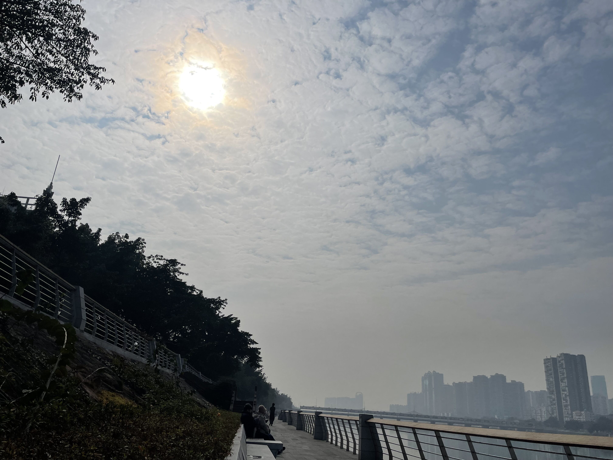
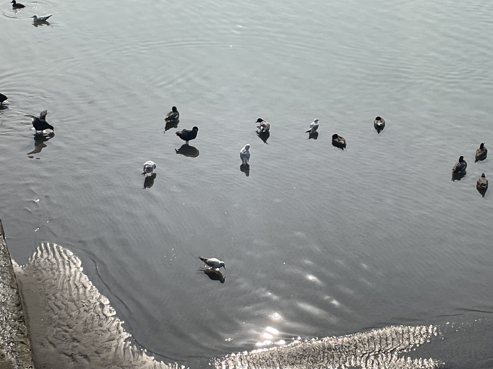
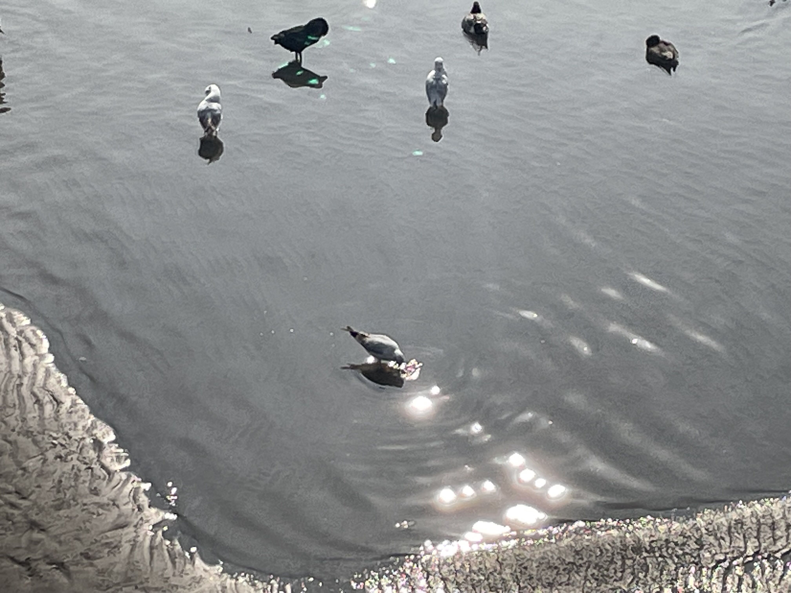
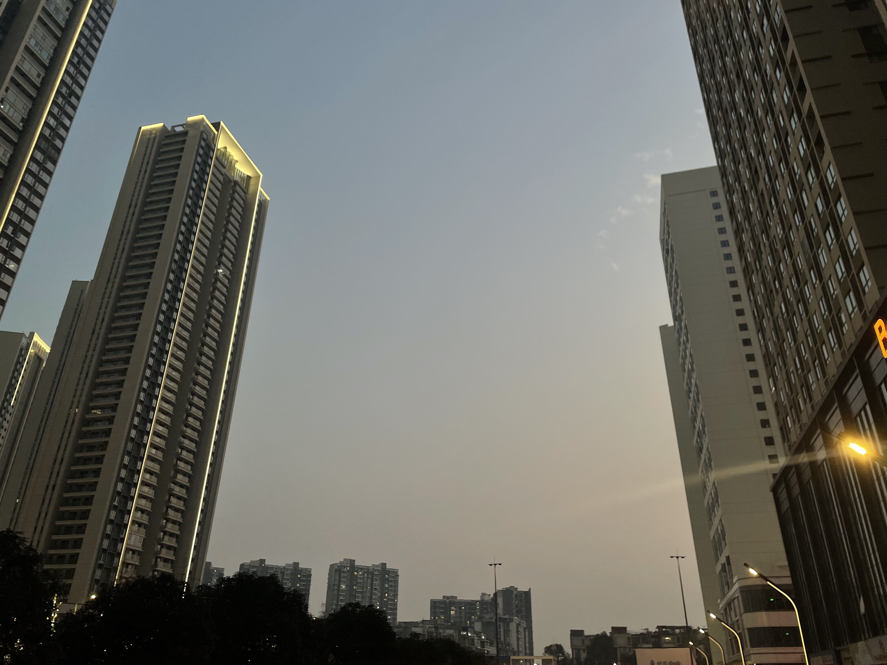
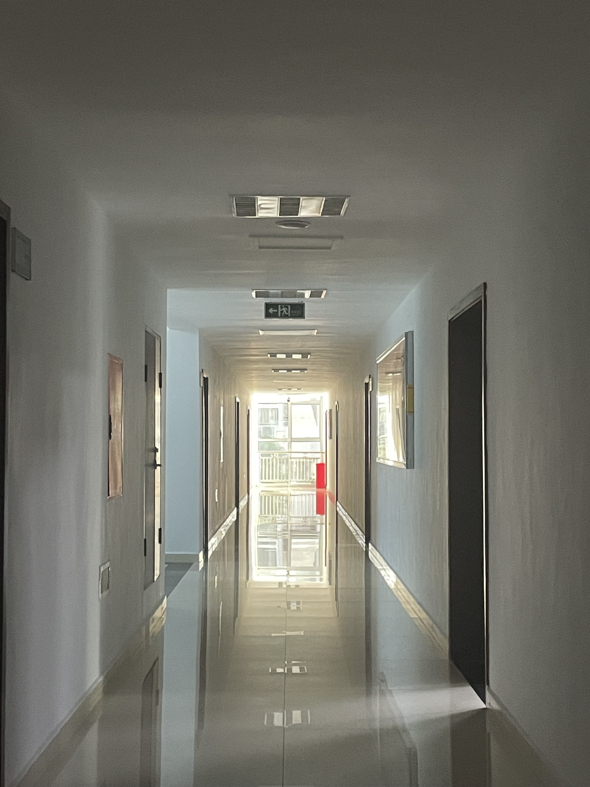
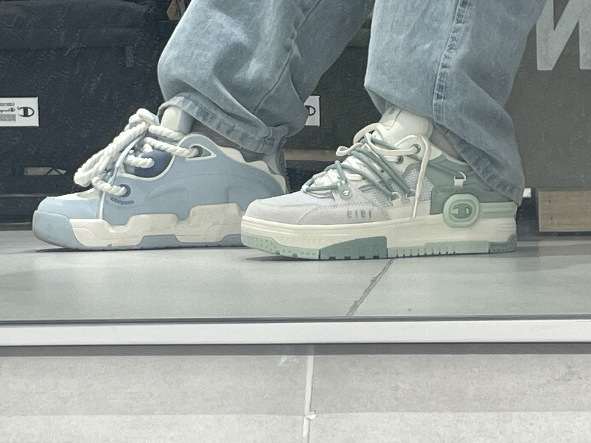
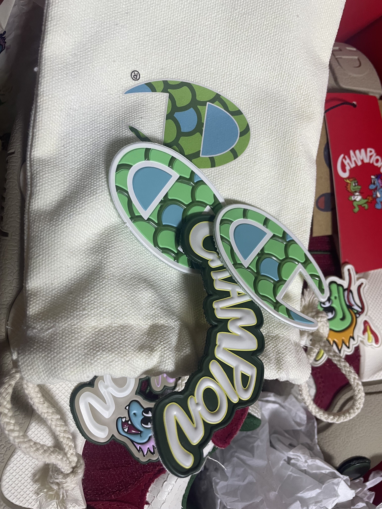
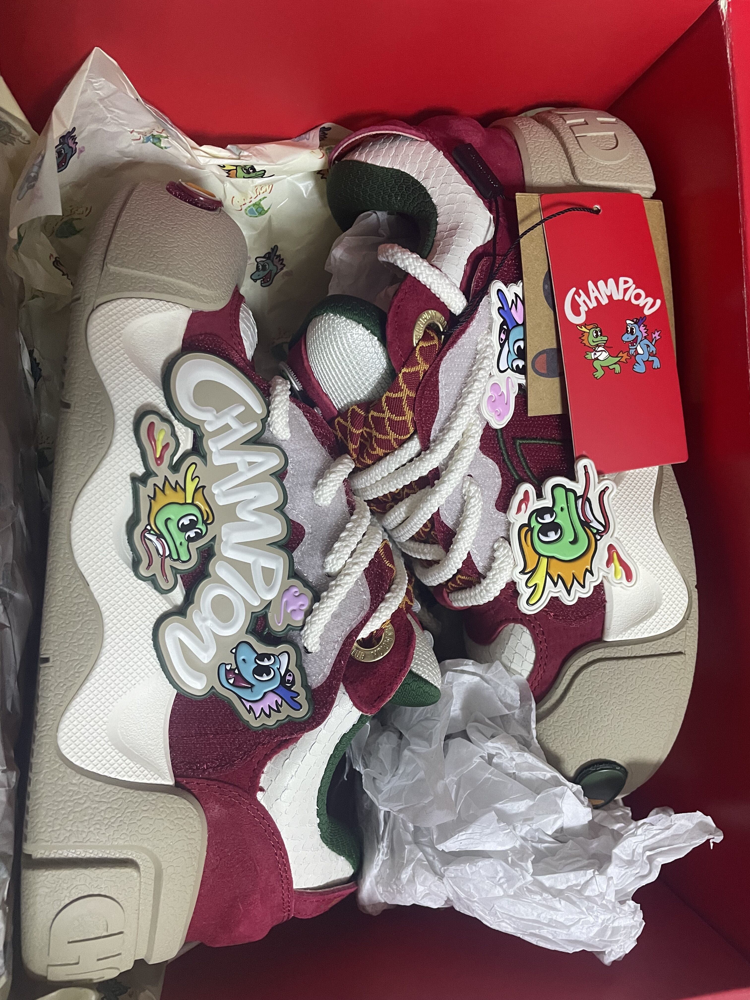
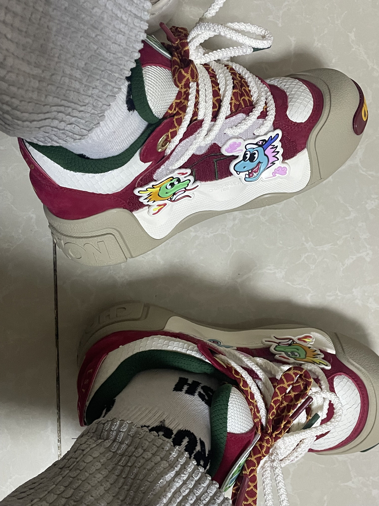

贰零贰肆第一篇博客！

# 近日的一些感悟

## “喜欢冬日晴天傍晚时的雾霭”

2024-1-7的下午出了个美美的太阳，于是我就出门晒太阳喽咯。

其实在我刚出门的时候，太阳是非常羞涩的，他吝啬自己的阳光，躲在云层后面貌似在告诉我今天不应该出门，就应该在家宅着。我现在都不知道我从哪个桥过的河（因为这个城市本就是沿着河建的），我只知道在过河之后，河边的市政建设很不错。我找了一块敞亮的位置，坐在河边的木质长条椅上。

我带上自己的连帽卫衣帽，把头戴式耳机套在外面，随机放着歌，就这么瘫坐在椅子上面。我肯定太阳会摘下云层的面纱，跟我相见。果不其然，一首歌的功夫，太阳就完全露出来。我尽情地享受着冬日午后的暖阳，贪婪地吸收他的阳光，我觉得我在为他刚开始的羞涩耍小脾气。

我把手踹兜里面，背靠在椅子上，任由困意席卷，我感受到我因为困意仿佛要倒下去，我又重新坐直，又重复倒下去...我不知道往复了多少次，到后面我就干脆头躺在了后面的椅子上，虽然后面种的是那种小花。

就这样舒舒服服晒了快一个小时吧。我想继续开始我的城市骑行漫游，我摘下耳机，耳机被太阳晒得有些烫手，我摘下帽子，我没戴眼镜但是我仍然能感受到阳光很刺眼。

我想从我晒太阳，让我觉得岁月美好，我享受下午这个时候的宁静与平和，不去争吵，不去疯闹，随着自己身体。我睡醒的时候我又被治愈，又被刺痛。治愈是阳光冬日暖阳的温暖，晒掉了我最近的腐朽跟麻木，我面向阳光，我感受到新生，我像一棵植物；刺痛是因为阳光太刺眼吗？我想可能或多或少还是因为自己一个人吧，最近其实我越发觉得，人见到的越多经历得越多，他的阈值就越高,当然包括被打动这件事。

后面我骑着车深入城区，去到城市的中心，广场上人来人往，叫卖声、老人们抽牛儿的声音————噼里啪啦、小孩子们的欢闹声、还有拉着大喇叭唱歌的声音...我觉得这个都与我无关，也都跟我息息相关。

因为路上车很多，有个小孩跟在他父亲后面骑车，应该是初学不久，所以骑得很蹒跚，经过一个街沿的时候，因为他车轮胎很小，然后咯噔了一下，自己的小水壶掉了出来，我跟在他后面停下，他看到我的车有些大，显得有点着急，他伸手去捡自己的水壶发现够不着，由于不平衡自行车也倒了下去，我停下捡起他的水壶递给他，他给我说谢谢，我冲他笑了笑，骑上矮矮的街沿跟他分道扬镳；我路过体育场的单杠我停下自行车去拉了几个引体向上，检验近期的健身成果，嗯~感觉还不错；后面路过“兵之王”想起高中喜欢喝的桂花酿，于是进去点上一杯，大吸一口，尽是满足，仿佛一下子回到了高中午休后能出校门的片刻欢愉时光。

其实刺痛更因为在物欲横流的社会每天追逐的许多，这一个平和的下午时光原来可以这么安静，在一个湛蓝的天空下，在一个人来人往的河边，阳光洒下来的时候，我可以靠在河畔的椅子上打盹，这我是从来不敢想象的，我从来没觉得我会在人来人往的环境下睡着，我现在发觉或许正是因为冬日的暖阳吧。

后来还在路上看见了海鸥和水鸭子。行人路过往水里扔面包来喂他们，还有专门的鸟类爱好者在桥上架着相机拍摄，我感觉那个相机像天文望远镜一样，可能他们觉得可爱的鸟儿就是他们镜头里面的星星吧。

傍晚六点过的时候我出去吃完饭，下楼看到冬日晴天傍晚时的雾霭，至此，今天阳光对我的恩赐才画上了句号。

那天在公司也拍到一个公司走廊，我们办公室在走廊的尽头，我发现我走向了光，那我也想成为光。

## 我有shopping了

介个，马上要龙年了，按照农历的计算方法，那么我就是本命年咯，我决定！先给自己一个新年礼物（之后还要给😶）————Champion的龙年限定鞋！

别管我了，我最近就是喜欢鞋子，哎呀！对自己好点啦~

周五我又去Champion了，我去试一试他们的板鞋，其实上脚也好看的，这设计感十足诶，左脚是试的板鞋，右脚是上次买的面包鞋。管不了那么多了，爱了。

其实店里面有没有龙年限定这双鞋的，都是后面从其他店里面调的货过来，我在店里面试的就是这个款式的基础款，我觉得也就一般，主要是鞋头我不怎么喜欢，但是为啥龙年限定就行呢？因为龙年限定可能看上去没得那么单调，而且设计感真的十足：

其一：基础款鞋头部分没有魔术贴设计，龙年限定的可以扯下来，而且一红一绿色，颜色冲突但是很协调。

其二：还送了一包龙头魔术贴，虽然鞋上面自己贴了，又送了一套还是很良心嗷。

其三：也是我觉得最细节的就是他有些部分是龙鳞设计，看山去就非常有质感，而且每个鞋两个鞋带：里面红色鞋带配色是红色的龙鳞样式。

总之就是细节到位，上脚也很软乎~

emmm，拍出来有点不太好看，我觉得嗷，但是细节还是可以看出来的。

## 写在最后

我们都要努力去提升自己啊，去做一做自己从未做过的事，去感受、去思考、去复盘过往的事，为何会如此，这样之后会造成什么，现在给我带来了何种影响。虽然有时在深夜，脑海中的思绪万千，让我变得感性，让我觉得满是遗憾，不过这又如何呢？失我者永失，我并不觉得以后我会多么多么的不好，相反，我现在觉得神清气爽，宛如得到了重生；不破不立，我亲手杀掉曾经的自己。成长就是这样，不停地把自己打碎，然后由自己重新拼凑。

那么，贰零贰肆的第一个周末，晚安；世界，晚安；我也，晚安。🌙

