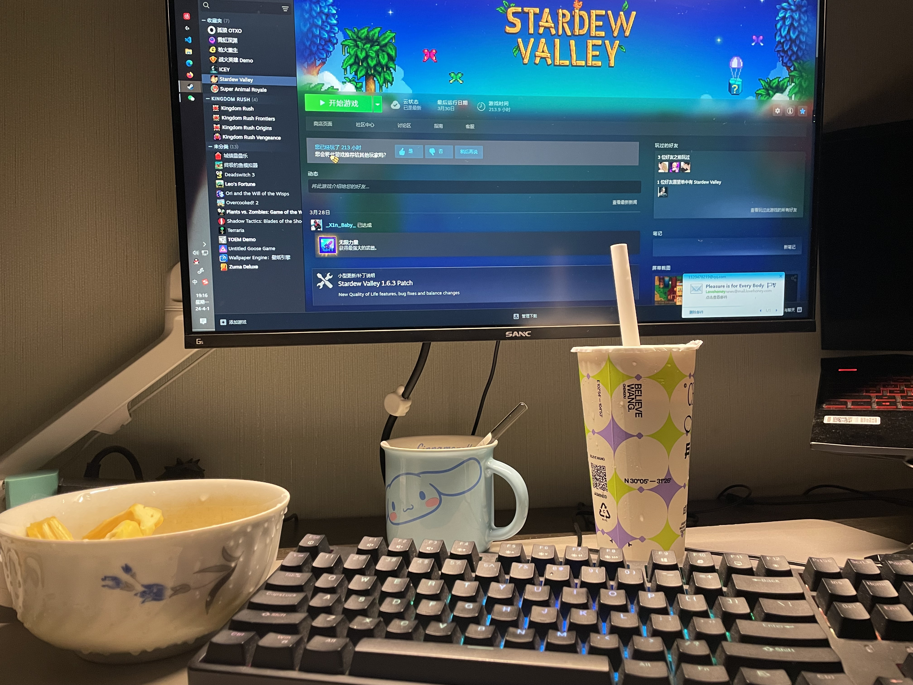

# 三月晚安，四月你好

今天天气很不错，早上在办公室上班，午饭过后小憩一会就出外勤了，去站上检查学到许多东西，又沿着没有开过的路去隔壁市，再返回，路上没有什么车，开着很舒服，回公司也正好下班。昨天已经锻炼过，今天想着放纵一下，吃过晚饭散步回家买了一盒菠萝蜜，前些日子看地图发现楼下就有奶茶店，到家之后又去寻觅了一下，买了一大杯一饱口福。

忽而发现，虽然今天去了很远的地方但是又很充实，很舒服的一种工作状态，下班也不算晚，想买点什么就买点什么，回家之后冲个热水澡，在浴室里面放声歌唱，坐在自己的窝里面敲着文字写下这段碎碎念，思考间隙嘬一口奶茶嚼嚼嚼。此刻仿佛一切都慢了下来，周围很安静，我也很自由，我具象化的感受到：尊重所有声音，但只成为自己。生命中的大雨，很多时候只有我们自己淋，想要去的地方很远，也只能我们自己走，有时候山路就这么窄，只容许我们一个人前行，人生本就是一场孤独的旅行，“事缓则圆，人缓则安，语迟则贵”，所以，一切都慢慢来吧，一辈子太长，我只争朝夕。

三月晚安，四月你好💤。

