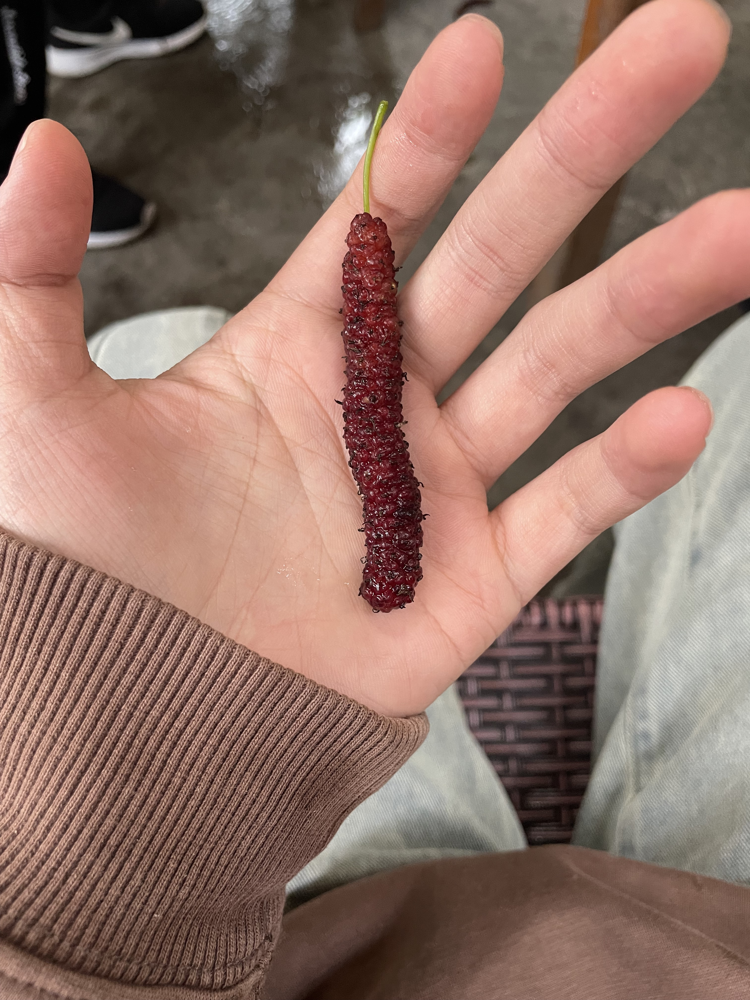
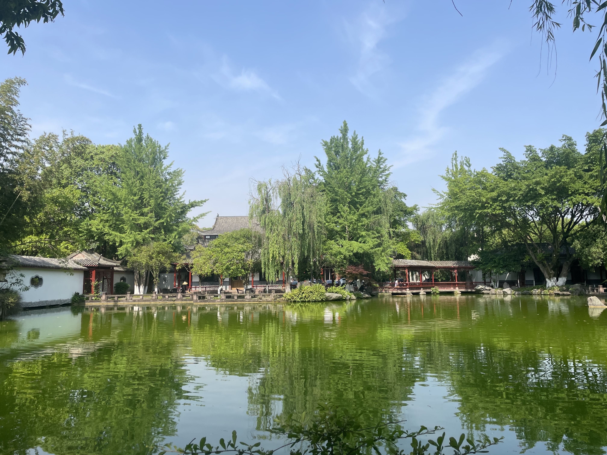

# 写在前面

这是一趟让我受益匪浅的旅程，我看到了许多许多之前没有的东西，我开始深刻感受到：“我们都生活在巨大的差距里”。许许多多一些人以为非常显然的东西，对别外一些人，或者说对于现在的我来说都是茫然。

叔叔受邀去乐山见他之前的大学同学，有个同学在十年前见过一次，其他的三个同学都很久没有见。称呼他们我都叫姐和哥，但是她们都是我姨姨辈了，就叫李姨、窦姨、袁姨、徐叔。还有是三个我叔叔的同学也跟我们一起去的，称呼他们叫卢姨、卢叔、王叔。

在后面三四天的相处中，我切身感受到他们都非常的优秀，基本是天花板的存在，这也让我在这次的旅行中，感悟颇丰，以至于我回到家之后就开始记录下着几天的所见所闻，所思所感。正如我博客HomePage写的：“困住你的是什么？”“是已有的认知。”

## 驾驶路上的感悟

首先我觉得自己还是非常厉害的，一个人一次性开了两百多公里，在此夸夸自己！“真棒！”不得不说这个车车是好开的，车况非常的不错，超车、提速完全没有压力（毕竟是四个圈的车车）

之前我开车的时候就在想：哎呀能不能自己开啊，这油门踩着真的很难受！其实还真有这个功能，那就是被我称为：人类最伟大的发明之一的—————定速巡航！操作也很简单，在方向盘左边，灯光控制柄的下面，有个小一点的操纵柄，具体使用就是：比如我要设定为100KM/h的一个速度，当速度到100KM/h时，将操作柄往自己身体这边拨动，再摁一下柄侧边的按钮，当仪表盘上面出现一个绿色的表盘指示，即设置成功。而且还可以微调：向下为减1KM/h，反之为加；一直往下长按就是10KM/h的加，反之减也是。关闭也很简单，只需要踩一下刹车就关闭。

在去乐山的过程中，我大多数时候都是用定速巡航来行驶，有时候就可以放松一下脚，这样身体会舒服很多，对油耗也是一个很好的控制，两全其美何乐不为呢~

叮❕🔆驾驶技能＋①

## 《乐山、峨眉》

到了峨眉山之后我们就和王叔他们三个汇合，去到了一处私房菜餐馆，是在峨眉山双福镇上，这家私房菜的鳝鱼弄得特别特别的好吃，而且他们自家的水果也非常的鲜美，特别是那个枇杷！

下面这个是他们家的桑葚，我第一次见到这么~这么长的桑葚，可以说简直是猪儿虫（别提了，这次我还真吃了资格的猪儿虫），我想这个桑葚应该跟什么水果嫁接过，不然怎么会这么长啊！

桑葚的口感还是很好的，特别的甜，已经不能用甜来说了，可以说有点醉人，我想到《诗经》中：于嗟鸠兮，无食桑葚。初中学这篇文章，我清晰的记得当时老师翻译说：这个桑葚啊，斑鸠吃了会醉倒。我其实很纳闷，怎么就醉了捏，我也妹感脚醉呐，好吧，今天初中的教育又一次形成了闭环。

其他几个姨姨来之后，给我带了凉糕，这个凉糕也让我眼前一亮，凉糕本身没啥，最让我特别的是那个糖汁！是黄糖熬制的，非常黏糊那种，看着甚至有一些小泡沫，但是入口很细腻。经过将近三个小时的开车，我其实很疲惫了，当我吃到那一口凉糕配糖的一瞬间，我精神了许多，身体具体的感受到多巴胺在分泌，大概这就是甜食的快乐吧。

后面就是吃饭环节，饭桌上叔叔姨姨们多年未见，很是激动，饭桌上的氛围也非常愉悦，推杯换盏，叙旧这这些年的事；觥筹交错，互相说着彼此走过的路程。叔说之前读书的时候就听过窦姨的名字，但是不知道是谁，如今32年之后再见，有种相见恨晚的感觉一样，哈哈哈哈。

不知不觉在袁姨的地道乐山话调调里，窦姨和李姨的正宗重庆腔中便已经酒过三巡，他们聊到之前有个对窦姨有意思的周叔就在峨眉。我们回到酒店已经是快十点，大概是叔和姨姨们觉得不够尽兴，于是再组织出去吃个夜宵，这个时候他们打电话给周叔，我猜周叔应该是一听曾经的白月光来峨眉了，飞快赶来见上一面，当我和叔去姨姨们房间找他们时，周叔都已经到了。于是一行人，在周叔的带领下来到了一处宵夜摊。

### 这个标题我不知怎么起，但是我觉得这个标题非常有必要。

在叔叔和两个姨姨的“起哄”中，窦姨跟周叔坐在了，周叔点了几个菜，又叫了一瓶白酒他们分着喝。**也就是在这个夜宵里面，我对年少的感情感受颇深**

在他们读书那个时候，周叔和窦姨其实互相有情愫，他们那一辈人是很含蓄的。周叔说他们最亲密的一次接触，是两个人在成都坐公交“那个时候窦窦把头靠在我肩膀上，我觉得那个时候是最幸福的一瞬间，至少她愿意靠过来，觉得我还是靠谱”，“我记得到那个时（↘）候儿（↗ ）~（重庆腔），那回是真的想睡瞌睡，反正你在，我就靠了。”他俩举起酒杯走了一个。

“你们后面为啥不在一起喃？”叔他们问到。

“那个时候毕业就各回各家了，我们通信交通也都不不发达，而且能交流都只能靠写信，哪还有联系了嘛。”

“如果联系，你们没准现在就是一个户口本的人了。”

老板把兔头上了上来，但是是一个整兔头，袁姨就说，耶，咋没切开咯。周叔拿起一个兔头说：兔头是这么吃的，先从嘴巴这掰开，然后拿着上面这一半，再从中间掰开。我们都纷纷试着处理手里的兔头。叔他们说：这你不给窦窦弄啊。

“那我肯定要弄塞，是吧窦窦”周叔说道。周叔弄好之后放在窦姨碗里面，眼里尽是温柔。

其实啊，正如他们所说：之前的通信很不发达，信息交流真的很慢，以至于错过了许许多多的人，许许多多的事，他们说我这一代很好，微信什么都方便，什么都好联系，我笑着点头。可是现在的消息很快，以至于我们看不清许许多多的人，许许多多的事。在后面的欢声笑语中，周叔很照顾窦姨，他们也是时隔20几年没见面吧，彼此都已经事业有成，成家立业，再见年少的意难平，心中也甚是欢喜或许也有一点遗憾，这种欢喜不同于喜欢，我觉得可以称为一种爱吧，一种很纯粹，没有任何世俗侵染的爱，一种光明正大的爱。

看叔叔他们聊起他们年少的事，我总觉得有一种上帝视角，但是又看不清的上帝视角在看他们，上帝视角是因为我能看到他们年少时彼此真挚的情谊到现在一转眼三十多年过后的久别重逢，看不清是因为我会想到当我也到了那个年纪，再跟我现在的朋友相聚，或是少年时的意难平相聚会是怎样的一种情况。或者以后也不会相聚。我想，现在的窦姨和周叔，在彼此心里面，也正如年少上大学时一般熠熠生辉，互相在彼此生命里闪闪发光了很多年。

**困了，后面的就后面再补充吧，图片先贴着，反正大纲已经打完了~**

<!--

住的酒店，真的让我大开眼界，那种Loft的套房，很高级

吃豆腐脑，感觉滑唧唧，还有饼子（而且那边的社会加油站很多，正规的中石油中石化基本是看不见的）

还去逛了一下古镇

还去吃了乐山的非遗而且这个地方的环境也是非常的好：龙须笋，很不错，而且这个地方让我最感慨的是那个老板，那个姐姐（附个地址：山边餐厅
-->

## 《成都温江区》

<!--
这个地方我吃了人生第一只猪儿虫，天。而且还喝了酒，也是体会到了好酒的那种舒服

这还有个公园很不错，很安静（水立方湿地）
-->

## 《广汉》

<!--

去了一下三星堆的码头咖啡，环境也很好。吃饭的地方在高铁站那，也是很不错很不错

-->

## 关于一个园林老师——卢叔

<!--
这个老师是非常有情趣有品位的，言谈举止，察言观色各个方面，都非常的让我受益匪浅
-->
