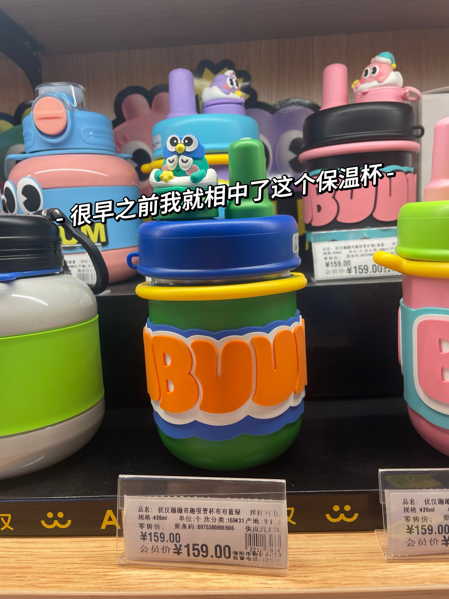
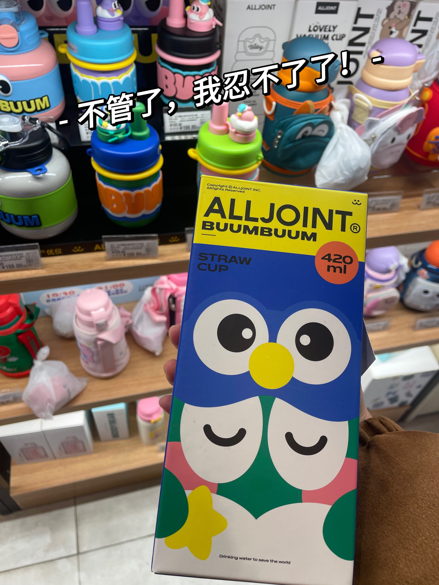
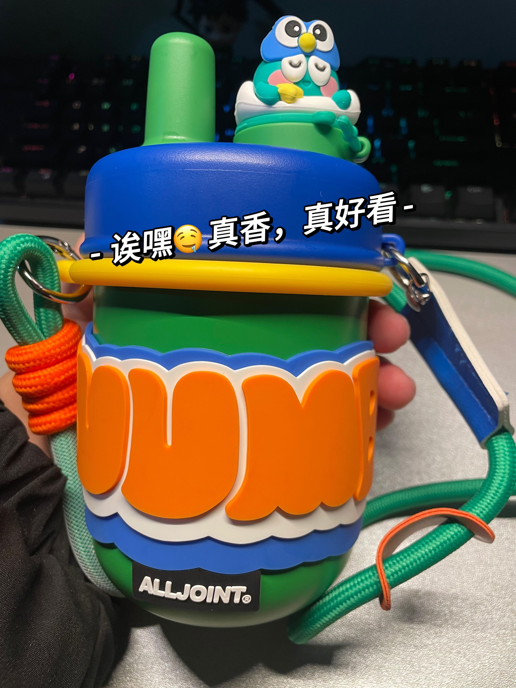
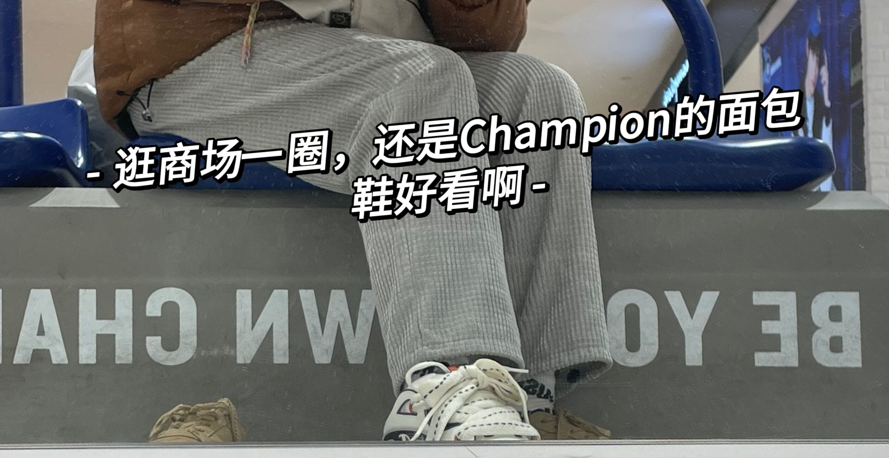
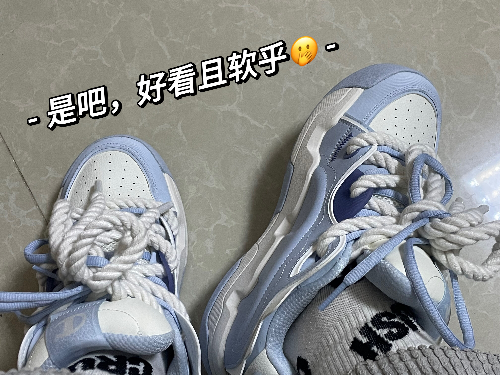
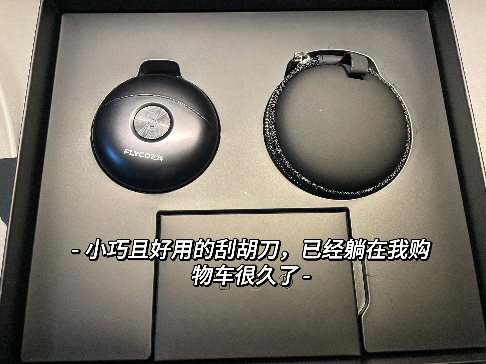
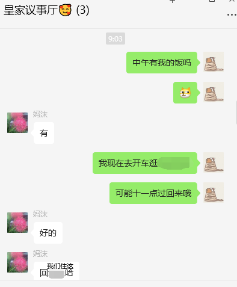
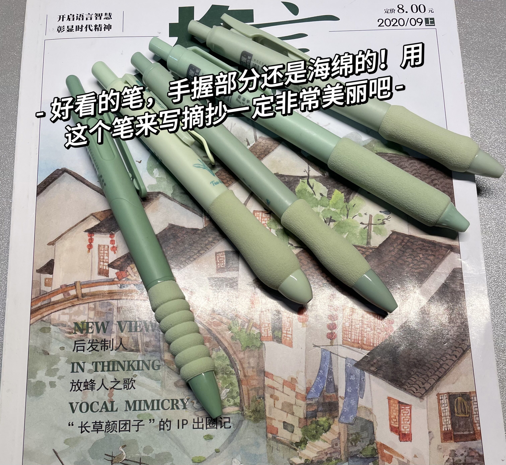

贰零贰叁最后一个星期啦，现在是12-30日，在此记录下最后一个星期的各种见闻以及感受，并且喜迎贰零贰肆。

# Shooping！Shooping！

今天去购物喽！芜湖真是开心，并且做出了勇敢的举动以至于我自己觉得又成长了些。

原本是打算昨晚购物的，但是因为年终工作上需要加班，昨晚的机会就没有了。昨晚去购物的话，会有年终优惠，又可以便宜许多，择日不如撞日，就今天！

## （不知道写什么标题但是这个标题要有）

首先是给妈沫买东西，这个购物计划很早之前就给我妈沫他们说了，他们如果需要一些生活用品我就顺带给他们了，最后我妈沫说买一袋米回去嘛，还有就是之前在京东给她买过一款叫“金燕耳”的银耳，她说有时候下班饿了，弄一杯吃睡觉正合适，让我去购物的时候就顺带看看有没有。

我直接开车过去，停好车直奔B1超市。首先就拿米吧，最后选了一个圆粒的米，圆粒的米煮了之后吃起来比较糯一些，长粒糯感要次一点，我寻思之前在家好像他们也没有怎么区分口感，这次就试试吧；逛了一圈也没看到有“金燕耳”，那到时候在网上给妈沫买吧。我寻思新年了给我老爹也弄个新年礼物嘛，他有时候喜欢一个人小酌一点白酒，我就去给他买了一瓶比较好酒，。

然后就该我自己买喽~~我之前在商场看到一款保温杯，我喜欢的那个杯子看着好看诶，而且他里面有个泡茶的小圆筒，这样茶和水就是隔离开的，正好在办公室有时候就泡茶喝。那就直接拿下！我猛然想起之前回家听我妈沫在我面前说过她买的保温杯不保温了，想换，我就顺手也给她看了一个保温杯，就当给她的新年礼物了哇~【给妈沫买的杯子忘记拍照了，她那个杯子算是比较中规中矩的保温杯，不像我的这么花哨且有点幼儿化，不管！喜欢就行】

是吧真的很好看诶，从第一章图就可以看出来有四种配色，但是貌似都很女性化，这买了不得被笑话啊（虽然我想买🙈）

## 欲买桂花同载酒.....

其实大多数男孩子心里都想一双AJ或者空军吧，当然我也不例外。有时候看见别人有，好酷，好羡慕，好想拥有。这次23岁的我盛情邀请那个十八岁的自己，去试一试自己心心念念的鞋子，并且圆一下梦。

最后也没有买AJ或者空军，我买了Champion的面包鞋，这个鞋也算是之前看到很心动的，但是迫于经济因素，就只是想想啦，哈哈哈哈。购物中心一楼有大牌的店，比如NIKE，Adidas，李宁，Champion，MLB...我都进去逛了一下，看看有没有喜欢的款式，我发现，当我真的说去给自己买一双AJ的时候我发现不好看诶，我其实更喜欢NIKE的那个AIR More Uptempo 的熊猫配色，真的好看捏~

上面一张是我试的第一双，可能看不太出来，可我发现面包鞋上脚真的好看诶，而且面包鞋比板鞋这些软，穿也好穿，基本套进去就行了。喜欢软一点点的，有时候上班有外勤，走来走去的。

下面那一双我最后买了，主要喜欢那个鞋带，可以两个鞋带一起系。（其实窝都埋了，只是没有尺码得从成都调货来🙊）

### 突破心理的障碍，大步向前吧

在上面酣畅淋漓的购物之前我其实有很大的心理戏的，这正是我今天感悟最深的，也是我觉得让我又长大的。

其实从小到大，我很少去实体店买鞋子，而且小时候去实体店买衣服那些导购让我很难受有时候；再加上小时候的环境就告诉我们要节约，以至于之后的我有一种淡淡的自卑感其实。我并不是在批判或者责怪他们从小到大给我的环境怎么怎么差，正如之前在给我父亲礼物那篇博客里面说“我们站在他们的肩膀上看得更远，依托他们的臂膀飞得更高，回过头来不应该的说他们这不懂，那不知，应该明白之后需要我们带着他们去见识更广阔的地方。”

购物中心1层、4层一层都有男式用品，4层里面有FILA还有一些我没有听过的大牌子，还有一些男式用品。我上到四楼，买了个剃须刀，因为剃须刀在我购物车躺了很久，而且早就该换了，那个剃须刀都是高三买的了，这都大学毕业了，哈哈哈。正好我就去问他有没有这款剃须刀，还真有。

结账的时候我问那一层的收银员：

“如果去NIKE或者Adidas的店里面买了也是拿到这结账吗？”

“在这也可以，他们店里面也有柜台可以买单。”

“再请问一下他们店一般鞋是多少呢？”  我有些怯懦地问到。

“看你选哪种嘛”

“你收银应该有个平均消费嘛，平均一般好多嘛” 我再次试探地问😬。

“有699，799，1299也有。”

对话完正好收银员也结好账了，剃须刀店的销售员也把东西打包好给我拿过来了，我谢过之后就继续了。

在四层，我来到NIKE店门口，鼓起勇气，心理暗示：“如果是1K之内，那我还是有预算的，进去看看把，没事的”我终！于！踏出了那迟迟许多年没有迈出的一步。在出门购物之前，我特地想了一下我穿什么，我觉得自己穿得还是很得体的，这样我想如果我逛这些店能让我有些底气。

我是快十点进去的，这边他们都九点半才开始营业，所以里面的销售员都还在为一天的营业准备，我进去之后他们说了句“欢迎光临耐克，看上喜欢的可以试。”我点了点头，逛了一圈发现鞋下面其实贴了价格的。**好像我们都很害怕购物商品下面补贴价码的情况吧。🤐**我看到AIR More Uptempo，但是他只有黑白的，我礼貌地问他们有熊猫配色吗，那个销售员姐姐说只有黑白的配色。然后我看了一下AJ，我发现我有点Get不到点。

后边又逛了一下FILA，之前在网上买过一双FILA的鞋，并且穿了很久，所以FILA对我的印象还是很好的。我进去之后走到了女鞋那边，这时候销售员其实没有过来，我都看了一下了，然后她走过来说这边是女鞋，我顿时感到有点尴尬。（为什么女鞋的配色就这么好看！🙃）

我尴尬地说“不好意思我不知道。😶😨”

“不好意思是我们，没有及时过来给你说”销售员姐姐也客气的回答我。

我发现男款确实没有中意的，我就说我再逛逛吧。

**我逛了两家，其实他们都不会追着你问喜欢那个，让你试一试，并且在我觉得有些尴尬的时候他们也会给顾客台阶。这就是让我觉得跟之前刻板印象不一样的地方，虽然我生活在城市，但是我还是想说：外面的世界已经发展得这么文明了吗**

后边我又回到了一楼，我走进了Champion，早上的Champion店只有一个销售姐姐上班，这都是后边结账的时候我才得知的。她看到我在看面包鞋，就给我推荐了两个，我思考着，她也没有说话。

“我可以试一下这个吗？”

“你穿多长，这个是40的”

“正好，我试试”

诶，上脚之后确实很软啊，而且面包鞋给我感受很暖和。**那个鞋带因为是连根鞋带，所以我不太会系鞋带，那个姐姐就蹲下来说你两根一起系也行，分开系两个结也可以的。**

唔~好看捏！

“我可以礼貌问价一下吗？”终究到这了，我笑着说。

我记得她说六百多，然后又说可以打折，到手的话是530左右。

那我还是可以接受的，后面因为一些原因我想凑整数，所以就试了两款，然后直接！拿下！！！！

记完账我就回家了，因为要给我妈沫他们拿米，我怕他们不够用，正好把给妈沫买的保温杯拿回去，老爸的酒拿回去。

😝很幸福的还是我去购物之前问妈沫中午有饭吗~

然后今天我买的笔也到了，好看的笔！！！这笔握笔出是海绵的，还是那种有点纹路的那种，握着很舒服！又开心一下🤤

# 💖💖

到家的时候，妈沫正好把门打开，我说快来拿东西哟，妈沫把后排门打开，把米提出来，我说有点重哟，给你买的最大袋的，还没了点洗衣液，洗洁精给他们，我也不清楚他们缺不缺。我特地把我老爸叫过来，我说来给你买酒了，老爸说诶呀握手脏得很，你拿进来就行。后面我又把给妈沫的保温杯给她，我大声的说：这个就是你们的新年礼物哟，老爸在院子里面说：好嘞，妈沫就眯着眼笑着说：你爸还说我杯子多得很嘞，你还给我买。

“这杯子不一样，保温很好，而且我特地选的有滤网的，你有时候泡茶也可以。我给我爸说这是我给你的，他不得说你”我很有底气的说。

妈沫转过身把锅里煮的酸菜鱼起锅....中午就在家跟他们吃了一顿。

最让我感触很深还是我一个去买东西的一些列经过，在2023年12月30日，我满心欢喜买上桂花，带着美酒盛情邀请18岁的自己一同去水上泛舟逍遥一番，逛自己一直没敢去的店，并且买了自己以为很久很久之后才能拥有的鞋子，如果我能现在回到十八岁对自己说一句话，大概还是“并不是度过了一段艰难的时光，以后的日子就会顺风顺水，哪有这么好的事呢，就像艰难是幸福的代价。不是的，艰难不是任何事的代价，它只是一段时间，而只需要等的就是时间过去。”

最后，感谢2023让我学到的许许多多，欢迎2024，2024赐教。