# 关于和平精英

**我还是那句话“如果打游戏玩不出什么名堂，单纯为了快乐，那没事了”**

首先对于这个游戏吧，我只保持一种中立态度，不说我是这个游戏的拖，也不是什么我不喜欢这个游戏。

## 喜欢此类游戏的原因
从小到大我都喜欢那种比较有操作的游戏，从小时候的4399 的机甲旋风，功夫派，再到造梦西游，这种比较赛博朋克风或者打斗类，枪战类我都挺喜欢的；你如果问我打不打CF，那我只能说小时候因为家里电脑不行，我又不是那种喜欢进网吧的乖乖孩纸，就很少接触了。

## 对于《和平精英》
对于和平精英是从鹅厂之前出的刺激战场开始，那个时候懵懵懂懂的高二，每周放两天，回去都要和朋友打，那个时候都是觉得一起开黑，好有趣，根本没管什么枪拿什握把，灵敏度也不会调，之前手机还是我第一个手机--红米2A，好老的手机，运存2GB🤣，后面高三也算是懂点门道了，才慢慢注意到操作这方面，但是碍于我的硬件配置，很多流畅操作也之后练习过，缺没实现过（什么69蹲，身法等）也到那个时候我开始尝试三指，那个时候多指很少，然后我就因为这个很猛，啊啊哈哈哈真帅啊🤪

上大学之后我手机也不是很好，只能把帧数开到“高”，对于吃鸡这个游戏我认为就是比较吃帧数，帧数上去好多都可以操作的。也是那个时候（大一）我参加了人生第一个游戏类比赛：

## 我与《和平精英》的高玩瞬间
### 第一次比赛
跟着我们学校校队，但是不是在校队，是我们自己成立的一个队：**IMT**这个名字的含义是因为**Immortal**这个单词：不死的、神仙的。听着还挺中二，啊啊哈哈，那个时候也算有个队友很强，我们也就有些配合，一路杀到了西部赛区决赛，当时晋级的有我们学校的校队1和校队2还有就是我们队。也很喜剧其他学校都是一个队，就我们三个队。说西部赛区的时候三保一，结果校一队太铁啦，落地打架成盒了，最后我们也就稳扎稳打到了最后，那个时候是线下打的，在四川内江威远的一个地方，也就是那次我真正体会到电竞选手的感觉，太棒辣！

当时在那现场的拍照，蛙趣我受不了我的头发，啊哈哈哈哈 让我笑一会🤣🤣🤣🤣🤣

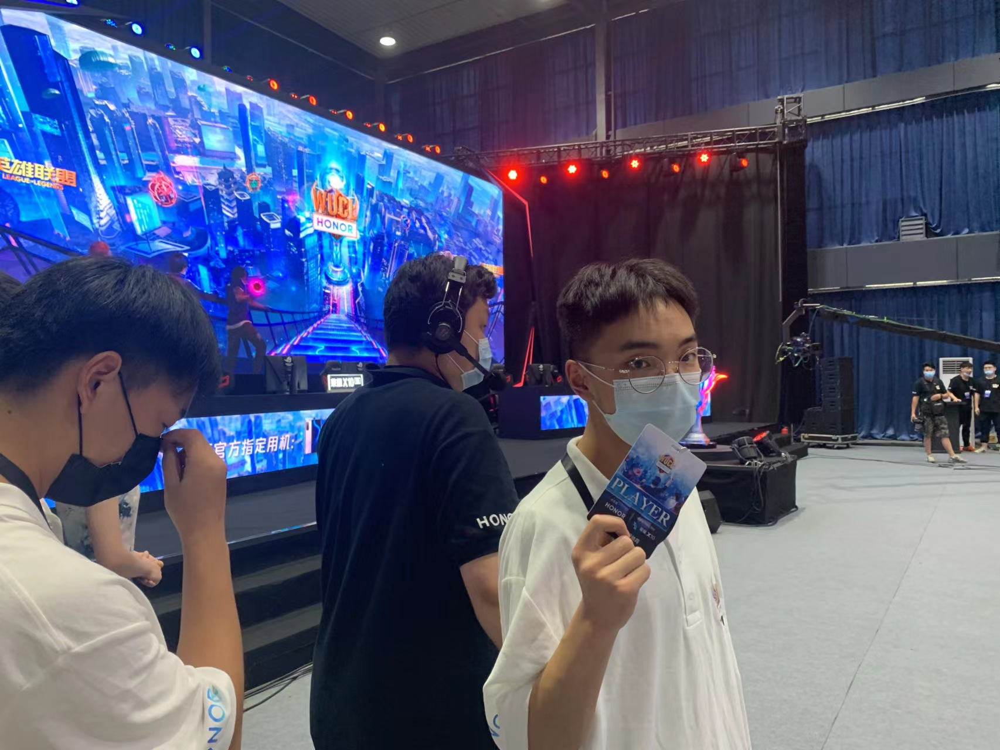

现在倒是想不起来当时游戏的细节了，唯一能记得就是那个住的地方，蛙趣真的环境很美丽的，在山里面，但是是新宿舍

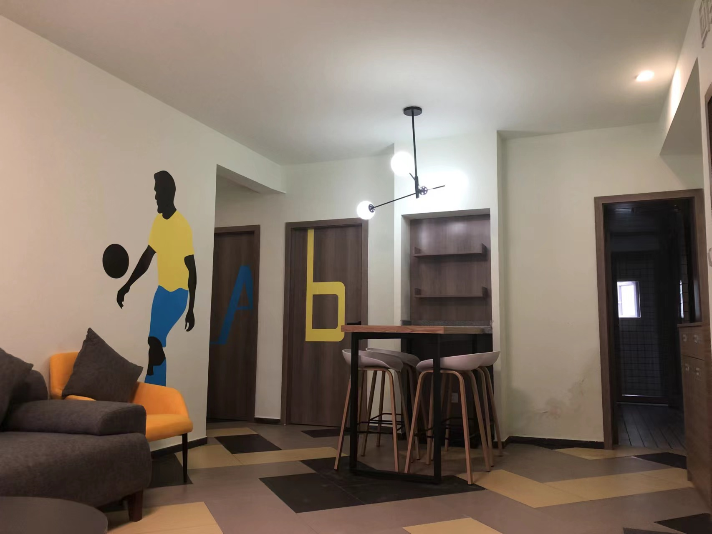

**激烈战斗，比赛中....**

-----------------------------------------
**最后我们是冠军🥳！！！**

当最终分数排名出来的时候，我看到**IMT**在第一个的时候，我整个激动了，挖槽，太感动了
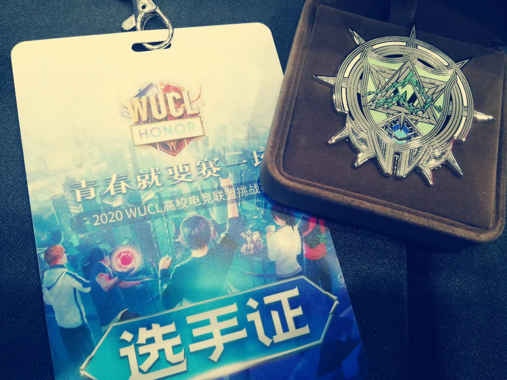
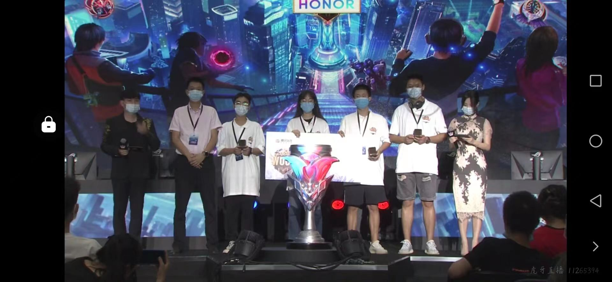

这张合照是因为当时在直播，我上电视了，高中好兄弟给我截图的

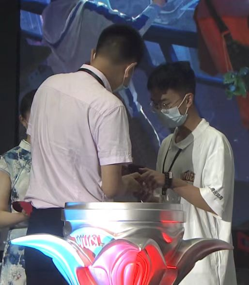

### 全国决赛
后来啊，就入选到全国决赛啦，和学校的二队一起，那也是我这辈子第一次坐🛫飞机，邀请到杭州老干爹俱乐部打的。那叫一个气派啊
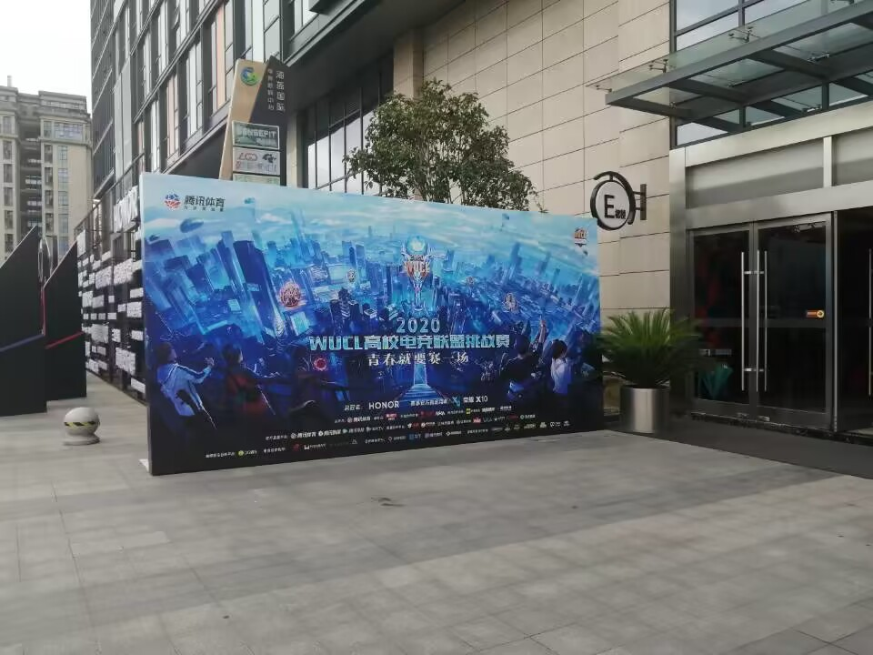
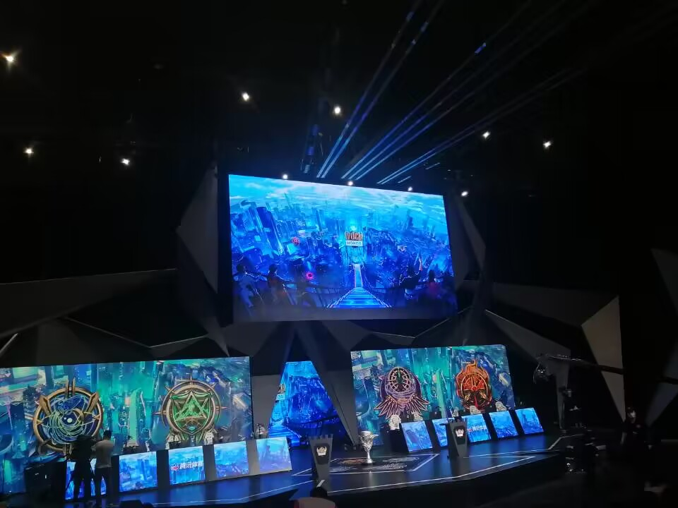
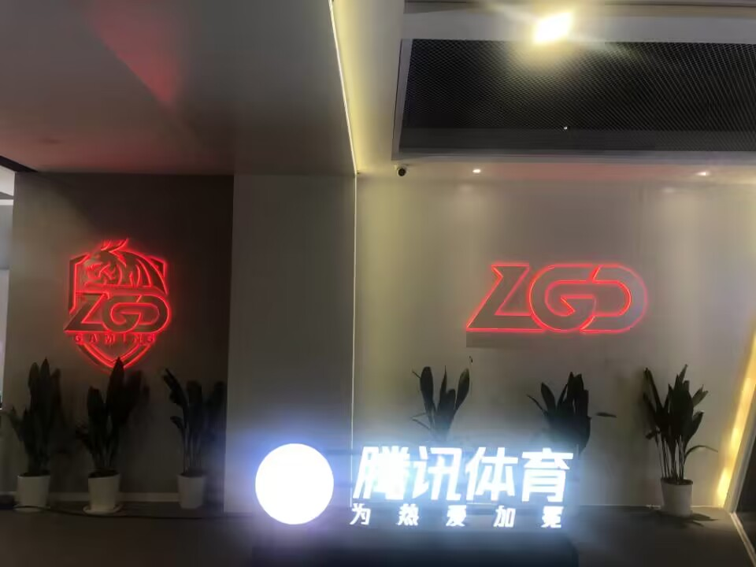
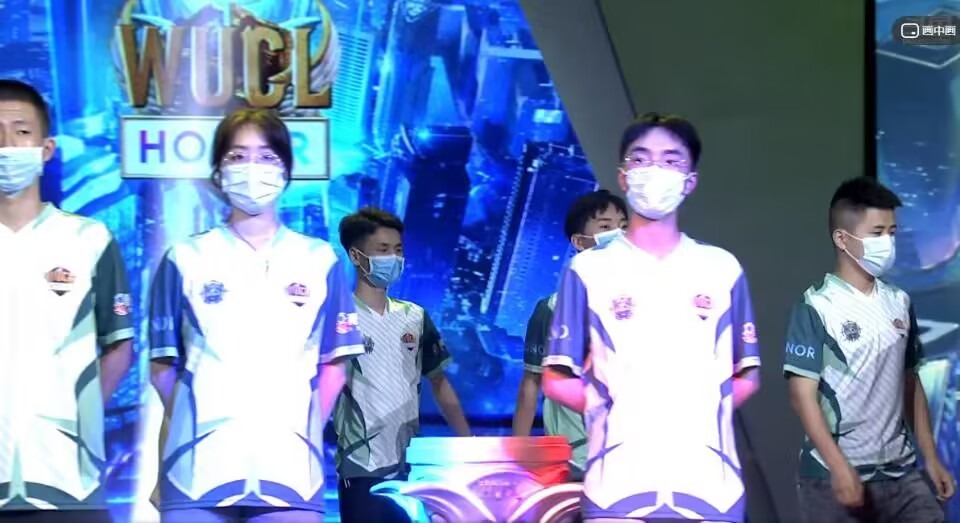

全国决赛我们就打得不是很好了，算是保了校二队拿了冠军了，主要也是我们实测了。不过也算是没有遗憾啦，公费去了杭州一次，记得那天很燥热....

### 关于城市赛
虽然城市赛是代替校队去的，那次是他们入围了，但是他们有事情，就让我们去打了，在成都春熙路的IFS里面。

>这是那个时候发的战服，噗哈哈哈

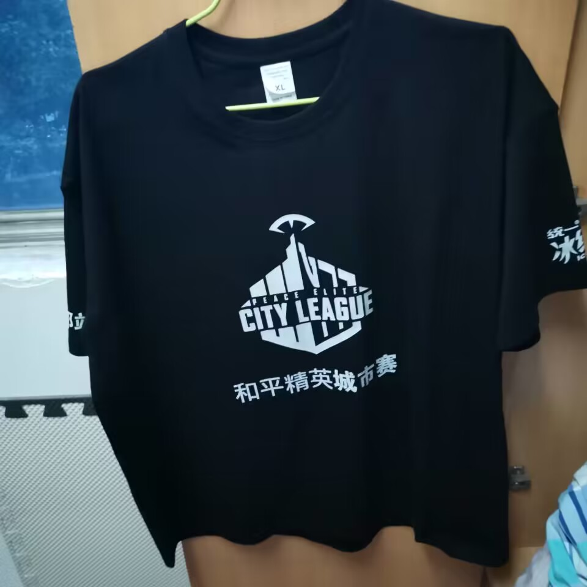

>那个时候让在地表去拍照留念下电梯我拍的

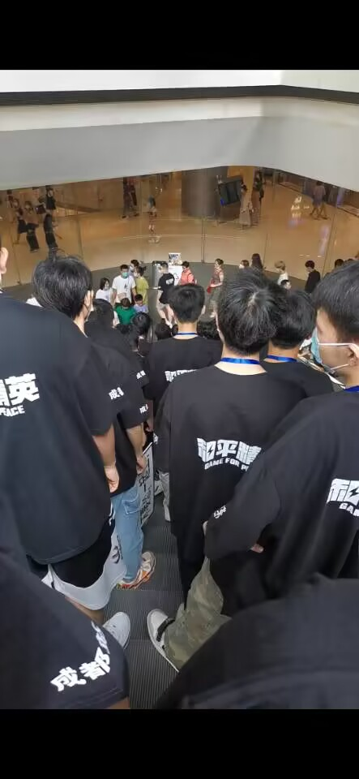

## 结语
虽说现在的和平精英已经是每周一套皮肤的出，BUG肯定是有，对于去年比算是好多了，也只是下班偶尔打打了，之前还能凑够四个人一起四黑，现在都基本自己打了，一个人打打单四就差不多够了，（突然伤感🙁）
也算是我青春比较热爱的一款游戏了吧.....祝好，一切顺意💟。