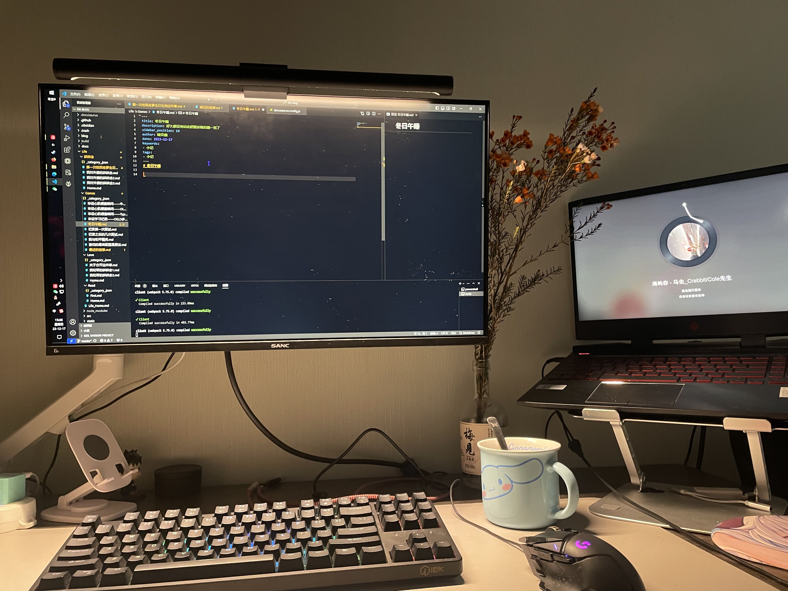
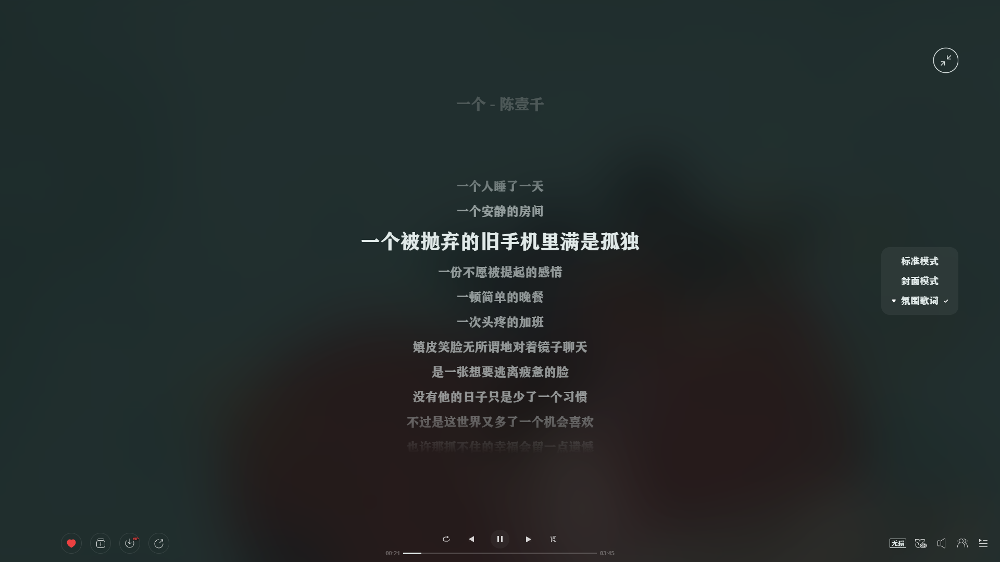

# 冬日午睡

在写这篇博客的时候，我感觉到了久违的满足感，来自一种安稳睡眠，一种被窝给我的满足感，这种感觉真的太久没有过了。

因为最近寒潮影响，德阳也不能幸免，开始了断崖式降温，几乎就是一夜之间的变化。我对温度感受真切是因为每天早晨我都是骑自行车上班，之前上班我都不戴口罩，鼻子呼吸都受得了，自从周四吧，我早上起来去上班呼吸就感觉可冻，好在我提前就买了一顶雷锋帽，这样保护了我的脑瓜和耳朵，不然“耳朵都要冻掉啦”。我觉得可能因为跟琴分开的原因，晚上还是会想她，晚上的思念更强烈；加上最近中午因为工作原因不怎么睡；所以最近睡眠质量很差。

正好今天下午没事，我一点过就躺在床上，准备还是午睡一下吧，原因是被窝里面有一个我昨晚灌的铁水壶，现在都是还暖和着，这让我冰冻的脚有了可以取暖的。

我并没有整理枕头，直接就躺在上面了。我床上有一个乳胶枕还有一个大大的靠背枕头，还有两个玩偶方便我抱着睡。躺着刷了会视频，把靠背往旁边放了一点，用我的抱枕垫着我脑袋就睡上去了，很舒服，我想说的是，这种随意的躺下，比我睡觉的时候充满仪式感整理枕头后在躺下要舒服~这是为何？

从一点过开始睡，睡到了两点过，本来该起床了，我迷迷糊糊有睡了过去，第二次睡我进入了梦境，梦的整体不是很好的：梦里我梦到了一个女孩，有种熟悉感，我梦到是一场语文考试，但是是一直在移动，边移动边考试，后面好像去到了一个荒漠，我去问路，只有一个牌子，那个人是当地有名的活地图，但是他一把抢过我的一个路牌不给我，我跟了很久都不给我，最后我很生气，以至于想打他，后边就梦醒了，真是奇特的一个梦。

我醒了一看，vocal，三点十多分，问题不大，起床起床！乘着现在这么暖和，而且心里倍感满足，我要记录下来，于是才有了这一个记录。

打开电脑我方了一手陈壹千的《一个》，带上耳机，打开空调，闭眼清唱，真是惬意。很早之前我听到这个歌就一种慵懒的感觉，但是很不应景，目前的各种情况下，应景了。

我不奢求每天都是如此的睡眠，只愿时不时让我体会一下这样的睡眠满足感。