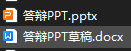

# 关于快要临近毕业的一些琐事

## 关于毕业答辩

这个才是最刺激的，我的天。

答辩老师组合出来的那天：李萍姐姐，魏蒙希姐姐，周大爷。对于我来说，好小子，我都认识啊！李萍姐姐使我电气的负责人老师，我上课也是比较唯唯诺诺，之前也在李萍姐姐手下带过比赛；魏蒙希姐姐就更不说了，之前跟她一起投了外刊，也算是很多交流；周大爷嘛，协会毕业的学长，自然是非常熟了。这波啊。这波天王老子来了一辩也是稳过；然后我一看，诶不是，我第一个啊，这？那我这不得压力给到后面的同学，啊哈哈哈。

其实我PPT这些都是很认真做的，我甚至还写了稿子，我想了所有的，他们会问的问题：`我OLED用的什么协议通信；我INA220用的什么协议通信；OLED多级菜单索引部分怎么实现；我的实物会不会有问题....`

到了答辩那天，`伞兵一号卢本伟，准备就绪！！！`，然后在教室电脑上拷贝好PPT，准备好实物，李萍老师说“DX你是第一个哟，准备好哦”，OK直接上去，然后我简单介绍了背景之后，就放到原理图那边，讲解完之后就是PCB，然后到软件。“好了，可以了，下来周老师给你说说论文的问题，你就没事了”。

我：？？😲？

诶不是，我PPT都没放完，然后我实物也没有演示，周老师说你IIC是自己写的还是CubeMX配置的，我说配置的，然后看了下HAL库的一行代码。就下去说论文的事了。因为我们几个关系比较好的同学都是在这一起答辩，他们看我这么快就下来了，全惊呆了，亚麻呆住，啊哈哈哈。

当天晚上我去找魏老师聊天，说我答辩之前老紧张了，她说“萍姐还没答辩就说你肯定没问题，乖得很”，原话如此，谁懂啊，从小到大那个不听话的孩纸终于当了一会乖娃娃了。乐乐。
