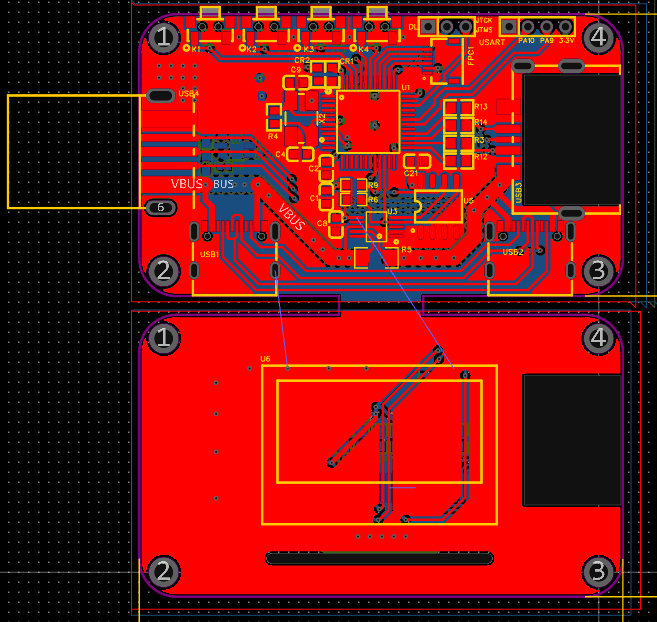

# 一、事情的开始

我迎来了毕业季，那么又到了做毕设的时候了，我的题目是一个《USB电压电流计》，我自己根据所需要的要求开了PCB回来，材料都到了，焊接完之后我直接就是开始一个调试工作。

芯片检测~~ding💡！通过---

串口~~ding💡！通过---

单独供电~~ding💡！稳压通过---

# 二、魔鬼OLED的四次折磨

Okey吖~现在也是来到我们的OLED测试环节好吧，由于我是开的两块板子，OLED跟主控部分是分开，于是我就是用FPC排线进行连接。就是下面这样的：

就是可以直接从中间给他锯开，就是两个板子。

FPC连接成功，通断正常！

## 第一次折磨——OLED外围电路焊接问题。

我调用之前我能够用的OLED底层，然后进行了IO的配置，发现下载进去之后居然不亮的，我心里一下子就不爽了，出事了，于是：让我看看怎么个事！

**这个时候我依旧是想的是看看程序有问题没得，因为我也隔了几个月没看过STM32的OLED使用了，好在有之前的笔记，我再对照笔记看了一次。OK没问题**

> 编译ing.....

> 下载ing.......

还是不亮！！！我造！“会不会我是IO口没用对啊，毕竟他是模拟的SPI，是不是我时钟线和数据线没对上”，于是我又在淘宝上找了个OLED的详情，对照他的时钟线、数据线、DC、RES，结合我的来重新调整了一下。

> F7 and F8...

果不其然的是，不亮，毕竟这第一次心肌梗塞还没到。**我猛然想起，我之前对照中景园的原理图画的时候他在旁边标注了有些电阻不用焊接的**

**鑫大惊，遂查PDF，知问题，嘴里骂骂咧咧ing，略心梗，信誓旦旦操作。👺**

于是我去下R2、R3。笑嘻嘻的上了电。这次，怎么也没事了吧！

**上电！！！！！！！！！！！！**

**熄火！！！！！！！！！！！！**

为什么！！为什么！！！硬件明明没有问题了（**你信嘛，其实还有问题，此时的鑫还不知道，这便是又一次心梗**）！为什么！！！

我直接拿出示波器，在出口打时序是没问题的啊，然后换过FPC排线到另一块板子，因为FPC排线引脚很短，不好打，所以我就打他出来的电阻焊盘，时序怎么不对啊，复位脚拉不低啊，嘶！不会是我的OLED电路画的有问题吧，再对照一下中景园的，一模一样啊！也妹问题啊！

## 第二次折磨——同向FPC排线
**此时的鑫已经麻了，脑壳已经裂开，已经是中午十一点过了，准备吃饭了，想放弃的他点了下自己画的PCB，又大惊！发现了端倪。**

“这PB5在上面的板子的顶部，也在下面这块板子的顶部，这FPC排线过来，好像是错位了！焯！我买成通向的线了！，改用反向的，同向就是镜像连接的感觉了🤡🤡🤡”

**又找到问题了，下单新的线了**

## 第三次折磨——PCB焊接顶级折磨
两天后，反向的FPC排线到了，快递一发，鑫就去拿了，直接暴力拆快递，插上我的反向FPC排线，在此确认引脚这次是一一对应的。

**上电！！！！！**

**熄火！！！！！**

又熄火，又熄火，干，最好给我面子。

正当我在全神贯注的看FPC排线的时候，瞄到一眼下面那两个电容怎么看着怪怪的。

**我记得我当时画的时候，电阻电容都是竖着放的啊，这怎么就横着的呢，不对劲，十分有十二分的不对劲。**

此时鑫急忙点开PCB一看，？！！？？？？挖的发？

**诶🙉！这样也行啊，这样也行啊，我还是做硬件的吗，。此时心梗到达巅峰，我特么画的竖着的，焊接的横着的💩**

此时真的差点当场去世啊，我都掐人中了。

## 第四次折磨——程序写错了

当我改了电容之后，我说这次怎么也不会出事了吧，都出这么多事了，不会还整我吧🙄。

**上电！！！！！**

**熄火！！！！！**

诶！不是，这又怎么回事。行！爱咋咋地嘛，哥们不搞了，真不搞了！（此时以为男大学生在座椅上扭捏了一下）算了再看看哪出问题，在看看引脚分配对没有。

检查ing...

嗯？！？！？！？这怎么回事,我之前是写成PB6了，我是说怎么回事呢，改了！下面是改了的：

鑫中二地摁下F7，给我编译！

> F7!编译....

💡~ding！

>"Test\Test.axf" - 0 Error(s), 0 Warning(s).

鑫再次中二地摁下F8，下载！

> 下载

诶~~您猜怎么着，亮了，OLED亮了，我宣布中华人民共和国今天成立了！这是人类历史上伟大的一步🤙🤙🤙！

诶呀，看看远处的雪山吧家人们

# 😈四次心梗后的死而复生

这OLED还真是不容易，其实说到底都是很小的一些问题，好在我板子没画错，板子是没问题的！这是我最欣喜的了也是最好的结果。

但是焊接错了那个我是真的把自己哭死，我在干什么啊，天老爷你看看你都干了什么！但是问题解决了还是很开心的，之后就可以去调INA226了，就是程序的问题了，这也是我比较头痛的一部分，程序嘛，写得少。但是捏，鼠鼠会加油的🦾！
