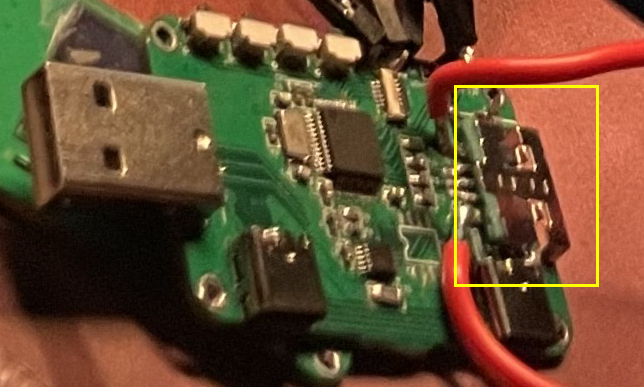
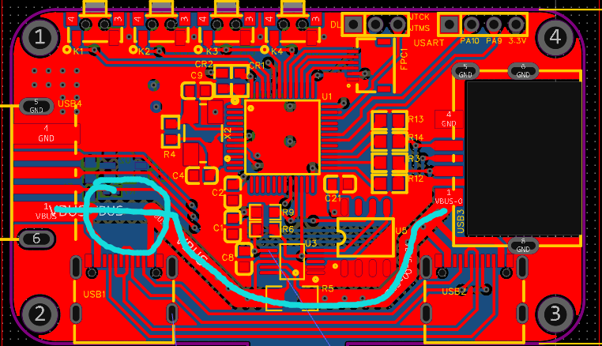

# 一、继OLED之后再一次心梗啊

当我感受了OLED让我心梗之后我就做好了再次心梗的准备，没想到啊，鑫直接给破防了，他妈的Type—A带破甲的吗？？！！

# 二、事情的前因后果

当我的毕设都基本成型之后，OELD！OK；INA226！也OK；QC2.0协议！也是OK的。OK啊我们直接上电好吧，直接插USB线接手机，看能不能充电就完事！

神奇的事情发生了，我插上USB之后，直接短路了，保险丝干烧了，我很纳闷：是因为QC协议是让充电头输出5V、2A的原因吗，电流太大了吗？可是INA226上面显示电流只有零点几A啊，是我INA出问题了？于是我又直接在Type—A的地方直接弄了输出的线，接了个铝壳电阻，并且串联一个电阻进去，确定是只有零点几A的电流！没问题啊😅

我说是不是我华为的充电线不支持诶（这种几率不大）我还是用我亲爱室友的USB口的线，OK没短路，然后我一接手机，也短路，我ST—Link直接短路闪烁，给我吓得。

# 三、问题分析ing🧐

现在就是我在Type—A的输出前接负载时没短路的，是完全没有一点点问题的，当我过了Type—A之后，就出现了短路，焯！难道是我的Type—A焊接反了？当初焊接的记忆再次重现在我脑海

由于板子上面Type—A是五个角的，所以我都是直接找厂家要的，市面上已经找不到五个口的Type—A母头（公头）了，所以厂家给我的跟我板子上面画的还是有点出入，当时焊接的时候我就换了个方向！🥴**此时鑫直接心梗了属于是！！！！**

如图所示，红色就是我直接拉出来的负载接线，Type—A就是反着焊接的！！！

# 四、解决最后的效果
我第二天去吹下来换了一个Type—A之后，一上电，一上手机，诶嘿！可以了🤑这问题又被我揪出来！**此时想重新开板子的心在此刻达到高潮**但是还是等最后都没问题了再优化一次板子吧，好在我画的板子没有什么大问题。

# 五、新的问题又发生了

1、但是插上手机之后，发现他的电流根本到不了2A，只有0.8A左右，这功率完全达不到啊，但是毕设的基本要求还是实现了，忽悠老师还是绰绰有余。😷但是，后面还是要解决吧

2、还有个问题就是：我发现我VBUS的线怕过不了3A电流，2A的电流时肯定可以过的，我没有开窗挂锡；并且输入的地方不是全连接;**之后下一版PCB这个地方需要特别的注意，还有就是Type—A的口可以换成4脚的，或者呢就把封装对应一下。**

