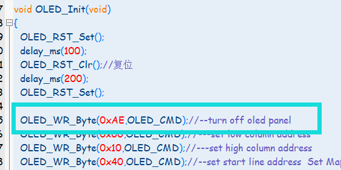
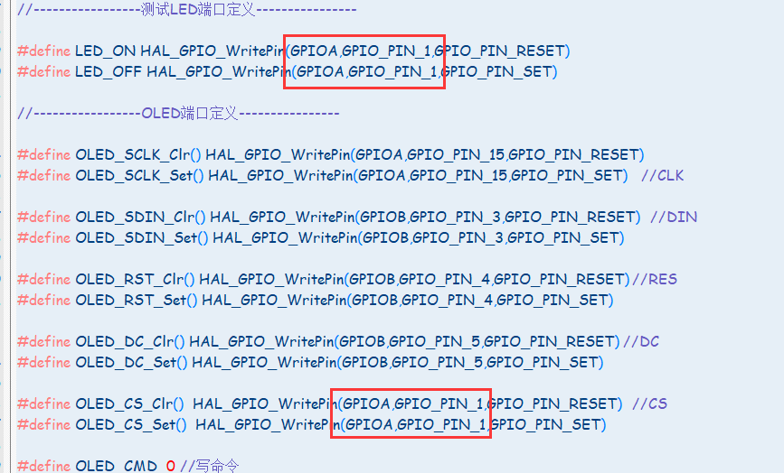

# 一、问题的发现

没事，经过上两次的心梗，我已经有心理准备了，当时毫无悬念的直接破防好叭！。这次居然是一个牛马端口、

问题的发现是我在调OLED的多级菜单的时候，发现的。肯定多级菜单得配合按键嘛，我把按键设置成单片机的外部中断模式。然后首先写得代码就是按键测试。按键按一下，串口打印对应的“KEY_OK”，**然后在初始化之前，他始终会先打印KEY3_OK还是在打印所有Init_OK的前面**诶，不是；你都没初始化完，就给我打印了？这么玄学

# 二、漫长的找问题（现在想来，我特么直接就应该Debug模式看程序怎么跑）

如下，便是主函数部分了，这会一点的人都知道咋可能是我说的那样：先KEY3_OK 再Init_OK ；为什么只有KEY3会打印，KEY3连接的是PB6这个口，一定就是这个口出事了。

OK，我都是配置的下降沿触发，那么只可能是他在刚刚某个地方，也就是程序刚刚启动的时候就被拉低了一次，导致他发了数据。

发了数据？？？🤔那我看看这个口！好啊！“USART1_TX”难道是他还能当串口用？？给发了？咋可能啊我都没配置成串口模式啊，绝对不对，但是我本着我画板子可能出问题的心理，还是着了一个1033C8T6测试了一下，结果可想而知，这个口是不会发数据的。

**那只有用一下我一直不想用的Debug了吧，因为我软件比较相对于来说比较弱，所以我很少用KEIL的Debug调试功能**

我来看看程序怎么跑的，好啊🤨！在`OLED_Init();`完事之后他就发数据了！我直接跳进去这个函数



又在这个地方完事之后就出事了....
最终：



原来是这个地方我没有改！图片上是改了的，这个地方我弄得PB6，CS这个口，OLED硬件直接接地了，我当初这个底层就没管他，结果又在这给我摆一道！，焯！**所以还是OLED的事！！OELD我与你不共戴天**

``` C
int main(void)
{

  HAL_Init();
  SystemClock_Config();
  delay_init();        //初始化延时函数
  MX_GPIO_Init();
  MX_TIM2_Init();
  MX_I2C2_Init();
  MX_USART1_UART_Init();
  mx_ina226_init();
  QC_DP_Init();
  QC_DM_Init();
//	HAL_TIM_Base_Start_IT(&htim1);
  HAL_TIM_Base_Start_IT(&htim2);
	/*OLED程序部分*/
  OLED_Init();
  OLED_ShowString(15,0,(uint8_t*)"Init_OK...",16);
  OLED_Refresh();
  delay_ms(2000);
  OLED_Clear();   //让OLED清理干净
  printf("Init_OK\r\n");
  QC2_adj(5);
  while (1)
  {
		get_power();
		printf("总线电压 = %f\r\n",ina226_data.voltageVal*0.001f);
		printf("电流 = %f\r\n",ina226_data.Shunt_Current*0.001f);
		printf("功率 = %f\r\n",ina226_data.Power_Val);
		printf("\r\n");
		delay_ms(500);

  }
}
//按键外部中断回调函数
void HAL_GPIO_EXTI_Callback(uint16_t GPIO_Pin)
{
	HAL_NVIC_DisableIRQ(EXTI9_5_IRQn);//消抖，关闭中断
	__HAL_TIM_ENABLE(&htim2);//启动定时器，消抖时间到后再开启中断
	if(GPIO_Pin==KEY0_Pin)
	{
		printf("KEY0_OK\r\n");
	}
	if(GPIO_Pin==KEY1_Pin)
	{
		printf("KEY1_OK\r\n");
	}
	if(GPIO_Pin==KEY2_Pin)
	{
		printf("KEY2_OK\r\n");
	}
	if(GPIO_Pin==KEY3_Pin)
	{
		printf("KEY3_OK\r\n");
	}
}
//tim中断回调函数
void HAL_TIM_PeriodElapsedCallback(TIM_HandleTypeDef *htim)
{
	if(htim == &htim2)
	{
		HAL_NVIC_EnableIRQ(EXTI9_5_IRQn);//消抖结束，开启中断
	}
}
```
# 三、总结

**我！就！应！该！直！接！Debug！**晚安家人们！