# 回忆当初有游戏搭子
## 大厅罚站
鼠鼠我呀，现在也成为那个登录游戏，在大厅罚站的人喽。
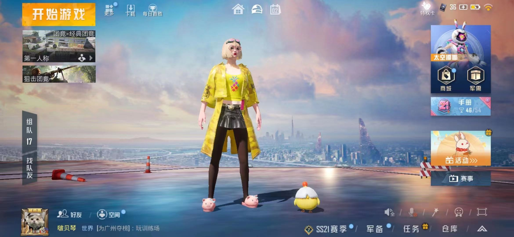

在大厅站很久都没有人来拉我打，点开好友列表也没游戏搭子了，渐渐的我开始打单四，独自一人打单四，我承认刚开始打的时候确实好玩，一个人打四个，那种激动的感觉，时间久了之后就会觉得孤单了，还是希望有个人在我身后，帮我补枪....可能因为鼠鼠没人陪，每次一打四打完之后都会开麦交流问候一下，鼠鼠单纯口嗨叭，或者是怎么呢？鼠鼠也不知道。
## 现在的我和以前的我们

现在他们都要么上班，要么有其他的游戏玩了，可是有谁跟鼠鼠一样捏，一直玩着这个游戏，一直不愿尝试新的游戏，总是在这方面守旧。

现在他们的号有时候我就拿来上上分，鼠鼠经过这么长时间的单四，上个分还是手拿把掐
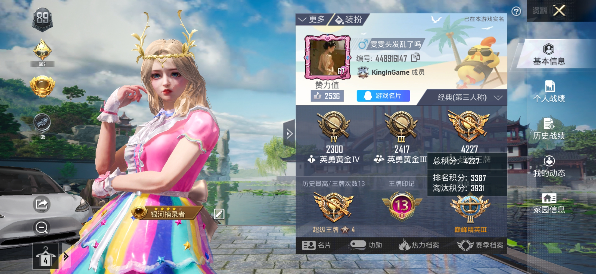
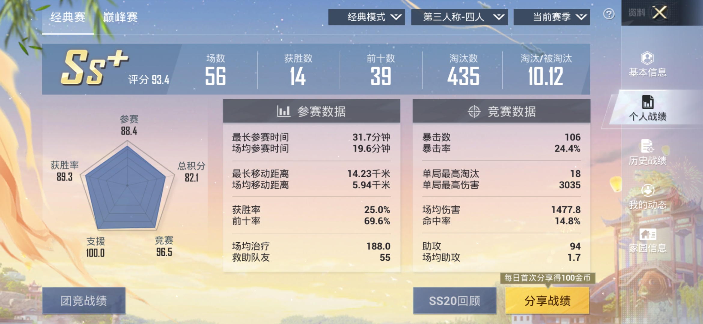  

**以前的我们**

想到22年刚过完年的那会，随便怎么都有四个人打。好在还有当初的点点滴滴的截图，用博客为载体，希望能一直记住：
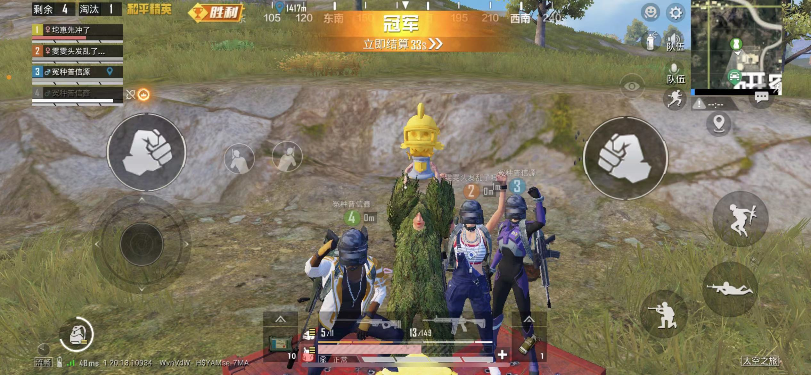 
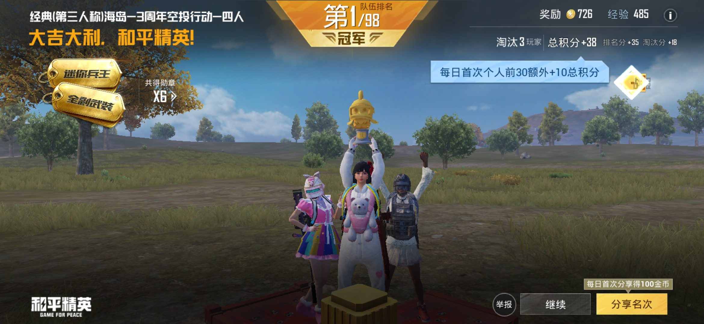 
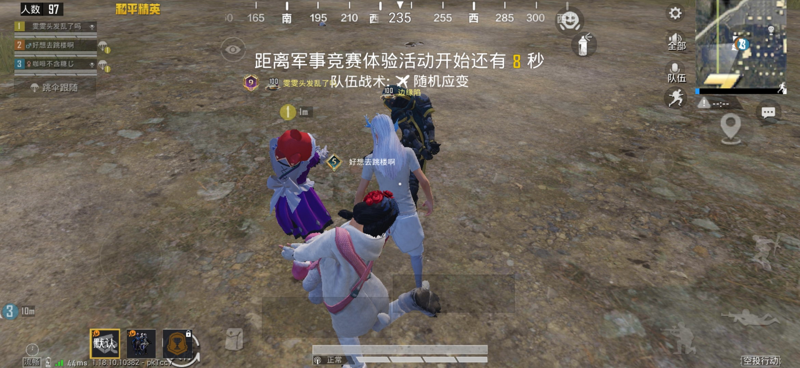 
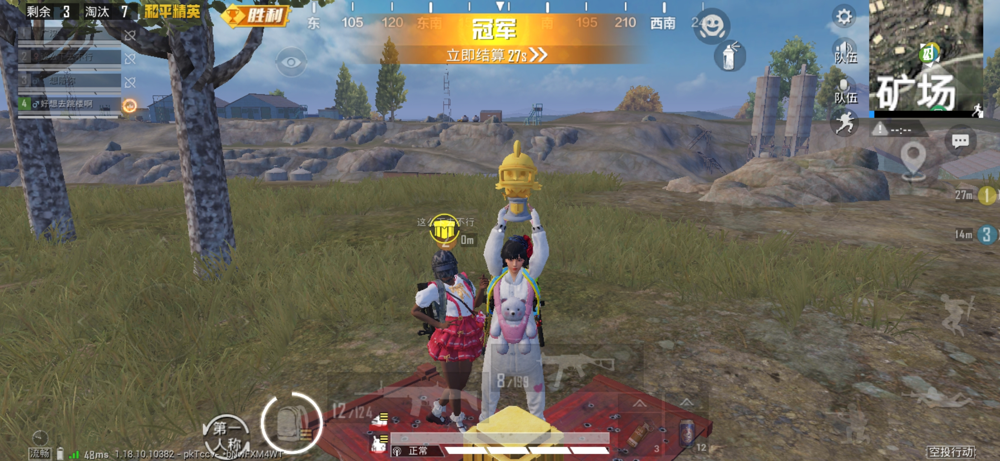 
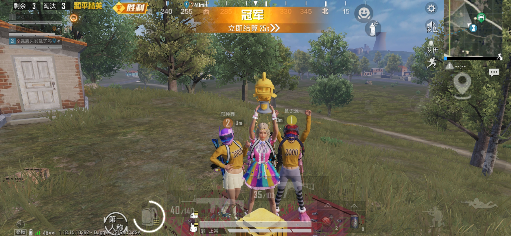 
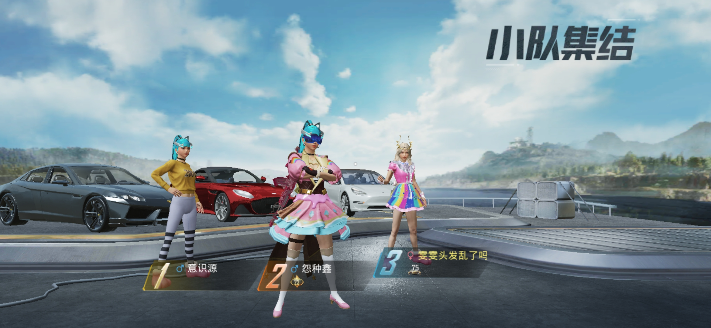
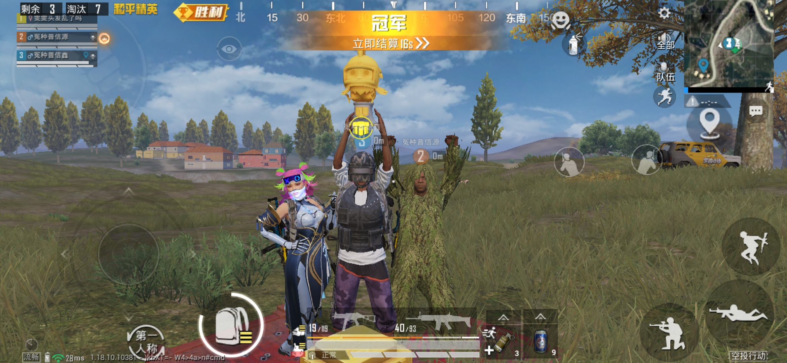
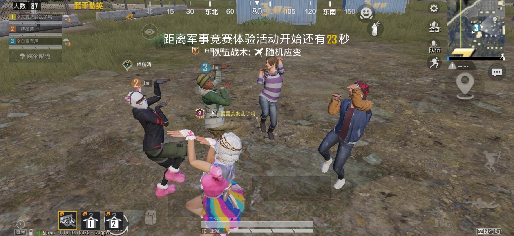
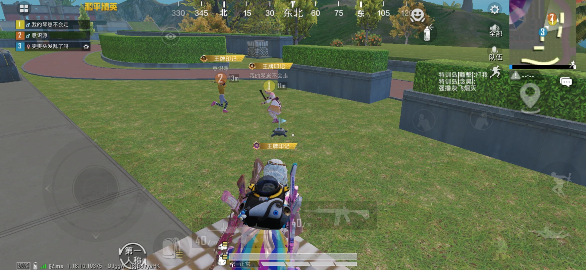    
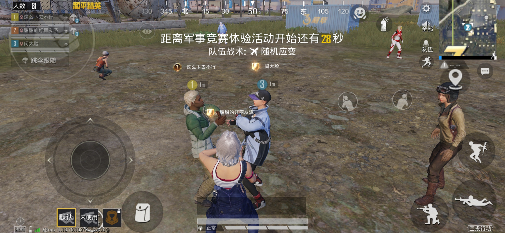 
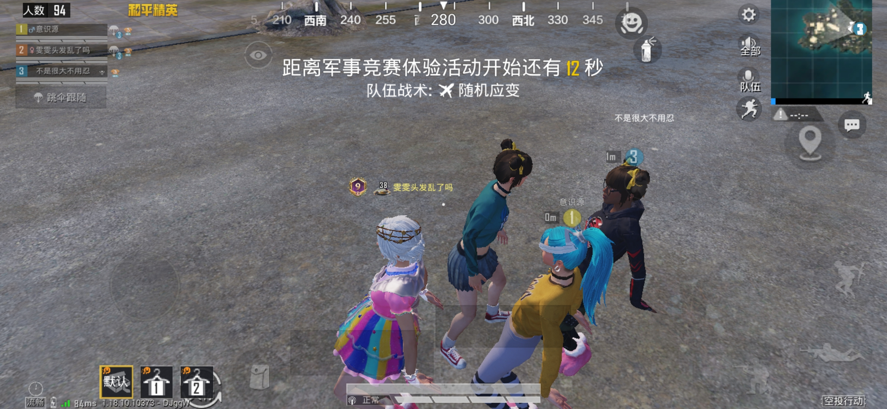
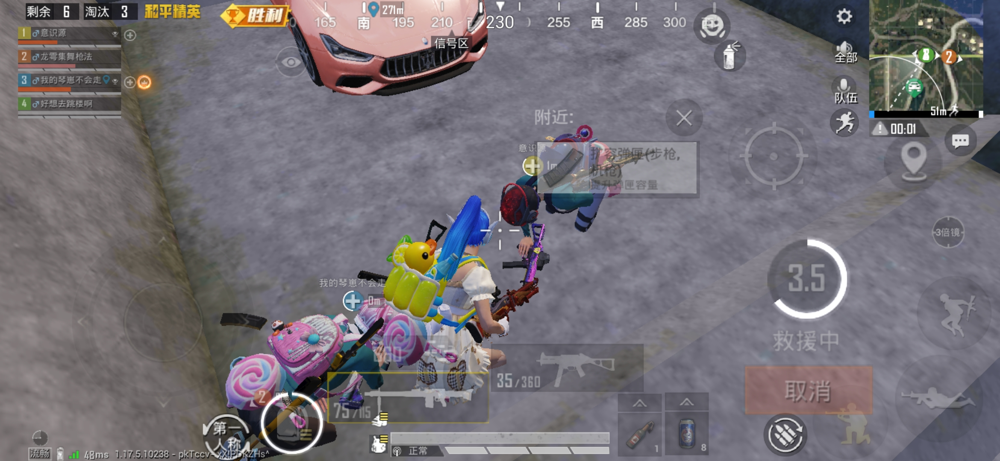  

**我变强了，确实也变得孤独了；游戏的最高配置确实是朋友。**以前我们输了都会开心，现在我赢了都会失望。