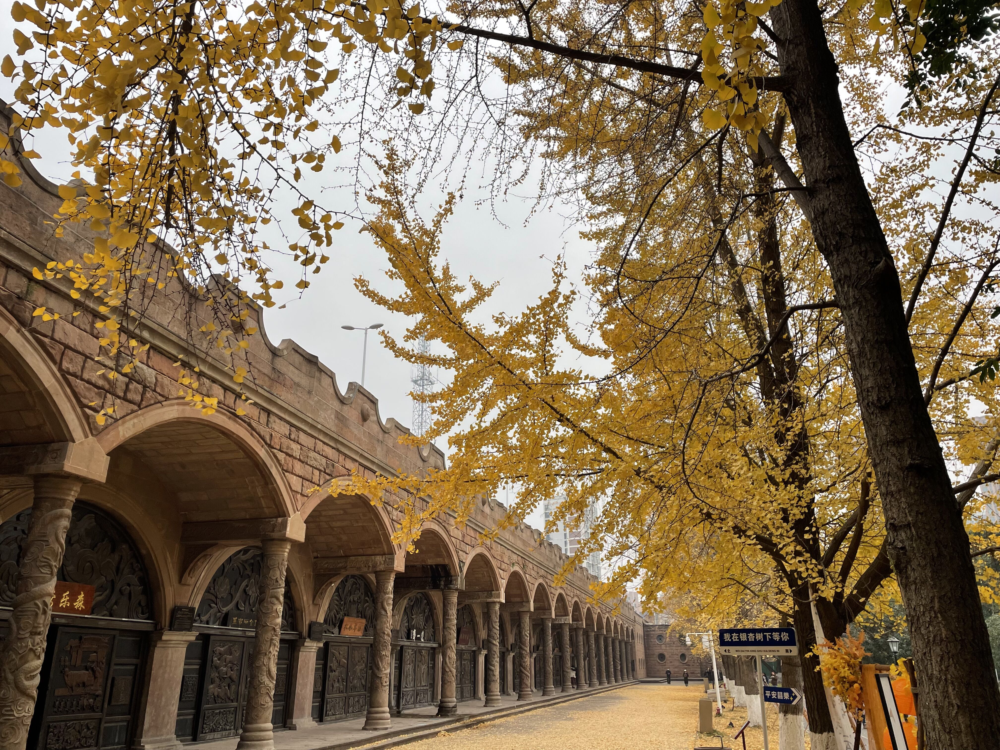

# 独居碎碎念

最近也慢慢习惯了这种生活，这真是一个奇妙的过程，我从我自己的睡眠质量我就能看出来，上周睡得非常的不习惯，这一周明显安稳了许多。不得不说时间还真是个庸医啊。也遇到了许多开心的瞬间，在此记录下来。

## “如果你很难过不如先收拾你的房间”

标题的歌词出自一首耳熟能详的网络流行歌：《**向云端**》，原本我的电脑书桌是在二楼的书房里面的，但是有一个非常致命的问题————冷。上楼之后是一个走廊，然后最里面才是我得书房，加上书房没有门，只有一个窗帘。拉上窗帘之后，窗帘的最下面有条缝会一直钻风进来，以至于我的脚会很冰，这不是我喜欢的，很冻，即使在这之前我都会泡脚。

最初我计划的把书桌电脑放在书房是因为我怕我把书桌放在寝室看到床之后就会躺过去，这不利于有时候我看书或者学习，但实际上我错了，我发现我在床上都不一定能睡着，更别说想躺过去了。【有被自己笑到】。

于是在周二的时候我洗了澡，我寻思要不把电脑搬到寝室吧，好歹我寝室也个门，而且也有空调，插孔也多。这个时候我还是挺纠结的，现在回想起来当时我到底在纠结什么呢，我这会坐在卧室里面写着博客，是真的很香啊~~！在我纠结的时候我给妈沫打了一通电话给她说我想搬过去，妈沫的建议是“想搬过去就搬过去，只要我舒服就行，她都支持我💖”

说干就干！

我寝室原本是有一个小电脑桌的，我把我自己的大书桌放过来之后，原本的电脑桌就横着了，我的书桌跟电脑桌就成一个“L”形状，电脑桌上就放我的书、平板还有插的花，还可以放一些零碎的小物件，比如零食！下面是完成之后的小窝展示：

在板凳下面个毯子，然后再把寝室门口下面的那个门缝用泡沫封起来，每天洗了澡或者泡了脚之后在寝室穿个毛拖鞋，诶，这个冬天大概就可以过去了吧。**或是配上甜品阅读，或是好友组队开黑，或是记录摘抄，或是带上耳机忘我的歌唱，又或是提笔画个插画，真的很喜欢这种————房间只有一个灯光，想干嘛干嘛，随时能听音乐，闲下来码码字，偶尔还能小酌一下，这一刻“天亮了时间就不属于我们”的话题具象化且形成了讨论的闭环，我想说的是现在的时间属于我自己，我喜欢这个氛围**

## 我开始偶尔嗜甜

一直都说吃甜的会让人心情愉悦，我想是的，不说吃了，看着就非常的让人心情愉悦了，更别说吃一口~这周买了两次甜品。定个小目标：吃遍爱达乐所有的甜品！（2/n）

这个甜品，看着下面那个巧克力味的蛋糕部分不是很好吃，但是入口很细腻，甜味也不重，但是一次吃一大口的话有点腻，所以还是建议配上草莓🍓还有少量奶油来食用。😋

这个长相像有点像热狗肠🌮的蛋糕【草莓配色】，吃起来有点硬，这个我觉得就没有上一个草莓蛋糕好吃，因为我不喜欢面包吃起来太硬，不得不承认爱达乐做蛋糕，虽然第一口吃着硬，但是它不干，这个让我很意外的。这个甜品我倒是觉得可以不用非要搭配着草莓一起吃，单独吃外面的部分都是可以的，不会腻，毕竟吃着第一感觉是干🙄

## 一个银的城市漫游

今天睡了懒觉起来就去城里面逛去了，去探索一下这个城市，其实还有一项必要事件是————Shopping！！！既然出都出来了，就去逛一下吧，我寻思去一下石刻公园的，正好也在洋洋百货附近，我打车直达洋洋百货的，y1s1，洋洋百货附近的吃的我没发现很多诶，去文庙广场都是那种地摊小吃，我！要！找！店！吃！我想起之前在这边来吃过塔斯汀，我就导航吃塔斯汀了，正好有团购有我想吃的汉堡。凤梨堡味道真不错，凤梨解腻。

吃完过后我就步行到了时刻公园，地图上看着挺大了，逛完就差不多四十分钟吧。**德阳我觉得神奇的地方在于，一个公园在两条公路中间，而且里面真的很安静，前一分钟还在听着呕哑嘲哳的汽车鸣笛声，后一分钟就在安静的公园里面了，是个逃离喧嚣的好去处。**顾名思义，石刻公园里面有许多的时刻建筑物，都栩栩如生，然后融合了一些市政建设的元素，还融入了党建的一些东西在里面，还是挺不错的。

里面有个地方是银杏林，一边是银杏另一边是石刻建筑，石刻充满岁月的气息跟当季金黄的银杏交相呼应，正巧当时我耳机里面还放着《Counter Attack Mankind》瞬间就有一种处在深秋的萧瑟落寞感。好在一边小孩的欢叫声把我拉了回来。小孩看着遍地的银杏叶甚是激动，今天虽然吹着风，来这看银杏拍照的人也不少。我拍照技术不是非常好，可这个景色确实还是不错：

逛完之后我就又自己走回洋洋百货那边了，我揣着几百的劵，我发现我不知道买啥，除了事先想好的一些生活用品外，一楼就是买衣服还有各种的打牌化妆品的，化妆品我一大老爷们也不用，大牌的衣服鞋子倒是可以买。我把一楼到四楼都逛了一圈，想着还是把要买的买了吧，于是！我就去下面的超市了，买了两瓶沐浴露，洗发水，身体乳，一些吃的，身体乳沐浴露给我妈沫整一瓶。这结账下来都三百多了，加上我一个人又快拿不下了，我就收手了，等29号有跨年折扣的时候再来吧。整好吧余下的用掉。

拿回来之后放在电脑旁边，看上去真不错。写着这篇博客，小酌下午买的酒，真是惬意。

# ♑

往后仍然岁月漫长，愿你千帆过尽，仍能守住内心的平静与祥和；少年与爱不老去，即使披荆斩棘，丢失鲜衣怒马。

我也是。