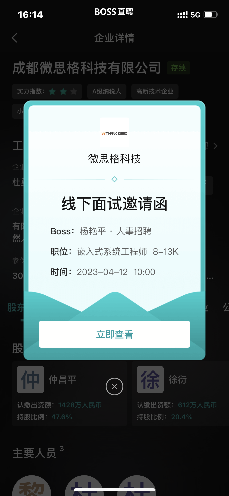
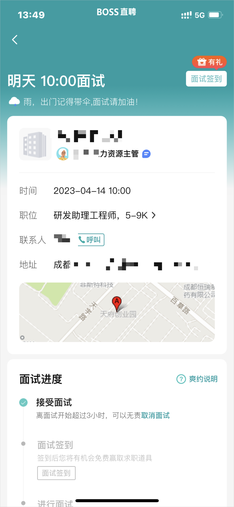
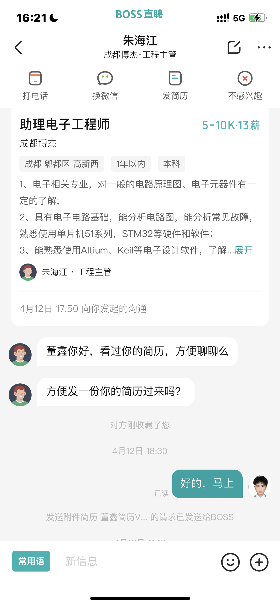
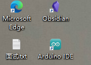
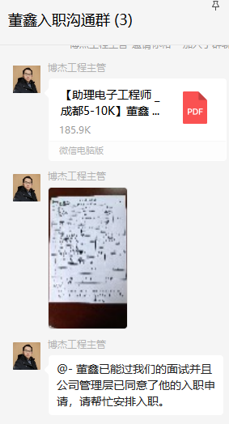

# 在我辞职后，又面临着新工作的寻找

其实这是不可避免的，临近毕业季，又加上会考虑到之后租房子，所以还是得早做打算吧。并且身边玩的比较好的几个都已经有班上了。

`游戏打不动了，找个班上吧....`

# 求职的方向

其实我一直都是想做硬件的，可是面试了很多家之后我还是想做硬件，虽然在面试的过程中，也面试过软件的职位，软件那边的技术对我说：你看画板子之后人工智能肯定会取代的，软件就是比较吃人自身的，所以软件是大方向。我知道他那个公司作为软件方面的，肯定觉得软件好喽。

我觉得吧，学软件没有成本的，就是纯写软件，网上开源的，B站上面教程，一抓一大把，还是得学硬件，从刚开始就是有成本的，比如买个开发板得花钱吧，再加上之后烧了的话，得自己找问题吧。而且回到软件技术给我说的硬件会被人工智能替代，其实不然，现在先替代的恐怕是软件吧，我记得之前不是有个什么电脑写程序的网站叫ChatGPT得嘛。

# 在一个风和日丽的一天，我打开了又打开了Boos

其实职位很多的，一抓一大把，我直接管他呢，直接私聊，对面的回了我就直接甩简历过去，肯定很多都是已读不回的。

这样持续了一两天之后，我发现有HR找我，主动跟我聊，我说是不是这些BOOS也有任务啊 哈哈哈哈，但是找我了就给她们一份简历咯。

# 第一家公司

这个公司是HR给我发消息，我一看职位：`嵌入式系统工程师`

我当时看到我都傻了诶，我本来没打算走软件的，这个确实是纯软，他直接邀请我面试的时候，我冒昧的问了她一句：我的简历你们技术那边看过吗？🤐；“都是给技术看过才会邀请你面试的”

## 面试过程

### 路上时光
因为原本跟我一起上班的同学去了RTT，也在天府几街那边，我就问他是不是离那边很近，他说确实，于是我就决定第二天跟他一起过去了。

当我们走进地铁的时候他说：一会换乘一号线的时候，最多等四趟，第五趟必须挤进去，不然我就要迟到了。我说：这成都早八一号线这么夸张吗？他说：一会你就会看到

当我们进二号线地铁的时候，就已经没位置了...地铁朝着成都二环以内进发，明显感受到了人越来越多，越来越挤。

`前方到站：天府广场，请换成地铁一号线的乘客，在本站下车`

下了地铁之后，人们都是在跑着，仿佛末日一般，当我们走下楼梯，我看到的是每个地铁门排满了队，一眼望去全是头。于是乎我们决定，反着座一站，再座回来...

OK，我们又座回来了啊，随着滴滴滴的声音，地铁门打开，一股强烈的推背感袭来，天，救命，挤进来很多人。

只能说人很多好吧，是真的多啊！！！！

### 开始面试

到了之后，嗯~~天府五街出来，这一片都是软件园，高楼大厦的，虽然太阳有点大，但是很凉快，都是树，绿化不错。我找到公司的大楼之后，远远我就看到门了，我说怎么这么多人在门口排着干啥啊，哦走进一看，原来等电梯，天，救命。好在那个公司在五楼，于是我就走楼梯上去的。

到了之后让我填了一张面试人员基本信息表，然后一个有四十岁的一个大叔走出来，他应该是技术吧。他了我基本的问题，什么通信驱动协议，什么IIC、SPI，区别在哪，说真的，我真的对这个工作只是试一试的态度，因为我软件都没怎么去深入的，他们想要会Linux的，我直接没接触过，鹅鹅鹅~~ 乐😶也是在这他说硬件会被人工智能取代，之后也就回家等通知喽，可想而知是没被录用，乐。

# 第二家公司

第二家公司嘛，是我投给他们的，但是这个HR的问题很要离谱，我都把简历给他了，他还问我学了些什么扒拉扒拉的，什么会焊接不，这两个问题都是可以理解的，他问：你想找个什么样的公司。啊？我想找贵公司这样的；我想找钱多事少的？我想找个白给我钱的公司？我改怎么回答...🤪

去面试之后，第一感觉哥们就很不舒服，去的时候是一个软件的面试我，他问我运放怎么接的，我给他说电压串联，他说错了，诶不是，电压（电流）串联（并联）是运放的四组态啊，可能他叫法不一样？然后问我一般的MOS怎么驱动的，我给他画了，他没说话...之后就是一个人事来面，给我说了一下公司的基本情况,然后我问题技术上面的事，他都不知道，唉，原本说技术今天忙得很，我就很纳闷，诶不是你们邀请我今天面试的吧，不是应该提前安排一下吗？？？！！！让我很不舒服，好歹哥们也是洗了头，认真前来的吧....

# 第三家公司

这一家也是我现在决定去的一家公司，从刚开始到最后决定入职，让我的感觉都很不错的。这个是技术主管聊我的，他说想了解一下我，然后还收藏了我，我发了简历过去，他也比较看得起我，所以久就先邀请了我电话面试的。

而且这个工作岗位我还是比较中意的`助理电子工程师`，我觉得现在我还是当个助理比较合适的，以为临近毕业进入社会职场，直接做工程师，或者是进入项目里面，我可能有点吃不消，作为一个助理也可以让我有时间适应职场，并且也利于学习。

## 电话面试

那天是周五，两点的时候我就等在电话面前，打过来是显示广州珠海的电话号码，我说难道不是本地人？接通之后发现确实啊，跟尚宇（友链里面有这个朋友）的口音有点相像，他的声音听着比较平和“ 你先说一个三到五分钟的自我介绍”纳尼！！！还好哥们打开电脑的，而且之前写过的一个自我介绍就在桌面

说时迟那时快啊，我直接点开对着念，给我整懵了一下子，好在一下子安全过去了，然后他就问了我简历上面的事，什么之前工作做了些啥，然后让我说一下我得的奖那些，我就一一介绍了，最后问我期望的薪资，我说我实习嘛，比BOOS上面写的低一点没事的，他也觉得OK的，能给到我，最后互加微信，并约了一下线下面试，在第二周周一（2023.4.17）

## 线下面试

我想着这个工作我还是比较心仪，所以看了下路线，就按照我之后上班通勤去的，骑车十公里，但是我还是选择骑行＋地铁的，也好为之后租房子选地方做准备。约的是十点半，我十点就到啦，打电话过去他说他在开会，我就在楼下大厅等了一下。

我上去之后他给我一个表，就面试基本信息表嘛，这个没啥，然后他说：主要线下面试一下呢就是想看看实际的能力，我等会给你一张原理图，你看看之后给我讲一下原理。我用他电脑看着，其实却是挺简单的，就32的主控，先从24V-5V；在从5V-3.3V，然后有个MAX的通信芯片，还整了个串口，然后后面两页原理图都大差不差的，就是有个光耦还接了个啥来驱动某个东西，这个当然都是查资料看到的，然后他说你说说光耦的驱动能力，我直接熟练的在立创找到数据手册，翻翻找找，还是看到了驱动电流时50mA；这个驱动电流我差点就没看到，还好我静下心分析了下。🧐这一个完成之后他说我会焊接吗？我说OK的，他就给我个废板子，说吧一个贴片的芯片移动到另一边，热风枪，焊台我都可以用，好在他有焊锡膏，吹下来之后还是很轻松就完事了。唯一让我有点难受就是他焊笔的头子太粗了点，emmm不是非常的美丽。最后他说挑战一下？我说挑战啥，他给我了一个成平，然后一个半成品，说对照成平把没焊接的焊了，我说行啊，大概看了下就是几个直插的，唯一我没做好的就是那个MOS，他装散热片的，我是先焊接之后装散热片，就不是很好装，没装多规整。

最后他说我能力还是非常不错的，问我什么时候可以入职，我回应道这周都可以，他说薪资这方面都是可以给到我我想的，入职需要去一下崇州那边，因为成都就是技术办公室，到时候给我整个群，准备下需要的资料那些就完事了。

# 总结

最近其实睡眠很不好的，总是睡得很浅，可能是压力比较大吧。`“现在的所有焦虑都来自于自己没有稳定的经济收入但是又会有大把大把的支出”` 而且很不想毕业，转眼间，我就真的是一个大人了，真的应该为自己未来的生活奋斗了，这就是时间慢慢推着我们走路的感觉，等之后我大学寝室被推开的时候，又会是两个男孩的青春，他们也许会跟我一样的专业，也可能不会；也许会浑浑噩噩的过四年，也许会忙忙碌碌有目标的过完四年...

加油，少年