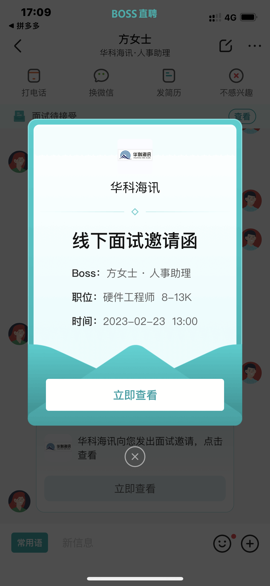
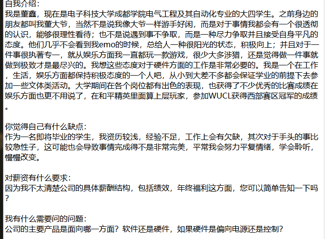
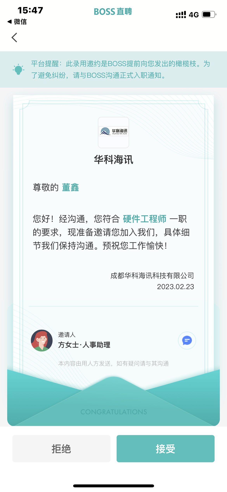

# 面试起因

由于我现在实习这个地方，怎么说呢，平时轻松，但是上边催起来就很烦，真的就是催命，然后过年也在网上上班，没想到，给我发了1K的巨资给我，我一看我是完全拿着烫手的。那就跑路了叭。

# 过程

我在BOOS上边看的，因为这个最早我就是看这个招聘网的，然后软件基本操作我也知道，然后我把自己简历又再完善了一下，就找了个离学校比较近的公司吧：**成都华科海迅科技有限公司**

在BOOS上跟HR简单聊了一下的，然后我就把我简历发过去了，她说简历筛选之后一周内联系我。

等待ing....

在那天的下午，我刚解开裤裤准备嘘嘘...

“请问是董鑫吗？现在方便说话吗？”

“是的”

“之前你在给华科海迅投了一份简历你还有印象吗？”

“有的，你说”“就是这边你通过了我们的简历筛选，想邀请你于本周四下午一点来本公司面试，请问你有空吗？”

“周四下午是吧，好的好的，谢谢”

“稍后我们会在Boss上面发一个面试邀请函，你注意查收一下”

# 准备
因为我是面试的硬件工程师，然后还去把硬件的基础知识看了一下，什么Buck、Boost、Buck-Boost、反激电路的拓扑都看了一下，然后还有就是运放的基本知识，我也是第一次面试，压根不知道什么情况嘛。就只有想到的都看一下，然后问了一下我的好兄弟尚宇：他给我提了几个问题，我有些还是不知道，偏向基础的嘛，比如多少兆可以叫高速电路.....

面试问题的解决，我在小红书上面查了一下，什么基本自我介绍啊，还有一些常见问题：

# 🙊终于迎来了我人生的第一次面试：23-2-23
我早上睡了起来，洗了澡，洗了个头，十一点就去吃了饭（🙊怎么有点像是去约会啊！！）然后选了一个网上推荐的技术人员穿搭，还是很合适的。在此：**💗特别感谢我的啵贝琴给我买的衣服，让我穿搭变好了**

骑车中...🚴
## 试卷面试
到公司之后我很有礼貌的，“你好我是来面试的，我叫董鑫”，然后先给我一份试卷，还有一个性格测试的卷子。嚯哟！做题啊，我但是是害怕的，我也知道会有这个环节，

第一个题就是一个三极管实现取反电路，这个毫无难度，第二个题是说什么DMA的我不会，还有就是说一下开关电源和线性电源的应用区别，这个我之前了解过，还是基本完成了；还有个是给了几款FPGA的型号，让我说说有什么共同的资源，我直接一通乱写，啊哈哈哈（疯）；还有就是有个时钟芯片的数据手册，让我说我能得出什么信息，就是说是读数据手册，还是轻松的；最后一个题是时序电路图，我完全是懵了啊，并不会啊哈哈哈。

## HR以及技术工的面试
有一个是HR，还有一个是技术部门的，还有一个应该是HR的助理，助理先让我自我介绍，我很轻松的说了一下；然后技术工倒是问了写问题，说我之前做过膝关节的产品，让我简单说一下，然后膝关节用的NRF52832这一款，让我说说他有什么资源，还说我画板子画过那些，说说怎么画出来的什么的；HR问得便是我高考多少分（我震惊😮）然后甚至问我家在哪，父母对我的工作态度等等...还让我用三个词语概括一下自己，我随便说了三个；然后问我薪资觉得是多少，我直接：我不知道薪酬体系，所以麻烦给我讲一下，最后我说4K-5K吧，因我也在实习吧。最后到我提问，我就说公司面向哪些方面产品（💥这个问题至关重要，为之后我跟老总谈的时候起大作用），还有就是我工作之后有人带什么的。

“面试结束，面试结果在一周内通知你哦！”

## boss面试😨

我刚走到电梯诶！“董鑫，董鑫，你再回来一下，我们某总想跟你再谈一下”

（不是哥们儿，这就老总面试啊，我焯）

老总也是很随和的吧，更多来说有点不显山露水的感觉。

“你对硬件了解得如何”、“你觉得自己做硬件的优势在哪”、“你说说常用单片机，介绍一下”、“说说IIC或者串口，CAN接口”“我看你打过游戏比赛，现在能打到哪种程度”（这个也是可以问的吗！😉这我可就来劲了）“你对我们公司了解多少”（蛙趣，还好刚刚面试我问了一下公司主要面向的产品！我太机制辣！🤭）

以上就是他的一些问题，总的来说吧，问得确实比较深层，让我有时候有些措手不及，但是勉强还是能应付过去。

# 事后
我回到学校就直接开启游戏timing了，我回来是两点左右吧，然后四点左右，我刚好落地成盒一把，然后HR给我打电话：

“请问是董鑫吗，打电话就是通知你通过了我们的面试，稍后会发一份Offer给你，你看你接受我们的offer吗？”

（我草？？？！！这么快我直接亚麻呆住了，不是说一周之内给答复吗！诶你就说是不是一周之内吧）

“容我考虑下好吗？明中午之前给你答复”

然后BOOS就收到了

那就冲冲冲！准备这边的上班吧！芜湖！！！~~~

# 总结
第一次面试给我的感觉是：不是很紧张吧，怎么说呢，都说拿奖有用也没用，工作也是看能力，但是简历上面的奖就是敲门砖，得“简历面试”过了，我人才能去面试，确实是这个道理，我现在是明白了，回头看看，大学“混”的奖也是有好处的！还有就是说话方式太重要了，“我涉猎很广，可能就导致硬件方面不是很深，这是我的缺点”再举个例子涉猎哪些方面，承认自己实习生确实没有他们那么专业，但是我们也不弱，至少有精力去学！

**加油！🐱‍🏍🐱‍🏍🐱‍🏍🐱‍🏍🐱‍🏍🐱‍🏍**
