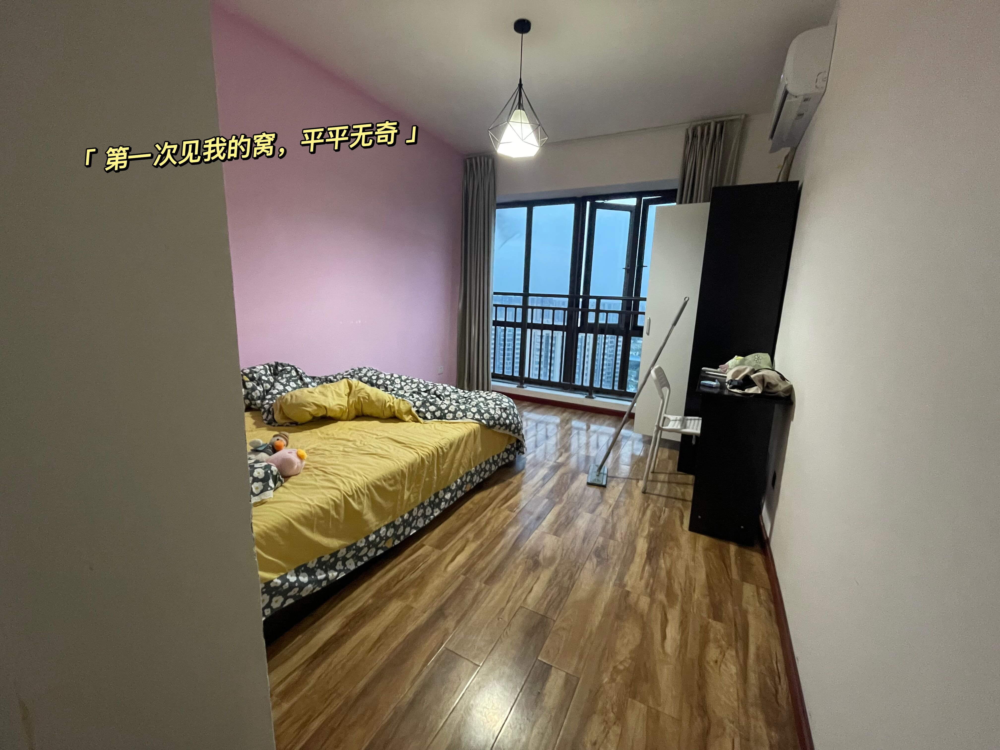
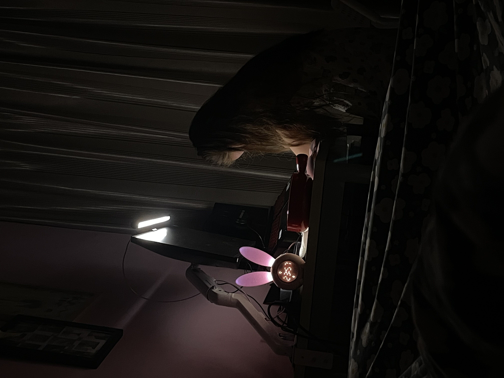
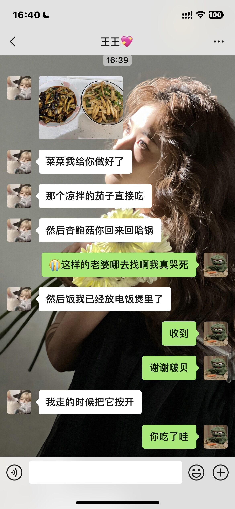
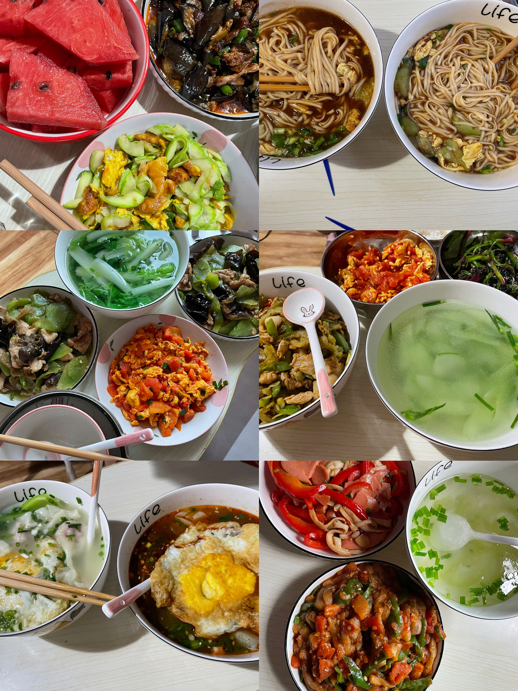
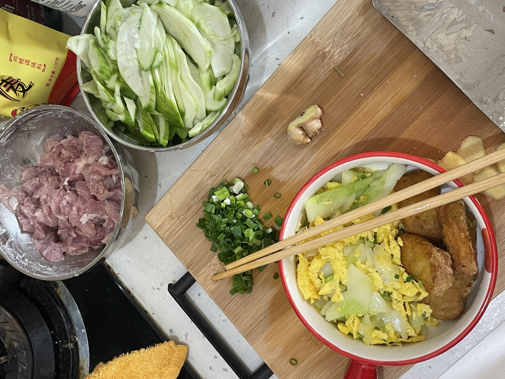

<!--

# 找到它

是因为当时五月份我面临找工作了，并且我都已经在上班了。最重要的一点还是**如果等到六月份，毕业季得房租应该会比较贵，且不好找，所以就决定提前下手**

原本打算了和朋友合租套二的，但是琴想有独卫，但是又说她没怎么住，所以还是看我的意愿。琴的社交又比较广，所以也看了几个中介，所以五一放假五天，后面两天我就打算去线下看房。

首先我去晨风村看了看，但是进去之后看到，里面的房子是很便宜，一个月才600，但是环境就真不是我想的那样美好，所以还是排除了。然后去琴了解到的中介那看套一，一个月差不多1500吧，挺小的一房子，但是就是有点贵，暂时考虑一下。**跟琴最终的理想的还是租一个套一，就是有独卫，但是厨房洗衣机共用。**

在五月四号的下午，我们看到了一家，应该是一个租房公司的房源，就在学校附近，离地铁站也近，还是主卧，带空调，一个月900，水气他们包了，我们就只需要给电费。这个不错啊，我直接马上去看房，然后进去看了一下：主卧在最里面，然后次卧有三间，其实是两间的，只是客厅被隔开，弄成了一个卧室。大小也合适，我录了像给琴看看。

# 拿下它

经过跟琴的商量，决定就这个了，直接签合同啦！900还是算便宜，也在我的预设以内。于是乎我们当天下午就签订了，傍晚那个时候琴跟我就去打扫了一下房间，这是我们第一次见到它的样子：

感觉真不错啊，我们的规划是：**靠窗的地方我放一个桌子放我的电脑和显示器，然后地上弄点地毯，进门就脱鞋子，右边靠墙的地方就弄个衣架子挂衣服，那个小桌子就给琴放她的化妆品。**

在之后的一周之内，我们就用我们存下的钱，琴买了一些家里面需要的东西。

--------------------------------------分割线-----------------------------------------------

（写到上面的时候，我添加图片的时候看到了我之前保存了这个文档想记录的东西，然后寻找路径去看，发现搬家的事我已经记录了，既然如此那么我就在下文记录下我们同居生活叭）

# 琴还没放假篇

五六月琴还没放假，还要上课，所以她那会一般就是周二，周五过来，周六周天也在，所以很多时候我都是晚上自己吃，虽然有厨房，但是每天下班回来都有点累了，就在楼下随便吃点就完事了。只有她过来的时候，我们煮点饺子抄手小吃来吃，因为那个时候我们的餐具也不是非常的齐全，很多时候都是用同居的哥们的。

总之啊，琴没放假的时候，我一个人还是很随意的，也没那么多的乐趣。

# 琴放假篇

我毕业之后，应该是六月底左右，她也进入了考试周，她就把书拿到这边来复习了，那个时候，我爸妈也给我寄了些锅碗瓢盆过来，我们能够“自力更生”的装备才算比较齐全，然后也添置了些许的调料，我们就可以正式开始做饭吃噜。

上面是琴那天很晚了还在我的电脑桌那边复习，我偷偷拍下来的，啊哈哈哈可别告诉她。有一说一我们一起布置的家还是很温馨的，我电脑桌布置的也不错，游戏办公都很舒适，特别是在618买了个电脑支架，那叫一个爽捏。

之后他放假，我每天上班，回来就能吃到热乎乎的饭菜，这的是非常的美妙啦。他们的室友调侃她是保姆，啊哈哈哈😽。

- 特别是有一天
  那天她晚上有个拍摄，所以四点过出门嘛，我六点过才回家，没想到她四点给我发消息说菜已经给我弄好了，热一下就能吃，饭在电饭煲里面煮着（但是忘记按煮饭按钮了，哈哈）这样的好老婆上哪去找，打着探照灯都找不到属于是！
  

  《   真的家人们谁懂啊，我哭死：)  》

然后就是我们一起吃的很多很多的饭菜以及有一次我们一起做饭~~🙊：

- 当然还有就是每天晚上睡觉时光喽，夏天了逐渐升温了，晚上洗了澡我们都会开空调，我习惯性的在我电脑桌这坐着玩会，写会笔记，学习一会什么的，一般到十一点左右我再上床准备睡觉；但是琴不一样啊，她一般就是躺在床上玩（2023-7-14-22：7此时我正在写这段话，她在床上四仰八叉，哦不对，反正就是舒舒服服躺着啊哈哈怪可爱的，穿个小内内🙊🙈）OK，然后我十一点上床的时候，她真的很暖和很暖和，就是个暖宝宝一样，舒服的嘞，“你有过人的体温吗！🤗🤗🤗🤗🤗”“ohhh~~胖宝宝胖宝宝，哈基米哈基米~”

# 💖
总之跟琴住在一起还是很开心的，每天回家都很安心，吃了饭之后暑气退去，下楼吹吹风，真是惬意啊；刚开始的时候睡眠会有点不好，有点不习惯的样子，现在睡得可安心了，那叫一个安稳得嘞！

不说了，我要上去抱着胖宝宝去了~💨

-->