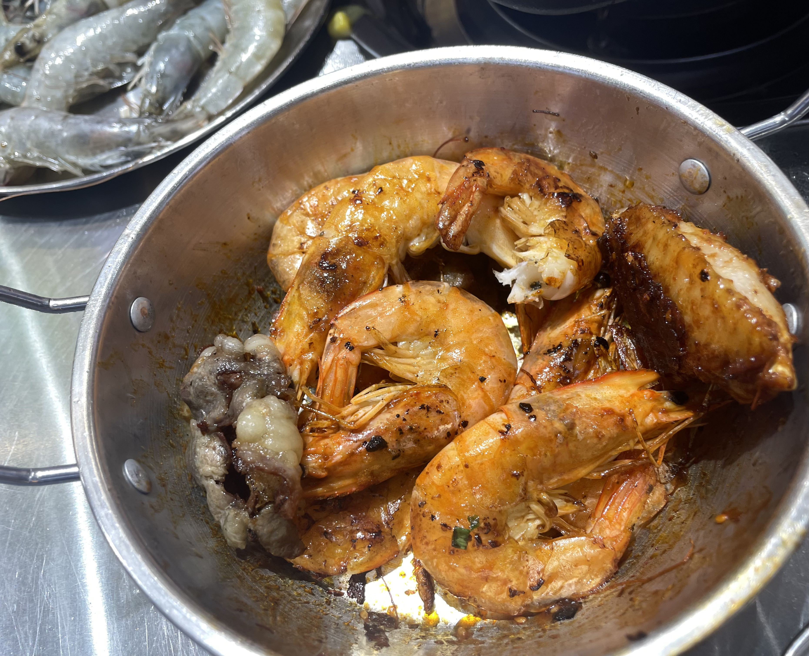
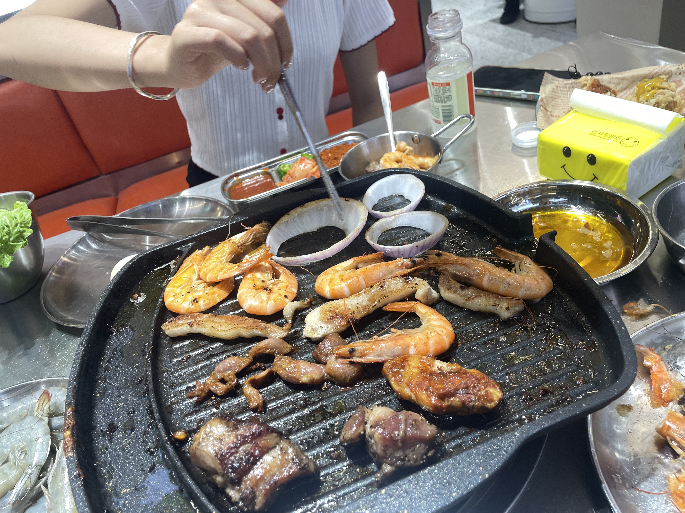
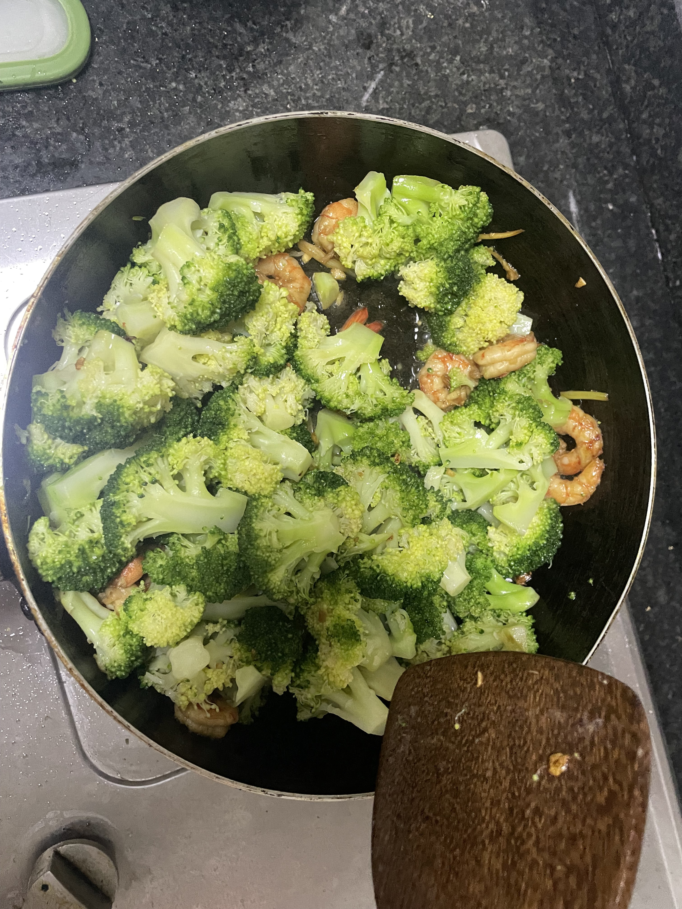
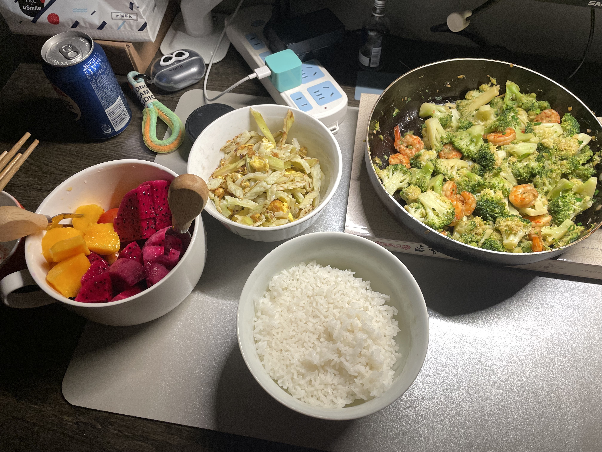
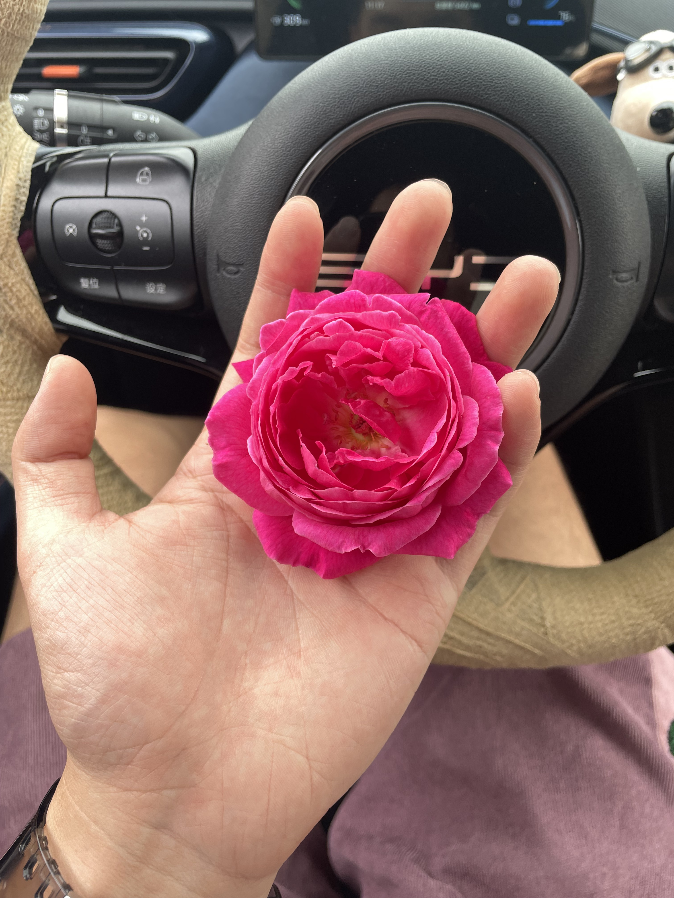
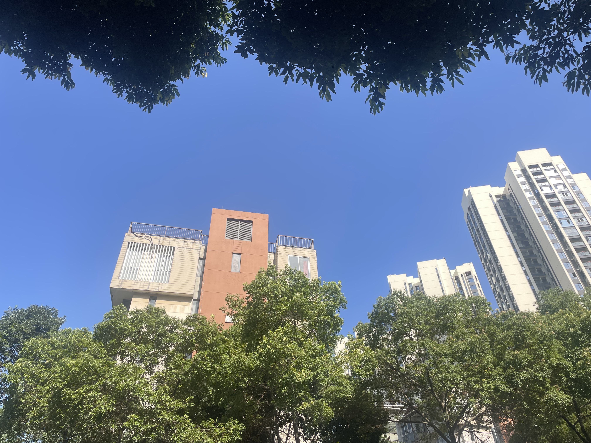

# -❄-

## ·

在2024_7_27的博客里面我写了她嘟嘟囔囔地看一家火锅（其实是烤肉）周四的傍晚我俩就去吃了，那天是下雨天，我们去得比较早，店里人很少，是一家自助，她以前吃过，到了之后就像是回到家一样：我点了火鸡面，炸鸡，凉面，你要吃什么再加，这三个很好吃我就先点，她这的牛肉很不错...她说着，眼里好像在发光。

点菜的时候拿了好多虾，她是真的好喜欢吃虾。我也很自觉地剥了全部的虾，先烤了再剥的虾真的很难剥，以至于第二盘我先剥好再烤，轻松许多。不好剥的虾，对于我这个满手油的人来说，抱着啃是最好的选择，也很满足。

吃了回家的路上，我车里面随机放了一首歌叫《你怎么蠢到我喜欢你都不知道》。

“你怎么蠢到我喜欢你都不知道”我重复了一遍歌词。

“嗯？你才蠢吧”她反驳了回来，很有自信。

我顿住了，嘶~好像是我蠢点。毕竟之前我喜欢她的时候她也喜欢我，我蠢到没看出来嘛，我又在车上笑了。

## ·

昨天周六在家待着，不想吃外卖了，就说自己在家做，我住了快一年的房子终于可以开火了，这是个重大的事啊，前几天我就下单了菜板，昨天去超市买菜的时候也添置了一些做菜需要的调料。决定做个·苦瓜炒蛋·、·西蓝花炒虾仁·

买了菜回来我俩就开始捯饬，以前她一直说自己不弄菜的，没想到啊，她回来就切菜，什么的，思路清晰啊！“你西蓝花这么大可以不”“葱子要长截的还是切细”“姜是丝还是片”...不是，你这么整啊，好好好，有人带了，这把稳了。

对于吃我是没什么讲究，做菜对我来说更是陌生，能吃就行，如果说吃货有段位，那我可能呢就算白银玩家，还是绝世白银。

最后经过一顿捯饬，得到了下面的：

最后附加我接她她采的家里的花

还有今天上午十点的蓝色天空

