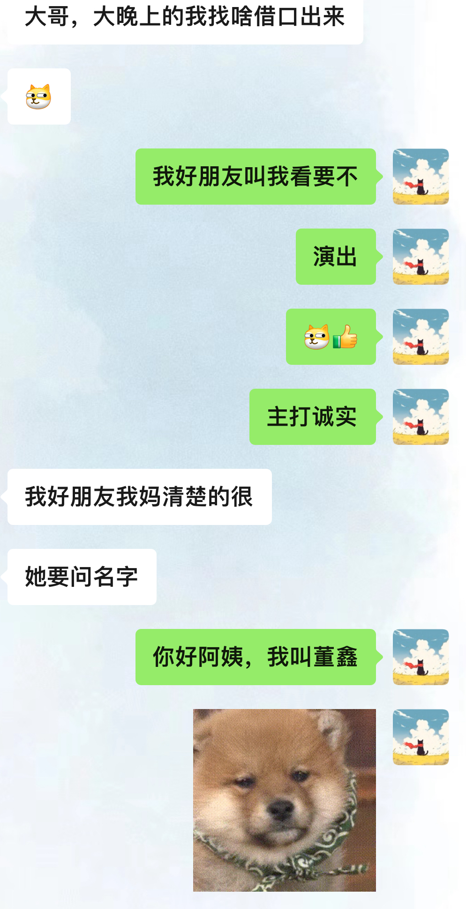

# 1

##   梦境、幻境

2024-2-15晚上，我梦到她，我梦到我们又回到了学生时代（不知道是大学还是高中，但是我俩还是像现在有手机）。晚课下课后，我等她回寝室，那会教室都没有几个同学，她在教室的前面，我在教室后面靠近插孔的位置。

“董鑫，帮我扯一下我台灯”

扯完台灯之后，我就和她一起在学校走廊上，她说她脸还是有点肿，（现实中：因为那天晚上她遇到了一些不开心的事，然后睡得很迟，第二天她就说脸上有点肿）我左手伸过去轻轻捧着她右边脸，嗯~是有一丢丢，我又伸出另一只手过去捧着她另一边脸，我脑子一热猛的亲了过去。她尖叫着笑起来。走了几步之后她笑着说:“拒绝你十几次了，你还这样”。

“我有预感我以后成为明星，到时候你是不是就说：拒绝我这个明星十几次，哈哈哈哈~”

到她宿舍门口了，我摸着她的头，她就那样对我笑着。她转身说走了，我俩互道晚安。其实她走进宿舍转角的时候我发现是梦。

“快抱一个”

“为什么？”

“因为我快要醒了”

她转过去之后，我就醒了，周围是万籁俱寂的黑暗，只有我显示器的电源灯在一闪一闪的，再次提醒那是梦，我仍然沉浸在刚刚的梦里，我顺着枕头摸过去，握住手机冰冷的外壳。可是没有任何未读的消息，冷寂的屏幕上只有昨晚互道的晚安。

人沉浸在爱里就会变成矫情的模样。矫情地去相信誓言，用华丽的辞藻去堆砌爱的箴言，以为一个对视的眼神能触碰永恒和奇迹。

所以啊，年少终究有意难平，少年也终会被一不得之物困住。

## 现实、真实

其实我觉得去再联系她是因为之前也是连着一周，隔三差五的梦到她，梦的内容我已经记不真切了，就这样偶尔有一句每一句的唠一下，我工作空了也就聊一下，分享一下我的日常。

最近回了趟老家，带了点土特产说带给她，其实我的小心思也是想见见她，时别五年没见了吧。还说到看电影的事，也说找个时间看看春节档电影，但是她最近总是有事，我也要值班，时间就不是很合适。

今天她说她出门了，早上我就问她：

X1n_bb.:
你出门了哦？

冰糖雪梨:
嗯嗯

X1n_bb.:
继续昨天的逛街吗？

冰糖雪梨:
对

X1n_bb.:
带我一个

冰糖雪梨:
明天

冰糖雪梨:
我还不想英年早逝，我爸妈都在。

到此我也就没有再问了，我寻思她在逛街，就懒得打扰了。

到了晚上我也忙完了，我决定再问问她这个事：

X1n_bb.:
明有安排不？

冰糖雪梨:
没

X1n_bb.:
走，看电影

冰糖雪梨:
行

冰糖雪梨:
只要不是逛街就行，还有爬山，也不行

X1n_bb.:
不逛，逛不了一点

X1n_bb.:
不过，洋洋百货可以，你有要买的不，比如零食，就洋洋百货那一栋楼都行

冰糖雪梨:
到时候再说吧，看明天状态。

## 此刻需要旁白

很久很久很久都没有这种感受了，通俗来说就是：小鹿乱撞吧。这么形容还挺贴切。我会去期待跟一个人见面，去跟一个自己心心念念的，曾经错过的意难平见面，说实话对于现在我来说，是有点紧张的，我相信自己已经今非昔比，不论是待人接物，言行举止，可我还是会有点紧张，我会害怕自己跟他交谈会做不好，过马路拉着她合不合适，晚上吃什么，在哪吃，我送她回家是否妥当.....

原来，去追一个人，感觉是这样啊。

# 2

**TIPS：该记录于2024-2-28，此时正跟Crush聊天，然后心情大好，写一下博客。**

那天之后，第二天我们一起看了电影——《第二十条》。我说去接她，她说不用，那我就在电影院等她吧。

我早早的洗过头发，把自己收拾好，试了好久的衣服，我想怎么穿合适，我又害怕我冷，但是穿多了我又怕显得臃肿，我脱了又穿，穿了又脱，在自己房间里笨拙得像一个小孩子，不知不觉，衣柜的衣服全都被我拿出来了，床上，地毯上扔的到处都是，好在，上天眷顾，我还是穿了一套我舒服的。

中午我并没有什么胃口，一两的米线我都没吃完，我想大概是有些紧张吧。收拾出门我开上我的车，那个时候才十二点过一点，因为我没有去过那个电影院，我得找位置停车，然后找到怎么上去，以便之后可以可以接到她直接到位，而不是让她跟我一起找。我把车窗摇下来一半，听着我最爱听的歌，我感觉风都是甜的，而且阳光正好。

“喝奶茶瑞纳冰么？”我到了之后停好车找电影院的时候她发来消息。

“可以耶”

“OK[可爱表情包]”

当我在电影院等她的时候，她自己就上来了，我还说下去接的，真是机智诶。

她穿着一件粉色的大衣，显得很温柔，没有戴眼镜，跟高中分别时我脑海中记忆的样子又有些不一样；下面穿着一双靴子，让她本温柔的感觉又给我一点距离感。其实在常人看来，穿搭很中规中矩，可是我却有很多感受。

她走过来，把奶茶瑞纳冰从口袋拿出来给我，我插上吸管喝了一口。

“诶，不是咖啡耶？”

“昂，这本来就不是咖啡。”

“你喝的什么？”

“咖啡，记不得名字了。”

这段对话当时很稀疏平常，都是晚上结束之后，我回到家，才猛然想起，之前给她说过我喝咖啡不耐受，而且晚上睡不着，她没有给我买咖啡。

我们进入影院找到座位坐下，唯一不舒服的就是还是买的有点靠前了，我是脖子有点不舒服，她说还行，这个位置我对自己的安排不是很满意。电影开始了...

看完电影其实才五点过，我计划的是我们一起吃个饭再回，奈何最后我俩都不饿，在文庙广场逛了许久也没有想到吃啥，她也不是很想吃。文庙广场逛的时候确实很无聊，于是我就去抓娃娃了，四十个币，一波操作下来，抓了一个，好在是个很可爱的娃娃，我分给她几个币，她摇了摇头。我寻思她在旁边看着也挺尴尬的，就问她：书记你说哪个娃娃容易抓起来。她也思考一下给我指一指。还记得高考前一晚，我们去抓娃娃，她抓到一个胡萝卜玩偶，然后送给了我，那个胡萝卜在我上大学时，在我床头陪了我好久。

后面差不多我就开车送她回家，车上她爸爸打来电话问她在哪，好像说是要一起去逛超市什么的巴拉巴拉，具体我也记不得了，我只知道那个时候我跟他在谋划她在哪下车，不让她爸看见，还有就怎么给她爸解释，后面就是想到什么聊什么，一路聊到了她家附近，她说在这下车。

“把这个玩偶拿着，回家好解释。”

“快点！拿着”

她拿着那个玩偶，下车了。

我怎么有种，高中谈恋爱没抓住的感觉呢~回到家之后我也是后知后觉，她穿的是我喜欢的粉色，我想应该是巧合吧....

# 3

**2024-2-24 元宵节**

元宵节正好我又要加班，但是我不是很忙，晚上在机缘巧合下有两张在德阳演艺中心的演出门票，是关于古筝的，从晚上七点半开始到八点四十左右结束。好在她给我面子，还是来啦。

其实我还是六点就出门了，我到了她家附近之后给她说：不着急慢慢来，我在你家附近，你到时候给我个定位，应该五分钟之内就可以到，然后刺激的来了：

“我妈喊我发电话号码”

“我给她说是女的”

“车牌多少？我给她说的打的车”

我把车牌发给她，她给我发了个定位。我点开位置导航过去了。

“我爸要等我上车，我回家要凉了[我回家要凉]（裂开.jpg）”

当我开过去之后，我发现，她老爹就在她旁边等着的，但是她老爹还是面带笑容，像是在吃瓜一样，我故作镇定，等她上车之后，我直接油门摁得很重，赶快跑吧！！！我的妈呀，我是害怕了。上车之后她玩笑着说好吓人，怎么怎么的，哈哈哈哈哈。我说今天太刺激了，以至于我都开到一百迈了，给我紧张得。

