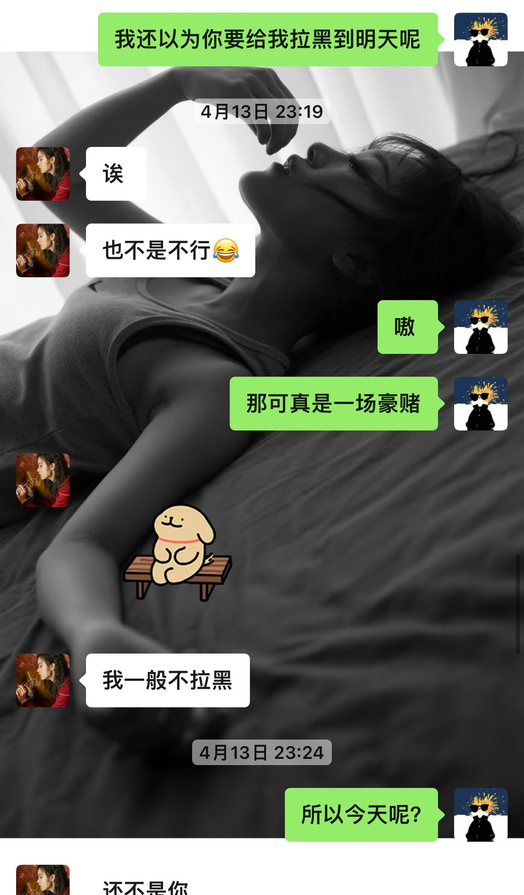

# 这是人生勇敢的一次

## 前序

“如果是你，我一定跑着来”

我跟雪儿同学一直联系已经四个月了，而且也一起出来玩，度过一下自己的节假日。还是处于很暧昧的情况。

那晚我们打电话畅谈，说了许多许多的话，我才得知，上次四月十三日她拉黑我那次，其实是一次暗示，只是在我看来太抽象了叭，我也没有get到，我甚至觉得她非常过分，把我拉黑了。事情的起因是因为我给她拍了一个我下班途中遇到的狗狗，我觉得很可爱，没想到她后面说：

“看了也不能遛，不要给我发了！！”她说。

“不~要~给~我~发~了~[loopy。jpg]诶，就发就发”我贱贱地回复到。

“等一哈，我看你咋发”

❗“嗯？”

❗“？？？？？”

<消息已发出，但被对方拒收了。>

❗“你玩不起！！！”

好好好！拉黑我，我当时是非常无敌生气的，因为我觉得拉黑是一件非常非常严重的事，基本拉黑之后就可以删好友了。

十分钟之后...

她说：没发哇，我说：嗯。然后就没后文了，大概一个多两个小时之后才又开始说话。

这个地方的聊天记录，她说的话，都是那晚我才知道，这个时候就已经暗示我了，如果我养狗勾，那么我们就在一起，现在我俩在一起了我也还是不知道她这个话的具体的、准确的、暗示，怪我愚钝，那就当也喜欢我吧。

后面的一天我都在想：她是喜欢我呢，还是喜欢养狗呢，还是都喜欢呢？第二晚我问她：她说当然都喜欢啦。我把这个消息告诉我的好兄弟，我好兄弟们都说：这你还不去表白！别不知好歹嗷。怎么说呢，这个回答固然是让我开心的，我问自己，是否想开始一段恋爱，因为我不得不否认，以前的经历给我的不好影响，可是她又不是给我造成不好影响的人，凭什么要承受这种果报呢？她是我年少心动好久的人，一直认为会在我记忆中闪闪发光的人。想那么多干嘛呢，我应该大胆的去追求自己心里面的东西，让我觉得人间值得的、让我能听见自己心跳的东西。最后，多巴胺战胜了理智，我要为了自己的心动豪爽地买单，再勇敢一次，我盛情的邀请18岁的自己，说出18岁时不敢说的话，去拉住18岁想拉住的手。

## 准备

五月十八号我去一趟成都，其实学弟们邀请我回学校看看的，我也很想念，十八号上午开车到学校，中午吃了个午饭，下午我就去学校不远的一个花鸟市场————春天花乐园，这个地方还是致力于打造成西部有名的花市，里面的鲜花种类繁多，也正值周末和520，所以下午来的人很多。

很早很早之前我就在心里想过，我如果表白，我要包什么花——————**就是“小王子”那种风格，只是里面唯一一朵玫瑰换成了白玫瑰，周围是红玫瑰，寓意就是白月光吧~ （我的内心小99）***

我买了20朵红玫瑰，20多白玫瑰，从成都回来之后，就开始醒花，处理，不得不说，玫瑰是真扎手啊！（具体的过程下面的长图里面有啦）我是打算亲手包的，因为我觉得亲手包的要有诚意一点，可是最后我高估了自己的包花能力，包得不是很美观！！于是我就放弃了。后面我想还是就直接扎成手捧花这种吧。我也是个有点极简的人。（y1s1，素素的一捧花还是很美丽的。）

## 行动

19号表白呢，是因为我一向是喜欢过节提前一点的，主打就是“错峰出行”520太拥挤，我就提前表达爱意~她那天其实在上班，我是下班去接她的，决定一起吃个饭，我想傍晚的时候表白。那天下午我把副驾精心的布置了，在副驾储物柜放上花，副驾旁边也有，唯一有点不足的呢，就是我没有买到彩灯来点缀，有一点点不完美，好在呢，那天的阳光很明亮，照在花上，显得格外的生机勃勃，下班去接她的路上微风不燥，我觉得甚至有点甜，这是我人生第一次主动去表白，带着花，这么有仪式感的表白。

到了之后，她还是坐的后座，她上车之后我把花递给她，她说：我现在没空，我要化妆。（本来我也没说现在表白，现在忙着开车呢，我只是要让她知道我是来表白的就好了，嘿嘿）路上她慢慢化着妆，我慢慢开着车，到了吃饭的地方，我俩就去吃饭了。

吃完饭之后下楼，我说你要不坐副驾嘛，她；嗯~好！我走在她前面一点，为她打开副驾的门“公主请上车”我嘻嘻的说道。她坐上后我问她坐好喽？她肯定之后我为她关上车门，然后我回到我主驾上。地下车库的灯光很暗，我打开车里面的灯把花递给她，她从我手上接过我亲手扎的手捧花。

“你接了我的花，那我俩就是在一起喽~”没想到我还是没有直接说：做我女朋友这五个字，我觉得太生硬了点哈哈哈哈。

“啊~”她低头看着花微微点了一下头，嘴角带笑。

啊啊啊啊~我伸出右手摸摸她的头，芜湖~

后面我们去河边散步，我们停好车之后，要过一条马路，我伸出手，她也伸出手，我俩牵着一起大大方方地走过了马路...

## 写在最后

当时拉着她手的时候，有一种记忆深处被唤醒的感觉，依稀记得高中那会，每天午睡过后，我都会去她桌位旁边，等她睡醒，我悄悄的握着她的手，那个时候还真是胆小啊！啊哈哈哈哈啊，真是羞涩的青春啊！但是那个感觉，就像那天拉着她的感觉一样。那羞于表达的青春诶。

好在现在我们的长大了，这一次，我们都勇敢一点，希望好好拉紧18岁那会无奈松开的手。