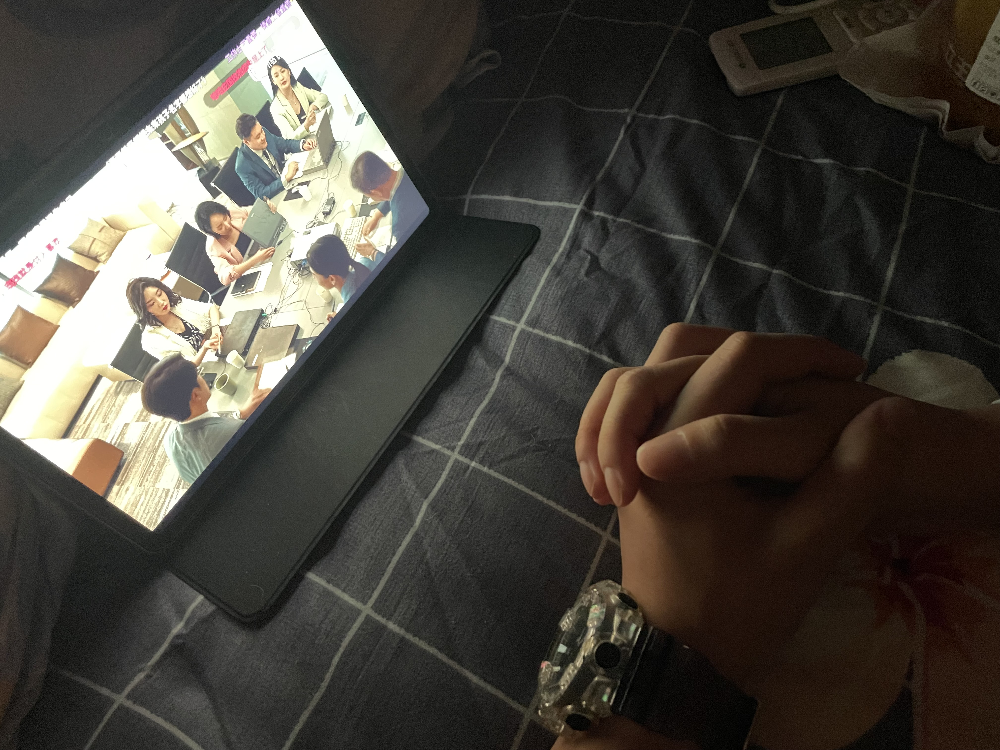
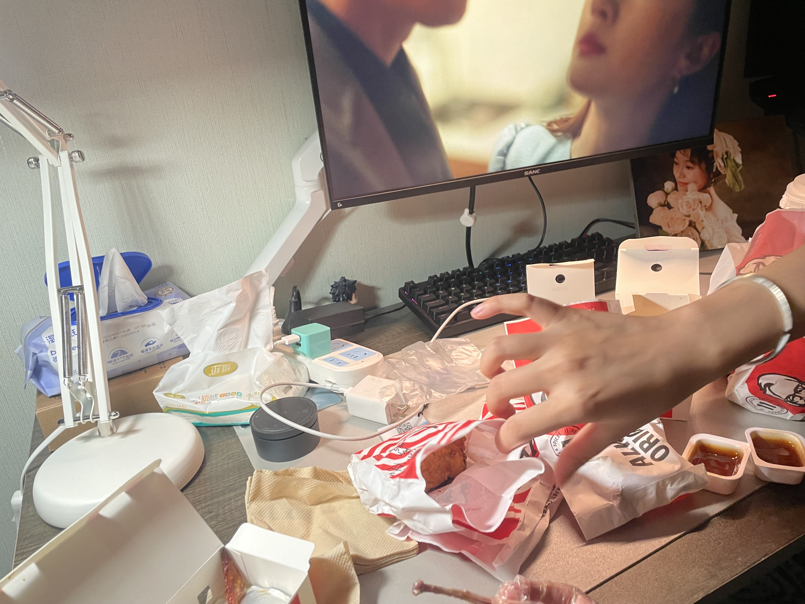
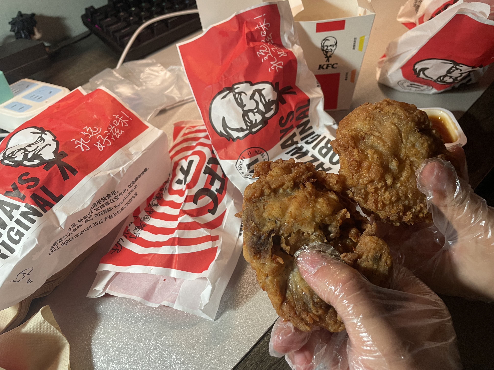
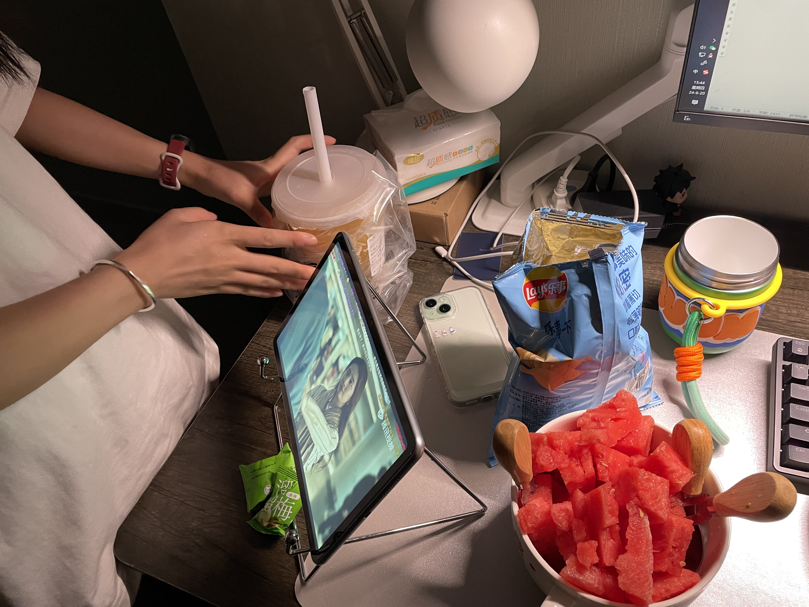
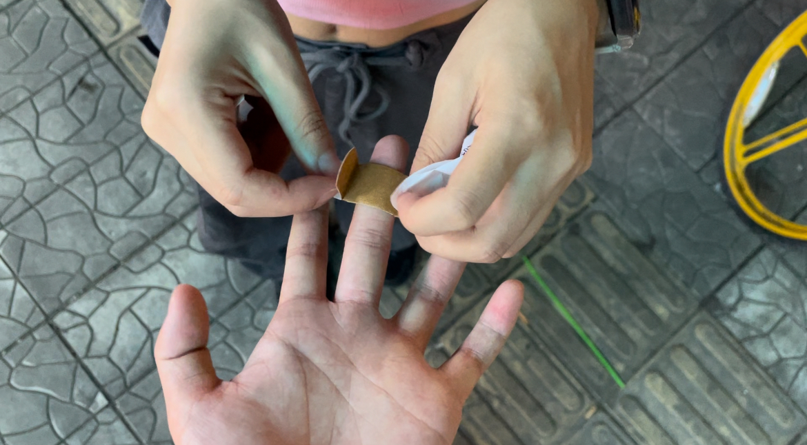
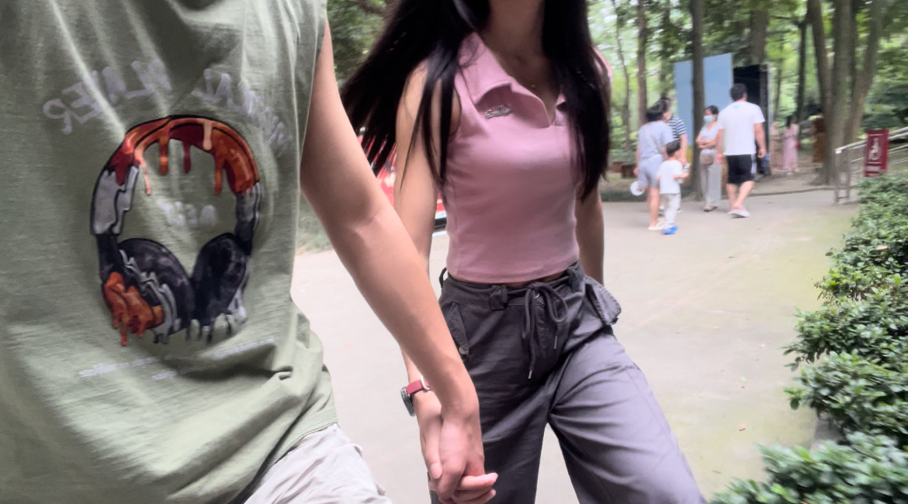
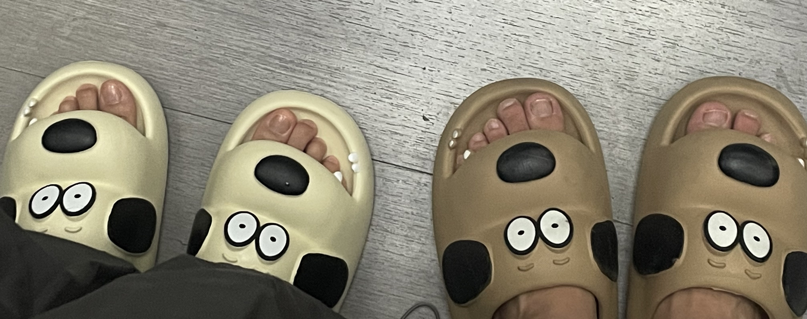

# 在家里约会吧

上次去宜家，我去接她的时候问她：有想到去哪约会吗？

“我不知道，我都可以。”

“那我说哪就去哪哦？我带你去我家”我试探的问。

“看你喽，我都可以”他脱口而出。

“那倒是听话嗷，去逛宜家吧，下次约会就带你去我家”

于是我们就出发去宜家家居了，谁知从这边开车到成都，逛完宜家才下午两点，我以为会逛一天呢，这么早，外面又热，真不知道能去哪。

“如果你没有想去的地方，我们就回家吧，去我家待会，看看综艺，吃点零食，也挺好”

“那走吧~”

我们就从成都慢慢悠悠开回了家。

其实我都还没准备好的，因为我家里没有买太多零食，冰箱里面只有点水果（你问我乱不乱啊，那肯定不乱，我对于我自己生活起居的整洁卫生还是非常自信的[酷酷比耶]）

到我家打开门的时候，我有点不知所措，我说你坐，顺带着我换拖鞋，我把我的狗狗拖鞋拿给她穿，“你就穿我的吧”其实还有一双拖鞋的，只是那双拖鞋遇到水会有点滑，我害怕她万一上厕所不知道加上一个不小心，滑到了，我会心痛的。

“芜湖~！[大声发]看剧看剧，走去楼上看，躺着看”我承认，回到家的我特别喜欢发癫，如果不是对象来了，这个时候我应该衣服都脱了搁家里裸奔。

经过一顿捯饬，终于是躺在床上，打开平板，开始追综艺了。

“喏，你给我买的猪猪，你要抱吗？”（猪猪在  <a href="https://littlefairy.top/Life/%E7%A2%8E%E7%A2%8E%E5%BF%B5/Crush">Crush</a> 这篇博客第四部分有说到 ）

“嘿嘿”她拿过那只大大的猪抱在身下垫着“她真的好大一只”

---后来看电视之后我俩点了个外面窝着吃----

这种时间慢下来的感觉，两个人在房间里，互相挨着彼此，有一嘴没一嘴的说话，有一嘴没一嘴的嘴一个🙄，真的是一件非常幸福且满足的事情。

在后面的一周里面，她就是备考，因为再过一周就是考试了，我说如果你在家学不进去，吵得很，我这挺安静的，你想来就来，我下班就飞奔回来找你。

这是后面某次我俩的小零食时间：

哦对！这个西瓜，我切的，当时我老牛逼了，因为家里我没有买菜板，我就将就西瓜皮做菜板，在那一牙西瓜上面进行操作的，你别说，切得还挺规整；小勺子、小叉子是我专门买来，为的就是某一天来我家，我俩一起用这个小勺子吃水果，真是可爱且有仪式感的一件事。😋

后面有天我关门，不知道为啥把自己手夹了，晚饭过后就出门逛街，在药店买了个创可贴，我走出药店门口：

“小姨给我贴创可贴”

“我白眼你了嗷”她有点不好意思，好像对我这种突然发癫的行为有点害羞。

“真是服了你了”

她接过创可贴，还是给我贴上了。😁

嘻嘻，还不是给我贴了~

# 陪她去考试

上面说到她在备考，转眼，诶就到了考试时间，是周末两天时间考试，有个问题就是考试地方在郫都区（这地方我熟，她把考场名字发给我的时候我百度看了一下地图，好小子，这不是我大学毕业上班的地方旁边嘛[内心Tips：这是真偏僻]），她在成都的朋友又住成华区，如果她从她朋友家去考试点，坐地铁也需要一个半小时，甚是麻烦。

如果可以，要不直接住那边。后面她思索了一下，说算了，下周还有场考试，更远，那个时候她就住外面。但是我想跟她一起去啊！就是那种，就算去送送、接接她考试，我也很开心的，那种很乐意去为她做点什么的冲动，我享受这个过程，我接纳享受这种意志沉沦的感觉，突然想到这个行为在现在不太被认同，可这有什么关系呢？想那么功利干嘛呀，我只知道我现在喜欢上了她，我就是想做这个事，克制着，惦记着，就遗憾了。正好，那个地方离我之前的单位也挺近，想了还可以去看看单位“旧址”（因为在成都的分部已经G了）这样也算是过了一个不一样的周末。

“不行，我要跟你一起去，我来订住的地方。”

我给她说是周五下午才说的，下班我就飞奔回家，我真的忍不住想去，飞奔回家收拾收拾：浴巾、洗脸巾、雨伞、牙刷...收拾完直接开车去接她了。

我们住的地方就在我之前上班的隔壁那栋楼，我不禁有点感慨：去年这个时候我骑电动车走在这条路上，今年我开电动车走在这条路上；去年走在这条路我害怕下雨，今年我享受这下雨。去年这个时候我想着今年的我会在何方，今年的我会过得怎样，原来，今年我是这样，好在这个男孩很快乐，也很满足现在，没有变得好高骛远，而是尽力地脚踏实地。

到了之后我们洗漱好，就躺在床上睡觉了，虽然这是第一次跟她在外面住，心里面还是很紧张的，就是有点睡不着的样子，可是又觉得很安心。后面的两天，就是中午接她考试结束，下午送她，我就回到住的地方追剧，这样“浑浑噩噩的”追剧也挺好诶~

周天下午三点她就结束了，这一坨之前我还是待了几个月，比较熟悉，附近有个叫“望丛祠”的旅游景点，我说带她去逛一下，里面挺安静的感觉，但是！！当我们到了之后，发现好多人，可这并不影响我们拉着一起在人群中穿行。

—— 散步，不论是一人还是成双，都是最高级的约会，一人便是和世界的约会。

我录了好几个我们散步的视频，这种两个人慢慢的感觉，有种溢出屏幕的生活气。

浅浅记录一下我俩的第一个情侣物件————狗狗拖鞋。

