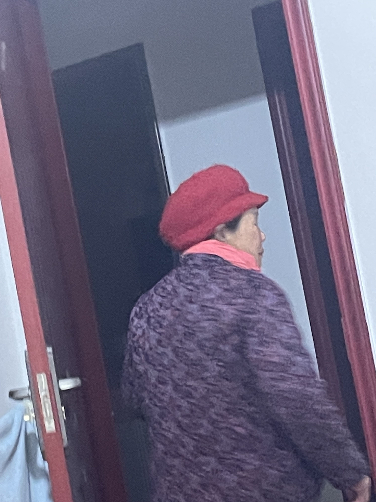

# 23-2-9

- 明天我就要离开家去成都上班上学了，外婆就真的只有一个人在这啦【😭】

今晚晚饭的时候，我早早就吃好了，我坐在外婆对面，看着外婆不紧不慢的吃着，她是那样的慈祥，她时不时抬头望向我，我不知还是下午她出去玩吹了风还是怎么，她眼眶里总是比以往红润。沉默了许久之后，她说：你爷爷还是想见你们两兄弟最后一面。我说是啊，如果不是因为一些在此不能说的原因，我也就可以回来看我爷爷最后一面..

“你一个人在家要记得弄肉吃，不要节约，有的是钱吃的”我叮嘱道，“你才是去学校也要吃好点”我心里面很不是滋味，想哭。“你爷爷在的时候就给我说了不会吓我，之前我做噩梦都是你爷爷叫我，你爷爷知道我容易做噩梦，所以说了不会来吓我，还说会保佑我们家里所有人的”。我想着之前家里有我爷爷在，虽然他话越来越少，走路越来越蹒跚..可是总是让我会觉得很安心，不知怎么的，这次离开家总觉得不踏实。

我在写这个碎碎念的时候，外婆又敲我的房门，给我拿来面包，说我晚上睡得迟，饿了好吃，她总是很关心我，想的很周到

是啊！家里什么也没变，只是少了很多的药，外公之前天天吃的药....