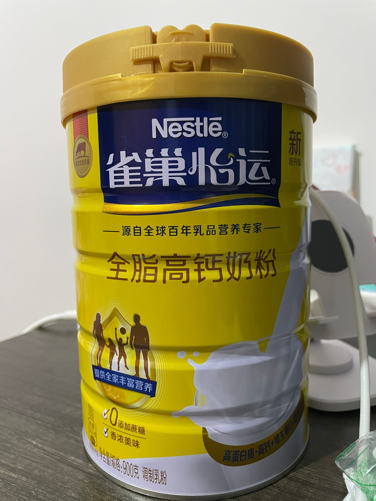

# 23-8-31

- 我又回到了我的家

原因是因为我来家这边工作了，不在成都了。所以每天也可以回家睡，就可以跟外婆生活在一起。

因为现在的工作时甲方身份，得盯着施工方做工，所以只有施工方晚上写下班，我也就下班。今天下班回来已经是七点过了，我上楼换了下衣服，看到我得桌上放着一罐新的奶粉，于是问我下楼吃饭顺便问起外婆

“你给我买的奶粉啊”

“啊，专门你们吃的”

“你今天上街就专门给我买奶粉啊？贵不贵”

“你猜猜嘛，我上街买鸡蛋，还买了些莴笋回来”外婆带着一点微笑并且夹杂着一点得意的说道。 

“几十块钱”我略带试探的回答外婆。

“几十啊，一百多”外婆端着碗，沉着的回答。

我心里想着，外婆她平时很拮据一个人，对我这个孙子一百的奶粉说买就买，试想一下她那去买的时候，对店员说买一瓶奶粉，要年轻人吃，或者还说要好点的，确实那个奶粉还是个大牌。一想到外婆背着那个小挎包跟店员说的场景，有点可爱甚至非常的感激她。

是啊，外婆她做菜虽然不是非常的正经，但是味道很好吃，她虽然有时候想着自己这一顿可以吃，不会想到我吃不吃得下（比如那种超级肥肉，我的天），但是她真的很爱我很爱我。