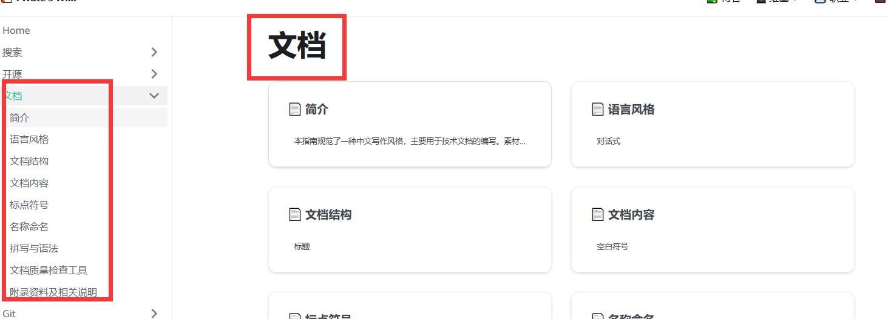

这是本网站的第一篇日志，测试了一下感觉还是很不错的🗯

- Web

## 将就才研究出来就直接趁热记笔记了吧

**我想要有如图所示的效果：**在右边有整个的预览效果，并且左边变也可以进行选择（我就是觉得这样好帅，谢脯肉！）


-------------------
于是我就开始琢磨文件，因为原始文件里面有一个叫做`tutorial-extras`的一栏，他就是这种风格，于是乎我发现，这东西在他的文件下面有个`.json`文件
虽然吧...我看不太懂**json**的文件，英文单词我还是勉强认识，我想是不是因为在下面加了这个原因；我开始尝试：
```
docs
├── log                           
│   ├── _category_.json     
```        

这个json 文件内容如下
```
{
  "label": "2022.12",             #这是显示的标题
  "position": 1,                  #这是在侧边栏排列的位置
  "link": {
    "type": "generated-index"     #这暂时还不清楚
  }
}
```
**然后在相应的侧边栏部分更改`position`的数字即可更改每一栏的排列顺序**


**结束，写得比较含糊，但是还是可以这么用**

**我在想我可以不可以用Typora来写.md文件然后复制进来我博客稳当里面，这VSCode的Markdown确实不太习惯**
