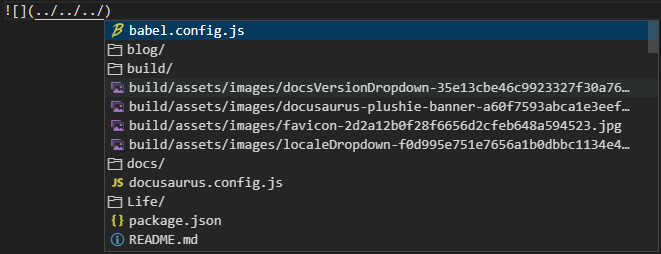

# 💫关于文件引用出错的离奇操作

# 起因

刚刚我在写一篇关于生活那一栏的文章的时候出现的大问题：如下图

红色部分就是我**点点斜杠，再点点斜杠，再点点斜杠退回到根目录进行选择图片的**然后就出现了问题，在本地编译是没有问题的，但是一旦当我git push 到Vercel的时候，就会出错，我的操作就想下面这样

>ERRO：在**XXX.md**中无法找到**../../../路径.png**的图片

这很玄学啊，虽然我知道是我前端知识，或者是这方面的知识掌握的问题，但是在我今天发现的时候，我是一整个**亚！麻！呆！住！**💩

# 总结

我算是知道了，之后我引入图片的时候就(../../然后选择)反正吧，我所有的图片都放static文件夹下面的，先就依葫芦画瓢吧。🐶