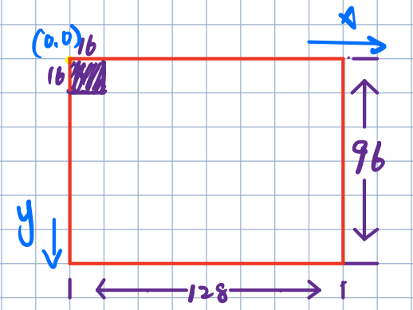
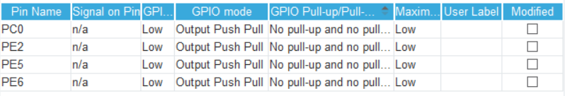
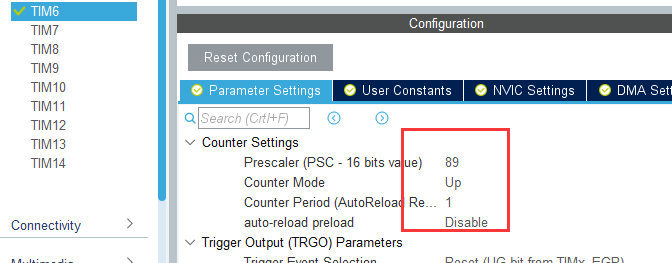
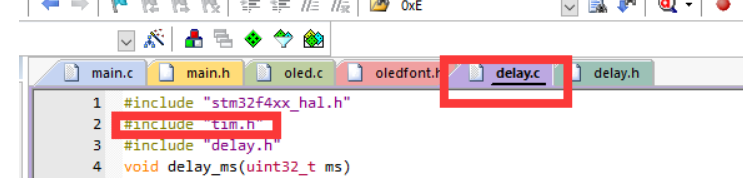
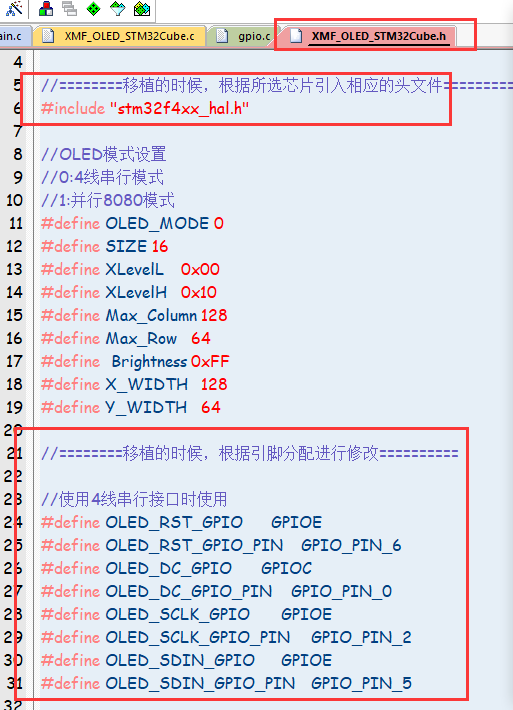

# OLED笔记                

> # 如下首先附上OLED底层下载：
> # <a href="https://gitee.com/xin-is-a-little-fairy/stm32-f1-cube-mx/tree/master/OLED">OLED底层文件下载</a>

**如果是显示字体为16，那么横向可以显示⑧个字，纵向可以显示⑥个字。**



# 一、“小蜜蜂”底层驱动函数说明

```c
//此处默认字体大小为16//
```

```c
void OLED_Init(void);          //OLED初始化函数
void OLED_Clear(void);         //OLED清屏函数
```

```c
//显示英文字符串函数
void OLED_ShowString(unsigned char x,unsigned char y,unsigned char *p);

参数1：x，起点列坐标，0～127
参数2：y，起点行坐标，0～7
参数3：*p，字符串指针
返回值：void，无。
```

```c
//显示中文字符函数
void OLED_ShowCHinese(unsigned char x,unsigned char y,unsigned char no);

参数1：x，起点列坐标，0～112
参数2：y，起点行坐标，0～6
参数3：no，待显示中文字符在数组Hzk[][32]中的位置。
返回值：void，无。
```

```c
//显示图片函数
void OLED_DrawBMP( unsigned char x0, unsigned char y0,unsigned char x1,unsigned char y1,unsigned char BMP[]);

参数1：x0，起点列坐标，0～127
参数2：y0，起点行坐标，0～7
参数3：x1，图片的列范围，1～128
参数4：y1，图片的行范围，1～8
参数5：BMP[]，待显示图片数据的数组。
返回值：void，无。
```

# 二、程序

## 1）、在main.c里面添加“XMF_OLED_STM32Cube.h”

## 2）、主程序书写（显示一个字，一串字符)

`main.c`

```c
#include "main.h"
#include "XMF_OLED_STM32Cube.h"
int main()
{
    
    while(1)
    {}
}

void OLED_display_Infomation(void)
{	
	OLED_Init();  		//OLED 初始化
	OLED_Clear();  		//OLED清屏函数，每次执行的时候都进行OLDE的清屏	
	
	OLED_ShowCHinese(0,0,1); 							//第一行显示一个汉字
	OLED_ShowString(0,2,(uint8_t *)"IMT_Test");			    //第二行显示字符串
	
}

//OLED_ShowCHinese(0,0,1);中的最后一个参数可在汉字取模软件里面生成只有复制到‘’‘XMF_OLED_Font.h’‘的’const unsigned char Hzk[][32]‘二维数组
```

`main.h`

```c
//函数申明。
void OLED_display_Infomation(void);
```

### 3）、☆用OLED显示变量详细程序说明☆

`main.h`中

```c
//添加头文件，因为之后的main.c里面会使用“sprintf”函数
//函数的申明
#include <stdio.h>
void OLED_display_dat(void)
```

`main.c`中

```c
//假设我们要显示的是C的值，C = A+B。
/*----------------变量的申明-----------------*/
uint16_t A = 1;
uint16_t B = 1;
uint16_t C = 0;
uint8_t Str_buff[64];  //定义缓存数组，用来存放数值强制转换之后。

/*--------------------主函数------------------------*/
int main()
{
    OLED_display_dat(void);
    while(1)
    {}
}

/*----------------------显示函数----------------------*/
void OLED_display_dat()
{
    C = A +B
    OLED_Init();  //OLED初始化
    OLED_Clear(); //OLED清屏 
     /*--------------------------------------*/
     /*  @(char *)    :  强制转换
     /*  @Str_buff :  缓存数组
     /*  @%d           :  转换成整型
     /*  @C=A+B      ：变量
     /*--------------------------------------*/
    sprintf((char *)Str_buff,"%d",C = A + B);
   OLED_ShowString(0,2,(uint8_t *)Str_buff); //显示Str_buff 数组。
    
}
```

**Tips：‘Sprintf’函数讲解**

```c
头文件：stdio.h
函数功能：格式化字符串，将格式化的数据写入字符串中。
函数原型：int sprintf(char *buffer, const char *format, [argument]…)

参数：

（1）buffer：是char类型的指针，指向写入的字符串指针；

（2）format：格式化字符串，即在程序中想要的格式；

（3）argument：可选参数，可以为任意类型的数据；
    
    如上OLED显示程序：
    sprintf((char *)Str_buff,"%d",C = A + B);
```

# 三、#@%$^(&(我他吗也不知道取什么标题))

在变量申明的时候

```c
uint16_t A = 1;
uint16_t B = 1;
uint16_t C = A + B;
//是错误的：因为C = A+B中AB的值是不确定的

uint16_t A = 1;
uint16_t B = 1;
uint16_t C = 0;
//这样先把C的值赋值为0，在之后的子函数中就可以写C = A+B。
```
------------------------------------------------✂✂分割线-----------------------------------------------------------

**《OLED-Driver_for_STM32Cube》文件夹里面的头文件直接可以用做硬件层插入**

# 底层文件说明 
## 一、在cubeMX中配置OLED的引脚

PC0;

PE2;

PE5;

PE6



## **二、Tips：添加文件之后，需要在cubeMX中配置定时器TIM6；具体参数如下：**



即定一个2us的定时器。如果时钟频率很STM32F427不一样就需要自行修改。

## 三、在delay.c中添加定时器



## 四、在XMF_OLED_STM32Cube.h中更改芯片头文件，还有引脚分配。

