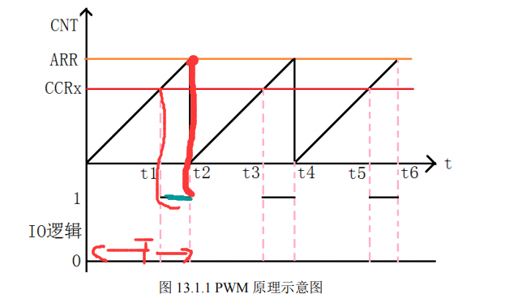
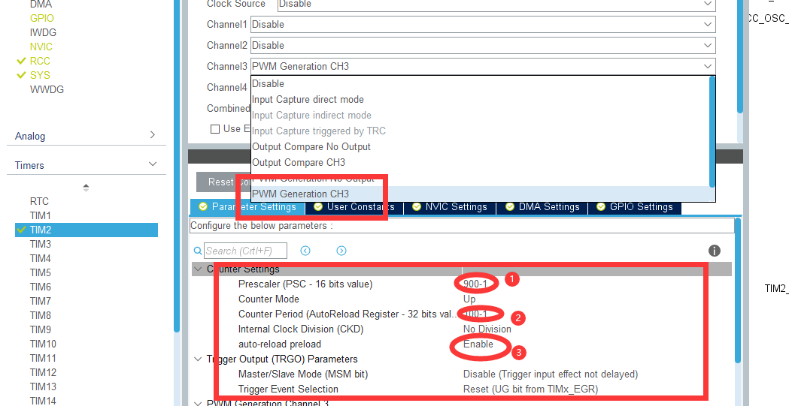
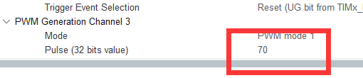
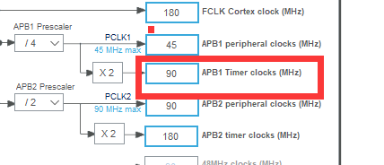
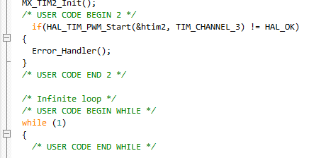
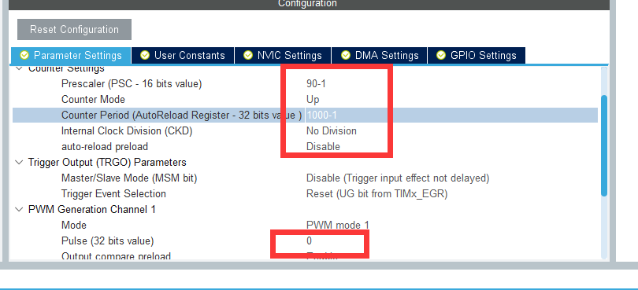
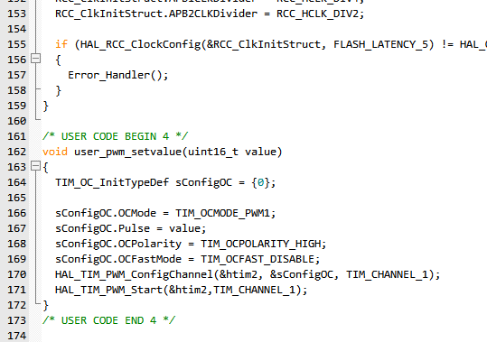
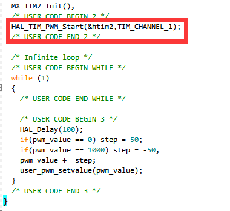

# PWM

## Tips：

​				Hz --- s

​				KHz --- ms

​				MHz --- us	

​				1s = 10^3ms=10^6us	

​				Hz =   KHz  =    MHz			

## 一：PWM基础



从示意图可以看出

①、**ARR决定了周期；CCRx决定了占空比。所以调节CCRx就可以更改占空比。此图是假设当装载值比CCR小我们产生一个低电平**

②、**通过向TIMx_CCMRx寄存器中的OCxM位写入110（PWM模式1）或111（PWM模式2），可以独立选择各通道（每个OCx输出对应一个PWM）的模式。必须通过将TIMx_CCMRx寄存器中的OCxPE位置1使能相应的预装载寄存器，最后通过TIMx_CR1寄存器中的APPE位置1使能自动重载预装载寄存器**

## 二、PWM输出配置步骤

①、使能定时器时钟和通道IO口时钟。

②、配置IO口复用映射

③、初始化PWM时基参数

④、初始化PWM通道参数

⑤、使能定时器PWM

## 三、cubeMX的配置

在Parameter Settings中设置好Prescaler(预分频系数)、Counter Period(重装载值)、Pulse(脉冲时长)，
一般习惯将PSC设置为主频*10-1，这样分频后一个周期刚好是1us，然后将ARR设置为100-1,这样每个周期就是1ms，频率也就为1KHz。而Pulse设置为占空比，设置为50，刚好为100的一半，则占空比为50%。
————————————————

### 1)、点开定时器（例TIM2）：



定时器的时间配置直接为PWM的周期（频率）

### 2）、这个地方写占空比。（不确定）




**Tips：看时钟挂在哪个主线上（TIM2为PAB1上）**



### 3）、生成工程

#### ①、配置IO口复用映射

```c
void HAL_TIM_MspPostInit(TIM_HandleTypeDef* timHandle)
{

  GPIO_InitTypeDef GPIO_InitStruct = {0};
  if(timHandle->Instance==TIM2)
  {
  /* USER CODE BEGIN TIM2_MspPostInit 0 */

  /* USER CODE END TIM2_MspPostInit 0 */
  
    __HAL_RCC_GPIOA_CLK_ENABLE();    //使能GPIOA时钟
    /**TIM2 GPIO Configuration    
    PA2     ------> TIM2_CH3 
    */
    GPIO_InitStruct.Pin = GPIO_PIN_2;
    GPIO_InitStruct.Mode = GPIO_MODE_AF_PP;
    GPIO_InitStruct.Pull = GPIO_NOPULL;
    GPIO_InitStruct.Speed = GPIO_SPEED_FREQ_LOW;
    GPIO_InitStruct.Alternate = GPIO_AF1_TIM2;
    HAL_GPIO_Init(GPIOA, &GPIO_InitStruct);

  }
}

void HAL_TIM_PWM_MspInit(TIM_HandleTypeDef* tim_pwmHandle)
{

  if(tim_pwmHandle->Instance==TIM2)
  {
  /* USER CODE BEGIN TIM2_MspInit 0 */

  /* USER CODE END TIM2_MspInit 0 */
    /* TIM2 clock enable */
    __HAL_RCC_TIM2_CLK_ENABLE();

    /* TIM2 interrupt Init */
    HAL_NVIC_SetPriority(TIM2_IRQn, 0, 0);  	//设置串口中断优先级
    HAL_NVIC_EnableIRQ(TIM2_IRQn);		      //使能中断通道
  }
}

```

#### ②、PWM时基参数设定

```c

TIM_HandleTypeDef htim2;  //句柄

/* TIM2 init function */
void MX_TIM2_Init(void)
{
  TIM_MasterConfigTypeDef sMasterConfig = {0};
  TIM_OC_InitTypeDef sConfigOC = {0};

  htim2.Instance = TIM2;
  htim2.Init.Prescaler = 89;
  htim2.Init.CounterMode = TIM_COUNTERMODE_UP;
  htim2.Init.Period = 999;
  htim2.Init.ClockDivision = TIM_CLOCKDIVISION_DIV1;
  htim2.Init.AutoReloadPreload = TIM_AUTORELOAD_PRELOAD_ENABLE;
  if (HAL_TIM_PWM_Init(&htim2) != HAL_OK)
  {
    Error_Handler();
  }
  sMasterConfig.MasterOutputTrigger = TIM_TRGO_RESET;
  sMasterConfig.MasterSlaveMode = TIM_MASTERSLAVEMODE_DISABLE;
  if (HAL_TIMEx_MasterConfigSynchronization(&htim2, &sMasterConfig) != HAL_OK)
  {
    Error_Handler();
  }
  sConfigOC.OCMode = TIM_OCMODE_PWM1;
  sConfigOC.Pulse = 500;
  sConfigOC.OCPolarity = TIM_OCPOLARITY_HIGH;
  sConfigOC.OCFastMode = TIM_OCFAST_DISABLE;
  if (HAL_TIM_PWM_ConfigChannel(&htim2, &sConfigOC, TIM_CHANNEL_3) != HAL_OK)
  {
    Error_Handler();
  }
  HAL_TIM_MspPostInit(&htim2);

}
```

#### ③、使能定时器PWM

```c
	if(HAL_TIM_PWM_Start(&htim2, TIM_CHANNEL_3) != HAL_OK)
	{
		Error_Handler();
	}
```


## 四、工程中的书写（即使能定时器）



```c
if(HAL_TIM_PWM_Start(&htim2, TIM_CHANNEL_3) != HAL_OK)
	{
		Error_Handler();
	}
```

写入这个函数即可放出PWM（PWM_Start开始），一定要在主函数里面写开始函数

```c
&htim2, TIM_CHANNEL_3

   |           |

TIM2           通道3
```

## 五、☆程序中更改占空比☆

`time.c`中

```c
/* @x:定时器几         */
/* @y：定时器的通道*/
void TIM_SetTIMxCompare1(uint32_t compare)
{
	TIMx->CCRy=compare; //把比较值直接传入TIM的CCR比较寄存器
}
```

`tinme.h`中申明

```c
void TIM_SetTIMxCompare1(uint32_t compare);
```

`main.c`

```c
/*头文件声明、变量申明省略*/
int main()
{
    TIM_SetTIMxCompare1(占空比);
    while(1)
    {}
}
```

## 六、OLED显示PWM占空比程序

①、为了方便使用，把time.c中的`TIM_SetTIMxCompare1(uint32_t compare)`放到main.c中，同样的在main.h中进行申明

②、写一个OLED显示函数`void OELD_PWM_display(uint32_t A)`参数定义为uint32_t类型

main.c中

```c
#头文件省略...

#include "stdio.h"           //sprintf 函数头文件
uint8_t Str_buff[64];   //缓存数组

int main()
{
    TIM_SetTIM2Compare1(占空比)；//占空比更改函数的调用。
        while(1)
        {}
}

void OELD_PWM_display(uint32_t A) //OLED显示函数(详细)。
{
	OLED_Init();
	OLED_Clear();
	/*---OLED显示---*/
	OLED_ShowString(0,0,(uint8_t *)"PWM = ");
    
	sprintf((char *)Str_buff,"%d", A);
	OLED_ShowString(54,0,(uint8_t *)Str_buff);
    
	OLED_ShowString(70,0,(uint8_t *)"%");
   	   /*----------------*/
}

void TIM_SetTIM2Compare1(uint32_t compare) //改变PWM占空比函数。
{
	TIM2->CCR3=compare; 
	OELD_PWM_display(compare);   //调用OLED显示函数，传递的参数就是compare的值，让他在OLED上显示。
}

```

③、**Tips：在配置PWM的时候period的值需要特别注意：☆如果是Period的值在0-100期间，则comper 的值就是0-100，给多少占空比就是多少；同理,Period 的值在0-1000期间，comper 的值也会在0-1000，例如500对应占空比为50%。**

```c
  TIM_MasterConfigTypeDef sMasterConfig = {0};
  TIM_OC_InitTypeDef sConfigOC = {0};

  htim2.Instance = TIM2;
  htim2.Init.Prescaler = 900-1;
  htim2.Init.CounterMode = TIM_COUNTERMODE_UP;
  htim2.Init.Period = 100-1;
  htim2.Init.ClockDivision = TIM_CLOCKDIVISION_DIV1;
  htim2.Init.AutoReloadPreload = TIM_AUTORELOAD_PRELOAD_ENABLE;
  if (HAL_TIM_PWM_Init(&htim2) != HAL_OK)
  {
    Error_Handler();
  }
```

## 七、PWM实现呼吸灯

### 1）、cubeMX配置



配置参数（最好！！把Per的值配到上千，之后写控制占空比时可以让时间加长一点）
占空比此时不用初始设置，默认为0

### 2）、程序中的配置

设置Pulse的值可以修改脉宽。这里我们在main.c文件中添加一个用户PWM设置函数，函数的参数为修改的值。


```c
/* USER CODE BEGIN 4 */  
void user_pwm_setvalue(uint16_t value)  
{  
    TIM_OC_InitTypeDef sConfigOC = {0};  
      
​  
    sConfigOC.OCMode = TIM_OCMODE_PWM1;  
​  
  sConfigOC.Pulse = value;  
  sConfigOC.OCPolarity = TIM_OCPOLARITY_HIGH;  
  sConfigOC.OCFastMode = TIM_OCFAST_DISABLE;  
    HAL_TIM_PWM_ConfigChannel(&htim2, &sConfigOC, TIM_CHANNEL_1);  
    HAL_TIM_PWM_Start(&htim2,TIM_CHANNEL_1);  
}  
/* USER CODE END 4 */
```
Tips：记得在头文件下面申明该函数。

### 3）、主函数里面写控制PWM占空比的程序


```c
  while (1)  
  {  
    /* USER CODE END WHILE */  
​  
    /* USER CODE BEGIN 3 */  
        HAL_Delay(100);   
      if(pwm_value == 0) step = 50;      //延时100ms之后让占空比的值减50  
      if(pwm_value == 1000) step = -50;  //1000是配置的per  
      pwm_value += step;  
      user_pwm_setvalue(pwm_value);  
  }
```
记住打开PWM，使用`HAL_TIM_PWM_Start(&htim2,TIM_CHANNEL_1);`

Pulse的值最大为1000，从0开始，每100ms增加50，当增加到1000时，又逐渐递减到0。最后吧pwm_value传进去。