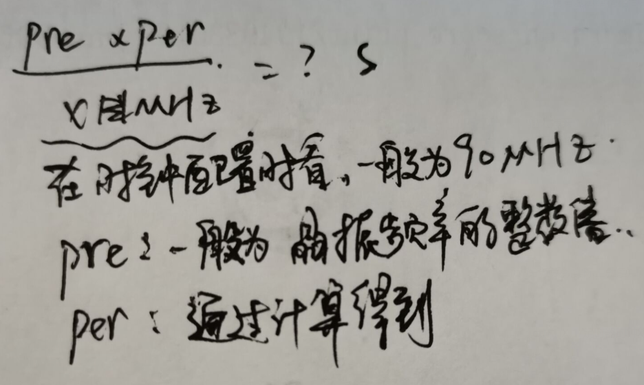

# STM32F4定时器

## 一、STM32的定时器资源

■ 系统嘀嗒定时器Sys Tick
	这是一个集成在Cortex M3内核当中的定时器，它并不属于芯片厂商的外设，也就是说使用ARM内核的不同厂商，都拥有基本结构相同的系统定
时器。主要目的是给RTOS提供时钟节拍做时间基准。
■ 看门狗定时器WatchDog
■ 实时时钟RTC .
■ 基本定时器: TIM6、 TIM7
■ 通用定时器: TIM2、 TIM3、TIM4、 TIM5
	在基本定时器的基础上，实现输出比较、输入捕获、PWM生成、单脉冲模式输出等功能。这类定时器最具代表性，使用也最广泛。
■ 高级定时器: TIM1、 TIM8

### ——定时器挂的总线：


**Tips：图片参照《STN32F4xx<u>数据手册</u>》第十八页**

## 二、通用定时器

​	首先，定时器时钟信号送入16位**<u>可编程预分配器(Prescaler)</u>** ，该预分
配器系数为0~65535之间的任意数值。预分配器溢出后，会向16位的**主**
**计数器( Counter Period)**发出一个脉冲信号。
​	预分频器，本质上是一个加法计数器，预分频系数实际上就是加计数的溢出值。
​	定时器发生中断时间的计算方法:




**定时时间= (Prescaler+1 ) X (Counter Period+1)X 1/定时器时钟频率**

**Tips：Prescaler、Counter Period都不能超过2^16**

​	

## 三、定时器cubeMX工程的建立

1. 配置好基本的参数之后打开定时器一栏

   

   2.选择时钟源

   

   3.计算分频系数、16位自动重装载值。

   s

   **Tips1：两个都不能超过2^16**

   **Tips2：设置预分频系数和自动重装载值为十六进制：**

   

   4.打开计数器使能端口：

   

   > * Prtscaler (定时器分频系数)  : 7199
   >
   > + Counter Mode(计数模式)    Up(向上计数模式)                    
   >
   > - Counter Period(自动重装载值) :    4999     
   >
   > - CKD(时钟分频因子) ：       No Division 不分频 ；选项：  可以选择二分频和四分频                         
   >
   > - auto-reload-preload(自动重装载)  :    Enable 使能
   >
   > - TRGO Parameters    触发输出 (TRGO)               不使能    与本节无关，之后做详细介绍 
   >
   > - TRGO：    定时器的触发信号输出  在定时器的定时时间到达的时候输出一个信号(如：定时器更新产生TRGO信号来触发ADC的同步转换，) 


## 四、程序的书写

.png)

1. **打开stm32f4xx_it.c文件-->打开之后找到**`void TIM2_IRQHandler(void)`函数里面的`HAL_TIM_IRQHandler(&htim2);`在跳转到该函数的定义：


2. **在该函数里面找到一个中断回调函数：**

         

3. **在tim.c中重写该回调函数**

   

   ```c
   void HAL_TIM_PeriodElapsedCallback(TIM_HandleTypeDef *htim)
   {
   	if(htim ->Instance == TIM2)   //判断是TIM2时执行下面的内容
   	{
   		HAL_GPIO_TogglePin (GPIOA, GPIO_PIN_4);
   	}
   	if(htim ->Instance == TIM3)  //判断是TIM3时执行下面的内容
   	{
   		HAL_GPIO_TogglePin (GPIOA, GPIO_PIN_6);
   	}
   }
   ```

4. **在stm32f4xx_hal_tim.c中找到**`HAL_StatusTypeDef HAL_TIM_Base_Start_IT(TIM_HandleTypeDef *htim)`该函数为中断初始化：

5. **复制函数**“`HAL_TIM_Base_Start_IT(TIM_HandleTypeDef *htim)`”**到主函数：**

   

   **括号里面写定时器地址。**

6. **定时器配置完成**

**Tips：要在代码层面修改定时器初始值在**：tim.c中修改两个值即可


