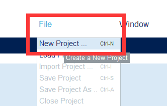
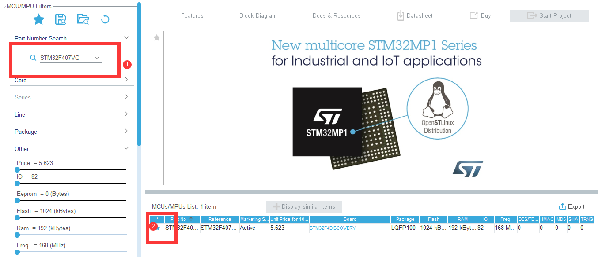
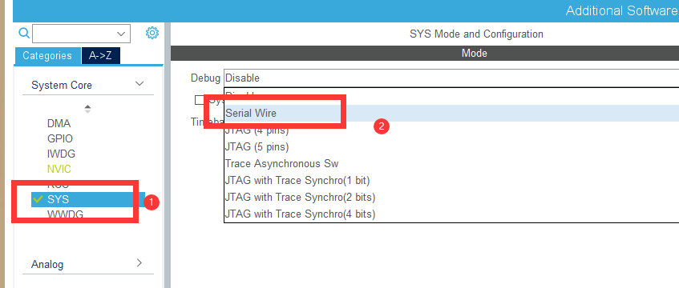
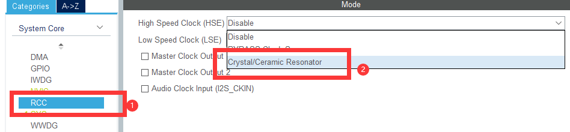
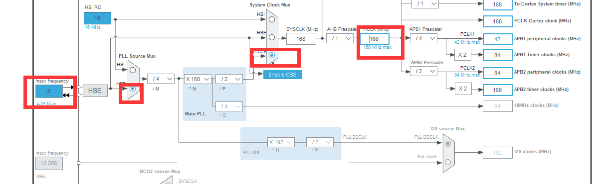
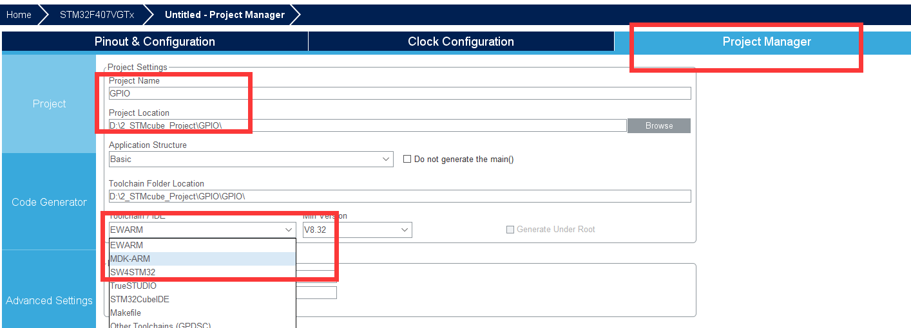
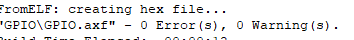
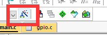
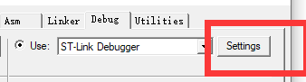
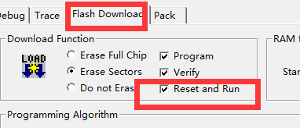

# STM32cubeMX工程的建立

**Tips**：这是很早之前学习STM32的时候记录的菜鸡型笔记，仅适用于一步步照做，如说是大佬，直接跳过

## 一、



## 二、



搜索芯片-->（可以点搜藏，之后这个芯片就直接可以在那个星星点进去了）-->双击芯片

## 三、初始化设置





### 配置时钟：如图配置



### 工程的建立：



**Tips：工程名字以及工程安装路径都不可以有中文哦**


## 四、


点击“GENERATE CODE”即可生成工程。

## 五、



生成工程之后记得直接编译一下，确保cube生成的工程没有问题。

# 六、Keil中的配置更改

生成之后：








**示例程序**

```c
void KEY(void)
{
	if(HAL_GPIO_ReadPin(GPIOE,GPIO_PIN_0) == GPIO_PIN_RESET)
	{
		Delay(1000);
		if(HAL_GPIO_ReadPin(GPIOE,GPIO_PIN_0) == GPIO_PIN_RESET)
		{
			HAL_GPIO_TogglePin(GPIOA,GPIO_PIN_0);	//
			while(HAL_GPIO_ReadPin(GPIOE,GPIO_PIN_0) == GPIO_PIN_RESET);
		}
	}
}
```

