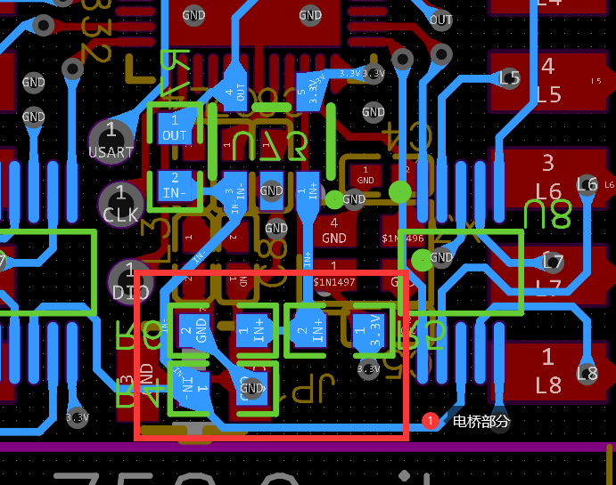

# 关于PCB的那些踩坑💢

> - 设计的时候应该先把原理图画完！
> 
> 就是原理图的所有东西，参数都要改规矩，有时候忙了，原理图一画就导入PCB，然后投产之后就出事了，拿回来也不知道参数的具体了，这是最大的坑了

> - 关于PCB布局的时候
>  
> 就比如绘制了电桥部分，电桥参数需要调整的那种，就需要在PCB上面流出合适的位置，方便后期更改电阻，如图就是，位置允许，然后我换成0603封装的其他的器件是0402的封装。这样方便更改又容易焊接，为后面调试省下不少功夫。

> - 多用热风枪
>  
> 能用热风枪就用热风枪，最近发现热风枪爽啊，涂点焊锡膏，加点助焊剂，直接爽！特别是能开钢网的时候，直接涂涂。❗当然需要注意的是风枪的风不能太大，容易吹飞！