# 预热知识

在大学的时候也学过运放的知识，知道虚短虚断还有放大倍数这些倍数，但是对于实际电路的分析甚少啊，这导致刚开始拿到这个原理图的时候我是一个完全都懵逼的状态，就无从下手。其实拆分开来，里面就是很多小的电路构成，每一“级”调通了，那就基本都通了。下面记录一下本次学到了两个新东西：**射极跟随器、差分放大电路**

Tips：分析运放其实都围绕虚短虚断，就是有这个概念，但是呢不要不局限在这个概念里面：**始终运放的作用就是让正负两端的电压相等，这就是虚短，并且是没有电流流入运放，这就是虚断。**

## 射极跟随器（射随）

射极跟随器其实也叫电压跟随器，顾名思义嘛，就是电压跟随，即**输出电压跟随输入电压的变化而变化。**其基本特性为：**输入阻抗高，输出阻抗低**基本的图如下
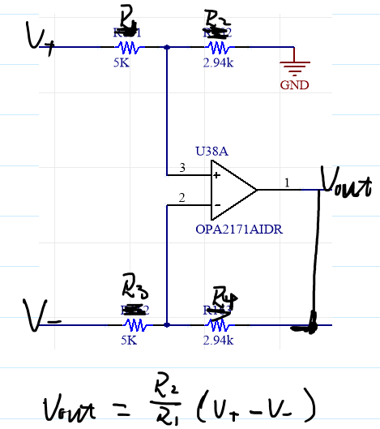

原本拿到这个的时候根本不理解，因为在我的认知里面，负反馈的那个地方是要结个电阻进去的，这一条线就拉过去对我当初的大脑无意识一个大冲击，很难理解啊。现在看来其实很简单：首先根据虚短嘛2脚电压是等于3脚电压的，3脚又是输入电压2脚有连接到输出的，所以3脚电压也就是输出电压了。

那么输出电压等于输入电压，那为啥我不直接一根线结通，还搞个麻烦的运放呢？

答案有三个原因：
- ↪️缓冲 在一定程度上可以避免由于输出阻抗较高，而下一级输入阻抗较小产生的信号损耗，可以说是承上启下。
- 🚫隔离 于电压跟随器具有输入阻抗高，输出阻抗低的特点，使得它对上一级电路呈现高阻状态，而对下一级电路呈现低阻状态，常用于中间级，以隔离前后级电路，消除它们之间的相互影响。
- 阻抗匹配，提高带载能力。

在本次的电流测量中，这个射随有很关键的作用——————呈现高阻状态，起到隔离！具体原因到下面的原理图分析的时候具体分析。

## 差分放大电路

其次就是差分放大电路，差分放大电路的特点就是R1 = R3；R2 = R4；**并且能够实现正端负端电压差值的比例放大**顾名思义为：差 分。

其实根据虚短虚短，然后电阻分压可以推导出输出与输入端的关系的。这就懒得推到了最后有个差分的公式就如图所示。

对于在LCR_Current这个原理图里面，又跟差分有一点小区别，原理图如下：
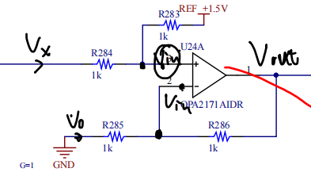

在这个原理图里面，接了一个1.5V的电压，其实最后还是保持的是输出电压为Vx + 1.5V。始终根据虚短虚短来进行计算——具体的推到过程如下：
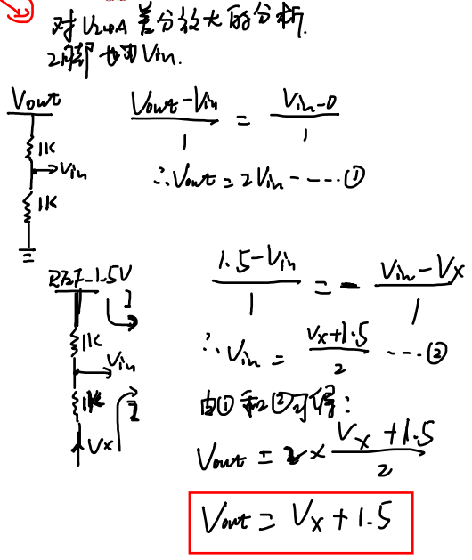

# 原理图分析

在说完上面的基本结构之后，就可以开始原理图的分析了，原理图里面包含了电流采集切换部分（电流转换为电压）、二阶低通滤波器滤波（目前还没细看分析，反正输入等于输出）、电压放大倍数切换电路、差分放大电路、最后输出。

## 原理图Demo
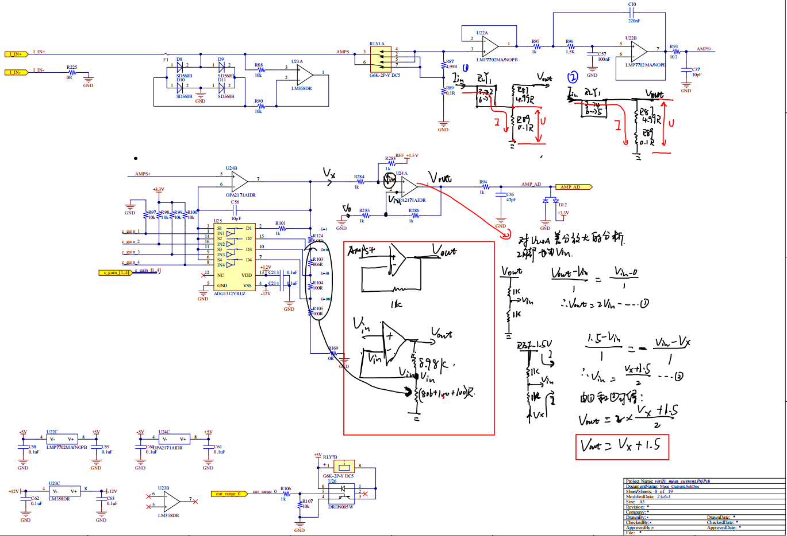
🔗<a href="https://kdocs.cn/l/coLgYbDUsnPg">原理图源文件</a>

## 电流采集电路

（两个档位切换电路4.99R 0.1R；放大倍数切换电路；差分放大电路）

电流采样电路有两个档位可以切换，使用继电器来进行切换，根据欧姆定律 U = I*R。当电流输入的时候，如图中的①和②电流方向如图所示。

**❗可能会有疑问，在①情况的时候为啥电流不从4.99R流过，这就是上面预备知识说到的射随输入阻抗很高，所以电流不会从这走**

其实这个电路还是很好理解的，画出两个情况的等效电路图，一目了然，转换成的电压就通过射随，二阶低通滤波器，就到了U24B那边，U24B就是一个典型的运放捏，然后ADG1312是一个模拟开关，用来进行运放放大倍数的选择。

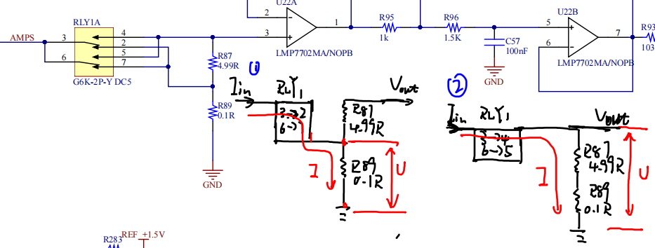

## 放大增益选择电路

上面说到电流转换成电压信号，然后来到了放大增益选择电路，，放大倍数的选择的实现是通过ADG1312这个模拟开关芯片来实现，模拟开关的重要就关注他真值表就OK（供电电压，每个脚干啥的也是需要了解，但是相较于真值表不太致命）

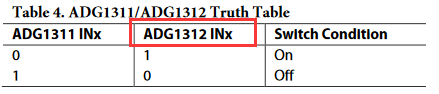

❌ Ok啊~有个很重要的就是这个真值表，当时调的时候给整神了的，看下面这个图片，他内部示意图画的是初始状态闭合的嘛，然后真值表写的是1为on，我们之前理解的就是打开，0自然而言就是闭合了嘛，所以给0的时候就是通的，这也是为啥原理图里面起手就是c_gain_1连接GND，就是为了上电瞬间是是放大倍数为1。结果实际情况真就那个恰恰相反，上电放大了十倍！！！

✔️ 正确理解是**1：接通；0：断开**直接不用管他那个内部示意图，搁那糊鬼呢！“C！”（首先排除我理解错误🤪）

所以原理图是有点问题的，起始状态应该是c_gain_1接VCC，其他的c_gain_2-c_gain_4都接GND，这样起始状态才是放大了一倍。

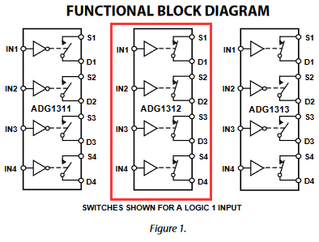

最终的放大倍数的运放端电路简化如下：

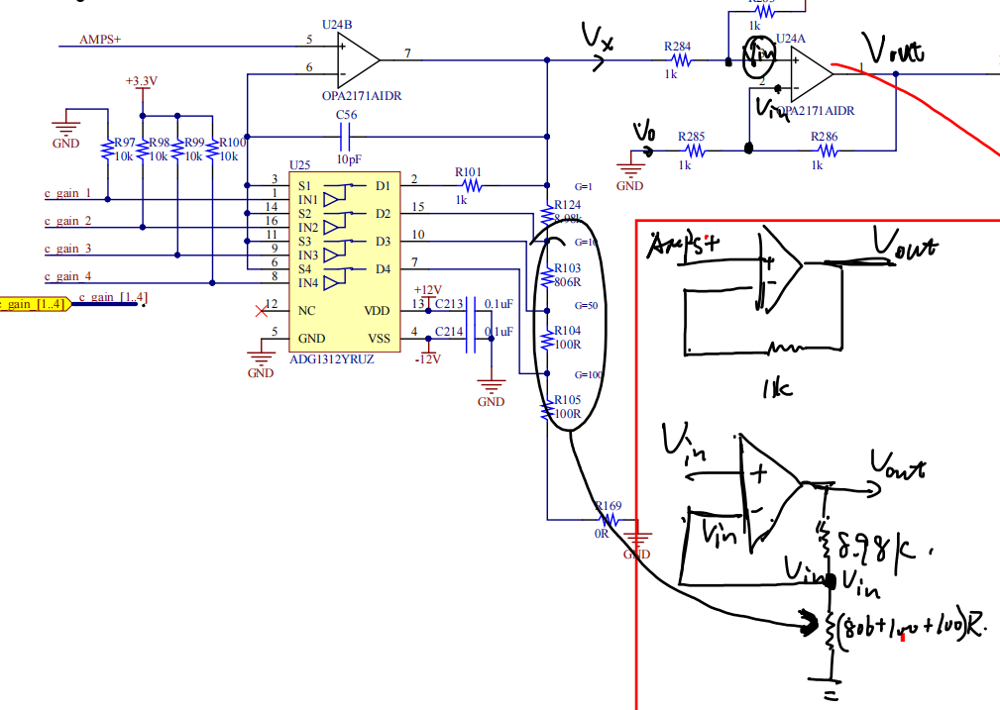

聚焦到手绘部分好吧，其实放大一倍的时候可以看成一个射随嘛，输入多少输出多少；然后放大10倍、50倍、100倍都是一个道理，假设10倍：就是R124与R103~105构成负反馈分压网络，放大倍数要推导就按照虚短虚断，分压定理来推就妥妥滴。

## 总体描述 
总体的脉络可以大致书写如下：

**输入->选择测量档位->选择放大倍数->输出电压为放大输出电压Vx + 1.5**Demo手绘图如下，其中在图里面标注了继电器选通引脚的高低电平以及放大增益的选择时ADG1312的高低电平。

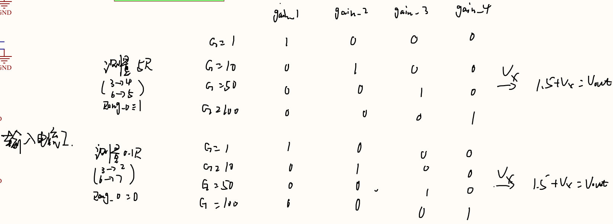

# 测试过程
上面只是进行了原理的分析，实际上是要去看各项参数指标合不合格的。

对于电流供电这方面，因为贵公司的条件，啊哈哈哈，就想到给电子负载供电，然后电子负载工作在CC模式，然后再把我的板子串进去，来实现电流的供应，如果是负电流就反相接。

🛠️焊接完成，接线OK，上电！！！**“CH1限流，该通道关闭”**哦豁，短路了，然后就逐步排查吧，首先是看有没有正负接反了，然后焊接有没有短路焊接，就这样看了一圈之后都没发现问题。带我那个工程师突然暴起！“盖亚！！”我走进一看，好小子，PCB正负画反了，其实原理图都有看到：

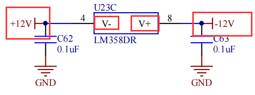

这简直属于是致命的低等错误啊！他说可能是心情不好的时候画的，毕竟我们的领导也是经常恶心人滴，不免有时候带我的师傅给恶心一下，啊哈哈哈。飞线吧，只有飞线了。好在这个板子的布局还是很松散，飞线还是好整，就隔断之后在连，加之我的焊接技术还是可以的。

🛠️再次上电，OK，可以噜！！！然后就按照他说的要求来进行数据的测量。是从后往前推的，由上面的Demo可以知道，最后的Vout是0-3V，这边最后是给单片机ADC采集的，单片机那边ADC的基准电压是3V，所以这边控制到1-3V，然后到Vx就是-1.5~+1.5V，然后放大十倍，在到电流转换电压那边，由欧姆定理可以算出可测电流的范围，综上就是有八种可能。测试结果我都是有Excel数据表格的，链接如下，方便备查：
🔗<a href="https://kdocs.cn/l/cmI3kAewfPy2">LCR_Current_Meas_Excel</a>

下面就是当时调试的接线以及可以说是纪念的照片叭~

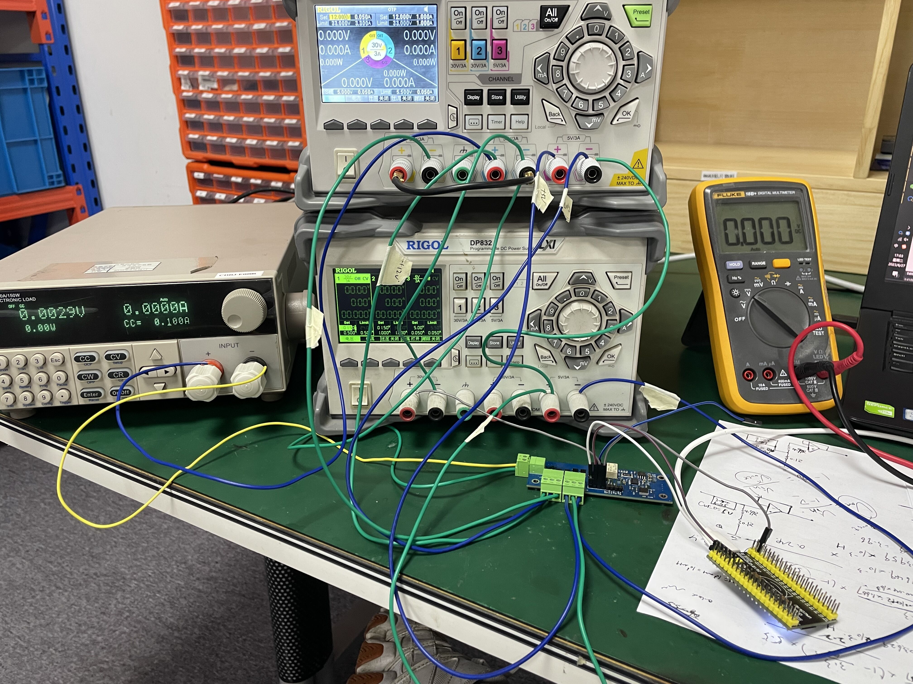
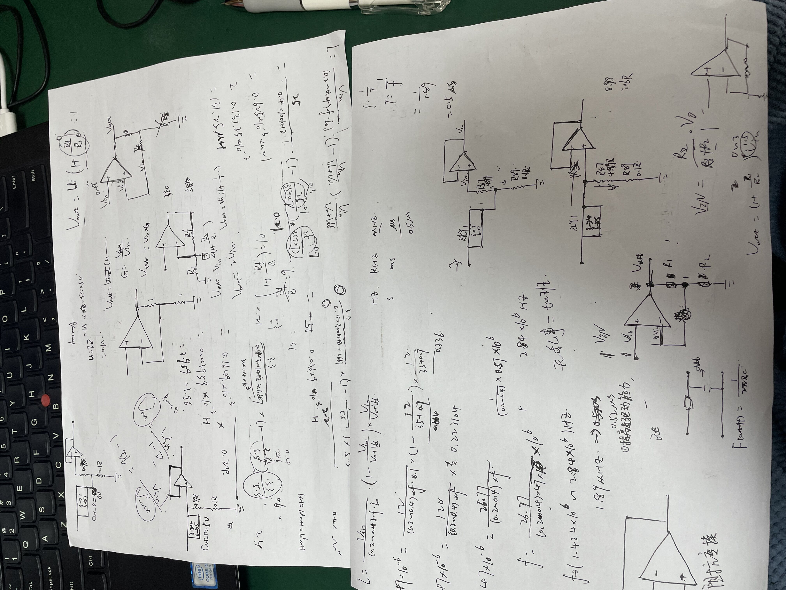
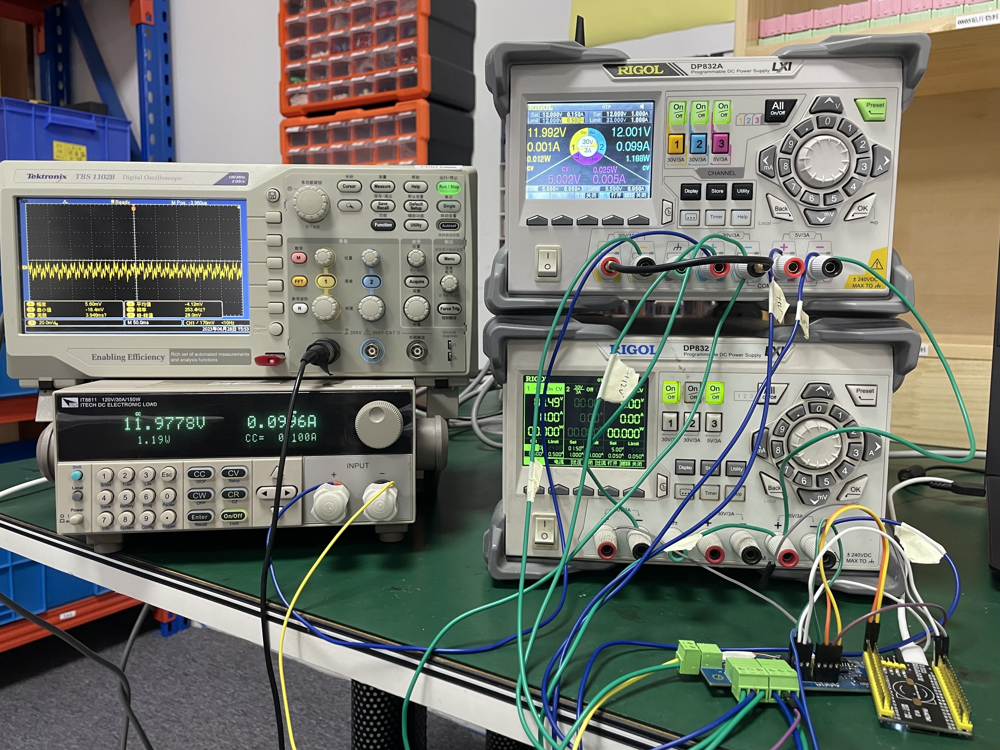

# 总结
在这次测试过程中，可以说是受益匪浅，其中还是非常让人着迷的：
- 接线，有±12V供电，用程控电源应该如何接线，其实刚开始觉得就接个线嘛这个多简单是吧，然后自己接线的时候还是有问题的，然后还有学到的就是**电流源可以用电子负载来输出，只用把需要的串联进去就OK了**
- 作为一个工程师，细节是很重要的，比如上面的原理图里面正负画反了，这个其实是很小且致命的问题，假设我没有开限流是吧，那很可能就是把芯片烧掉，有些芯片有非常贵，就非常的划不来。**做技术细节很重要，这也是我需要注意和提升的地方**
- 最让我觉得开心的就是学到了运放更深的使用方法和分析方法，还有就是抛出来了一个二阶低通滤波器的东西，之前其实也知道，但是现在觉得有必要去系统看看这些类型的滤波器了，清楚一下特性。
- 最后就是对于电流的测试有了一个方案参考，这是打着灯笼都找不全的啊，这么系统的方案，我想这为之后工作也受益匪浅吧。其中单独的一块也是非常有参考价值的，比如电流测试那边，电流转换这部分，配合射随，实现电流对电压的转化；以及运放配合模拟开关可以实现运放放大倍数的切换，也是个很好的组合方式。
- 最后的最后，还是很感谢那个工程师带我，在我不懂的时候能够不吝赐教，真的很感谢。可以说是毫无保留的告诉我，其实以后我如果变成他这么厉害的人，我也会延续这样的传统：知识的传承！
