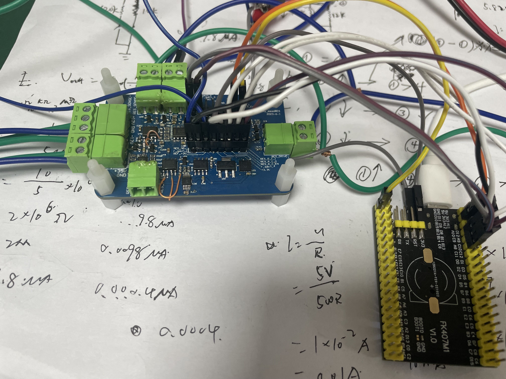

# 电阻测量电路的原理阐述
这又是一个非常美丽的方案，无论从测试结果还是硬件方面，对于现在的是来说都很好。经过方案验证以及调试加上数据调试之后，在此也留下笔记，方便之后的备查。对于原理图方面：

首先是硬件搭建了一个恒流源的电路，可以输出1mA；0.1mA；0.1mA；5uA；0.5uA的电流，然后加到被测电阻两端，此时电阻就流过了电流，然后根据欧姆定律，就会有一个电压产生，然后电压在输入电压采集端，把电压进行处理，然后输出0-3V的电压给ADC采集，最终，ADC采集的电压反推过去，就能得到电阻两端的电压，加上电流源输出的电流也是可知的，那么在根据欧姆定律，得到被测电阻值。

综上所述：**主要有两大块：恒流源，电压采集**其实原理图中还有个射随跟随器的。

# 原理图分析

上面进行了原理的阐述，下文说明每个部分的具体实现

## 恒流源部分

电流源电路分为两部分，这分成上下两部分说明，方便理解。

- 上半部分

    

    首先对于恒流源部分：主要有**运放加一个MOS**其中，运放为负反馈电路，MOS可以根据情况更改的，可以换成PMOS、NMOS、PNP管子、NPN管子。工作过程：
    1、根据运放的基本特性，MOS的2脚电压应该与运放3脚电压相等，为3V，当U36选择到S1时，上当与就是12K接入，那么会有一个电流流过R141电流大小根据欧姆定律可以得到为ID = 3 ÷ 12K。

    2、当ID确定之后，MOS会根据自身特性有个VGS、ID、VDS之间的曲线，这时候就可以找到对应的VGS的值，然后由运放去调节运放6脚电压，也就是MOS的G极电压。

    3、最终，在MOS的D极接一个电阻，电阻两端流过的电流就是ID，根据欧姆定律就可以得到Vout = 20K × ID

    Tips❔：我之前其实就有个疑问，既然最后MOS都导通了那12V过20K然后经过MOS，在经过12K到GND，流过的电流为啥不会是12V ÷ （20K+12K）A这么多呢，其实**正是因为有MOS管的原因才保证了电流的恒定。**所以在这个电路中，MOS和运放都是缺一不可的。（这个方案其实网上有很多，之前看到了一个分析还是觉得不错，贴出来🔗<a href="http://www.ejiguan.cn/2022/changjianwtjd_1123/6226.html">方案分析</a>）

- 下半部分
- 
  

  下半部分主要的作用就是把电压转换成电流输出，其中U23B的3脚Vin为上面说的Vout。只是一个运放与PMOS的结合使用，大致原理跟上面说的相同，只是有个地方有点不一样：

  对于上半部分说道的第2点为确定了ID，这个地方就是没有确定ID，原因是这一块运放的输入时随着上半部分变化的，所以输入这一块的电压不是恒定。
  
  1、根据运放的基本特性，使得PMOS的S极电压等于运放3脚电压，即S极电压等于Vin。

  2、此时如果选择的是RX=134，那么输出的电流Iout = Vin ÷ R（134~137）。具体的工作流程就跟上半部分解释的一样，PMOS和OP会根据采样电阻（R（134~137））的电流去控制恒流。

  Tips❔：在这个地方是一个PMOS，采样电阻在上端，上半部分的恒流部分是一个NMOS，采样电阻在下端。在哔哩哔哩也看到这个方案的视频讲解，只是他的管子都是用的三极管，而不是MOS，**区别在于三极管是电流控制，会导致输出的电流与ID有些误差，但是MOS是电压控制，就可以不用考虑这个问题**🔗<a href="https://www.bilibili.com/video/BV15s4y1a7Rr/?spm_id_from=333.788&vd_source=b4a5541156532564b8967b429e1c5543">视频解释</a>）
  
  ❗❗❗❗需要注意的思想就是，如上半部分是NMOS时，这个电路搭建出来，就不会收到上面12V的干扰，同样对于PMOS的也是一样的道理。

- 整体输入输出的关系以及原理图控制接线表格如下，这样方便调试接线以及分析。

    | 　   | LINE     | 　   | LINE(EN=1)      | 　      |
    |------|----------|------|-----------------|---------|
    | 12K  | R_CV_1=0 | 5K   | R_C_0=0;R_C_1=0 | 1mA     |
    | 12K  | R_CV_1=0 | 50K  | R_C_0=1;R_C_1=0 | 0.1mA   |
    | 12K  | R_CV_2=1 | 499K | R_C_0=0;R_C_1=1 | 0.01mA  |
    | 12K  | R_CV_2=1 | 1M   | R_C_0=1;R_C_1=1 | 5uA     |
    | 　   | 　       | 　   | 　              | 　      |
    | 120K | R_CV_1=1 | 5K   | R_C_0=0;R_C_1=0 | 0.1mA   |
    | 120K | R_CV_1=1 | 50K  | R_C_0=1;R_C_1=0 | 0.01mA  |
    | 120K | R_CV_2=0 | 499K | R_C_0=0;R_C_1=1 | 0.001mA |
    | 120K | R_CV_2=0 | 1M   | R_C_0=1;R_C_1=1 | 0.5uA   |

## 电压回采部分

- 射随加差分放大
- 
    

    电压回采的电压由恒流源输出电流之后，加到被测电阻上，被测电阻上就会得到一个压降V，该电压输入到RES_SENSE+、RES_SENSE-,然后各自经过一个射随之后，进入到差分其中进入差分的电压分别为**V+、V-。其中差分电路的输入与输出关系为：Vout = （Rf ÷ Rin-） × （V+ - V-）**

    对于该电路来说，经过调试过程之后，确定的是V- = 0，所以就是单纯的放大了V+。且Vout = 0.558 × V+，也就是说电压在此处是被缩小了
- 保护电路
  
  

  这个肖特基二极管的保护电路我至今还是没有理解。。。。。等之后好好看看吧（2023-7-9）

- 放大倍数选择
  这部分其实跟电流采集是复用的，都是通过ADG1312模拟开关来进行选通，具体怎么个事在这就不多赘述了详情就看《-“LCR”电流采集测量电路分析及调试》其中的《放大增益选择电路》部分

## 整体原理图以及错误记录

- U45B正负接反
- 
  
  
  如图为反接之后的问题分析，其实就是正反馈与负反馈的分析。
- U40A正负接反
  U40A为电压回采负端的射随，正负接反之后明显是不行，输入输出会吃问题。

  

# 调试

原理分析完毕之后就到了关键的一环，调试以及数据记录。

## 电流源测试
1、首先测试的档位为12K，5K组合，即输出的电流为1mA，被测电阻为5110R这个也是第一种组合，正好能够拿来测试电路能不能正常运行。“OK啊，上个点吧”好出问题喽，第一级的恒流就出问题，用电表打U45B的2脚、3脚，其电压明显不一样，具体怎么个事如下图，这说明肯定出问题，检查其供电正常，±12V供电都是OK，并且3V供电也是OK，其实问题在上面错误记录里面都已经说明，是运放正负端接反造成。**处理方法就是飞线（下面贴图有看出来，啊哈哈哈哈🤓）**好在这块板子是我Layout的，虽然注意了器件的位置问题，但是还是有些密集，不过呢，也是可以飞的，无非就是隔开两条线，在飞两条线。飞线之后，这一块是通的。

在这部分的时候当时也是一级一级打了U45B的2脚、3脚、6脚、以及MOS的D极和S极，电压值没有进行记录，有机会再测试一次加上这部分数据。

2、后一级便是电压转电流的，这个地方用的是5K的电阻，所以I = 5V ÷ 5K，刚好为1mA电流，于是把电流表穿进去到输出端，测到的电流差不多为0.998mA左右，有一点误差。

## 电压回采数据测试

1、接线思路：电压回采部分的测试就是把电流源那边接到被测电阻，电阻因为可以测量很大的范围，从输出为0~3V反推，到每个组合（由上面分析可以知道可以输出的恒流值有8种，所以就有8种被测电阻范围）的电阻范围。

因为实验室那的电阻都是电阻盒一套的，并且基于我们一般画都是用0603，所以手上之后0603的电阻，这问题就来了，这么小我咋给他接进电路里面啊！（物料盒翻找ing👺）最终找到了一个精密电阻测量的夹子，然后给他的线拆下来，弄成了一个测量夹子,如下框起来那个，电流表就串进去测量电流（飞线也是清晰可见的嘞，<乐.jpg>）：

2、这部分后续电路使用的测试在下面的总体测试中说明更加好。🤡

## 总体测试
首先也是跟上面测试恒流一样，电流源选择1mA档位，然后接入的510R的电阻。然后电压回采的差分输出是0.28V，因为使用的510R电阻，1mA的电流，根据欧姆定律输入到回采电路的电压为0.51V，实际测量为0.49V，然后经过差分之后输出0.28，确确实实是放大了0.588倍。

2、过了R148之后就出问题了，问题如下，这个就很怪的，我的第一觉得应该就是后面那个保护电路的肖特基二极管搞得鬼，然后就把D16拆下来了，拆下来之后就OK了，真是奇怪捏~~。

3、最后一级的增益选择为G = 1，就是不放大，输入多少输出多少果然遇到了跟上面说的一样问题R149的左侧（运放输出）的电压为0.29V，R149de右侧就是0.377V，这个时候跟带我的师傅讨论了一下，决定把103的电阻换成101的电阻，换了之后就对啦，然后就开始分析

就相当于R149上面有大约0.008V的压降，有压降即电压V，欧姆定律V = IR，R有了，那说明R149上面有灌电流流过！！然后电流算出来差不多有就是8uA，这个电流的来源就是D17这个肖特基二极管。

4、**之前数据都测量完成之后发现了一个问题：每一组其实都不能满量程测量所有电阻，比如第一种组合的时候，当电阻上去之后，电流就会掉，而且都在某个电阻值的时候，电流就会掉了，说明该电阻往上这个档位就是不能满足需求的了。**最后测试完成之后，发现并不是0R~10M的电阻都包含了，于是乎通过过画了个数轴！（😻内心独白：家人们谁懂啊，居然用上了高中学到的集合知识，有些激动！！！）

从图上清晰可见的，0~510R中间其实有没有测量的数据，3.6K~5.1K之间也是没有测量的，虽然知道，这一部分肯定可以测量，但是对于测试数据完整性来说，是应该测量的。

5、🙊还是对于测量来说，进行到这，说明这个方案是没有问题的，可以实现的，这是最应该关心的，但也是最浅显的。**重要的是恒流源的5uA、0.5uA档位测试结果，因为这两个已经算是小信号了，这才是最考验硬件电路的,好在的是，这个方案算是很不错的一个方案了，对于这两个档位，之前测出来的纹波也是能够满足需求的。**

# 心得体会💬
1、这块板子收获最多的无疑是恒流源方案的硬件模型，可以说是抛砖引玉，我在此进行总结和调试复盘的时候又去查阅相关资料进行了一下知识体系完整的构建：例如使用MOS和三极管是有什么理论上的区别，这真的是一个宝贵的财富，在分析和调试过程中，都能够受益匪浅。

2、在调试过程中，对于硬件调试的分析过程又可以说是进一步加深了，那种逻辑分析的感觉真的很让人上头，**特别是从电阻数据分析自然而然想到了画一个轴来看有哪些遗漏的电阻，这一下子想到了高中集合的知识，知识没有那么正式非得求什么交集并集什么的，知识轴上一目了然罢了**

3、在测试过程中重要的还是记录好数据，“方案的数据拿到手才是至关重要的”——Mr.pan.调试过程中多思考，多查查数据手册，其实有时候对于数据手册还是研究的不够透彻，可能有一方面是他都是英文的原因吧，最近师傅给我了两个网站，里面的资料是真的非常全，但是是英文，其中有个网站我之前看过，但是后面收藏夹吃灰了，现在看来是时候有空抱着啃一啃了。

🔗【<a href="https://www.allaboutcircuits.com/">🌟</a>】
🔗【<a href="https://www.electronics-tutorials.ws/">✨</a>】

4、现在看这个板子的接线，啊哈哈，好多，旁边那块32其实就是拿来进行IO输出高低电平控制的。**嗷对，这个板子还有单独的一块射随，之前电流采集电路的时候调过射随了，这就不赘述了，有一点就是，输入+35V，按道理射随可以输出0~35V的，实际上是达不到了输入范围是0.7V~34.3V，34.3再往上输出也上不去了，就会一直乱跳，应该是运放的震荡。**

