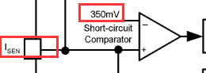
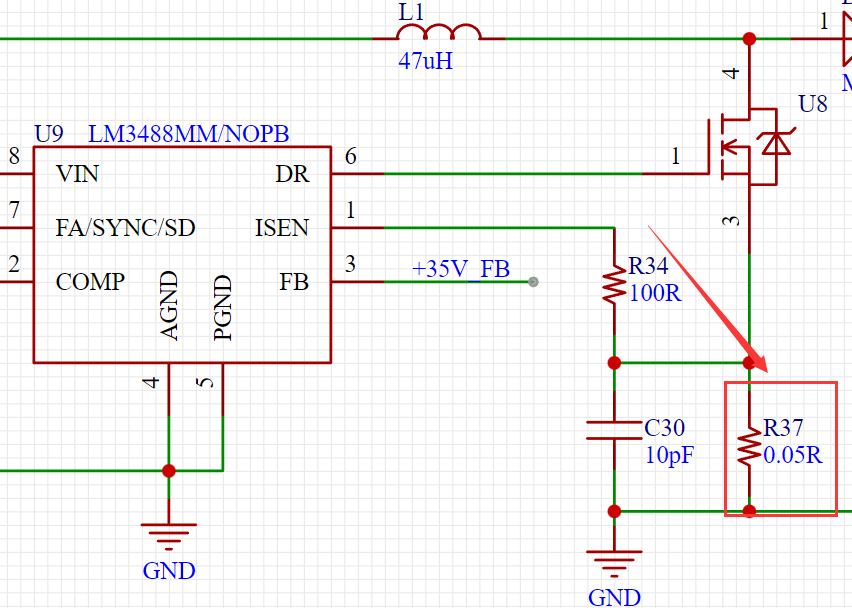
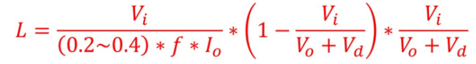
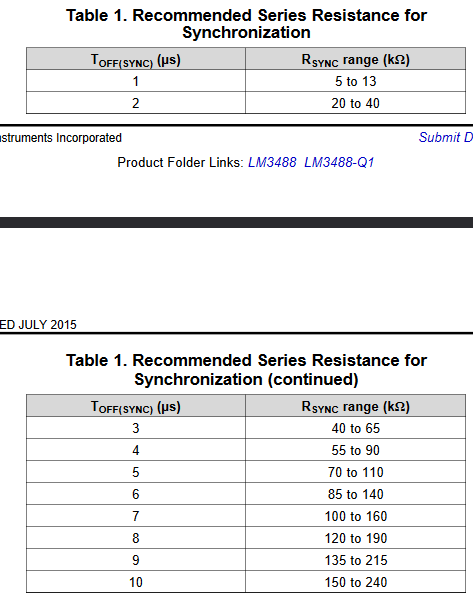
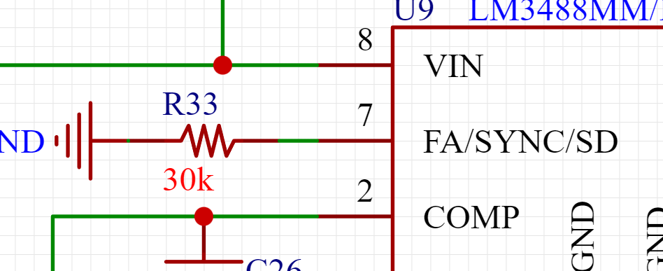

# 关于在工作中遇到的BOOST电路，调试的一些问题汇总

## 问题起因

在工作中，带我的资深工程师甩给了几个板子给我Layout做验证，其中有一块为DC35V的板子，板如其名，跟DC35V有关。需要的是输入25V，输出35V的一个BOOST升压的电路，主控为LM3488。我自己布局的布线的板子我觉得是没有什么问题的，规则那些都是没有很大问题。再加上之前还是了解过电源板。

终于等到物料回来，以及板子打样回来

焊接ing....🧐

## 调试过程

1、-

首先上电的时候发现，输入设置的是25V，但是显示输入只有2.3V左右吧，很奇怪。排除了短路问题，以及其他一些焊接问题之后，就逐步排查，查阅数据手册可以看到在Functional Block Diagram里面有限流的存在,对应到原理图中就是有一个0.05R的电阻：

（🤬其实这个0.05R的电阻目前我还是有点困惑到底是个怎么意思，总之，对于这个0.05R的处理就是，在其他问题排除之后直接短接，是不影响芯片工作的，后面加上这个0.05R后，现象为：电压上升得很慢，在上电的时候会有一个电压上升的肉眼可见的过程）

2、-

后面去排除NMOS，好小子，直接烧掉啦，少穿的嘞。排除是把MOS的1脚（G）翘起来，不接信号，去打3、4脚电阻；然后把1脚接高电平之后上电，看是否导通，这边是导通的，然后把1脚接地之后上电，看输出部分，还有电压，那说明这个MOS是没起作用的，按道理，1脚接低电平，GS之间是没有压降，那么DS也不会通，所以可以大概判断是MOS烧掉了，我觉得应该是去就上25V烧掉的，加上最后我发现我们的电感感值严重不够（后文会具体分析）
>Tips: 排除NMOS的时候，可以去打他的3、4脚的电阻，正反都打一下，如果都是几欧姆那必然是通了，如果是几十M欧姆，就是可以的

3、-深入的思考🧐

 + 电感值可能太小了

    根据《硬件工程师炼成之路笔记》中关于《手撕BOOST电路公式》可以得到的：

    

    此时Vi = 25V;f = 100K;Io = 1A;Vd = 0.7。得到的电感值**L = 131.25uH**其中频率是更换MOS之后用示波器测量得到的，换输出电流算1A，实际工程上只用100mA就足够，Vd为二极管的压降，此处写标准理论值0.7V。

    于是乎我就想着降低输入电压看看能够加到多大的电压，电感达到饱和、首先设置输入3.3V，输出是能够到达35V的，然后逐步调高输入电压，当输入电压调整到7V的时候，电感出现了啸叫，并且芯片的PWM输出开始变得不稳定，此时应该是电感到达了饱和。**此时验证出来一个事：那就是这个BOOST电路是没有问题的，只是有些细节的参数需要进行理论计算和实际调试进行调整。**

  + 调整频率

    根据跟工程师讨论，发现电感如果重新购买比较耗时间，并且根据BOOST电路电感的公式可以知道一个信息：电感偏小的时候降低频率理论上是可以的。并且对于LM3488来说，更改输出的开关频率只需要进行一个电阻的匹配，数据手册说明如下：
    

    在原理图中7脚接的是30K的电阻：
    

    由此可见，在30K的时候频率2uS左右，然后根据BOOST电路电感的公式，此时的L为确定值，其他的参数都跟上面算电感的时候一致，此时频率f为未知数，即可求出此时47uH电感对应的频率，从而得出一个周期，然后通过数据手册的表格可以得到此时需要更换的电阻。

    记得当时算出给了个200K的电阻，给电感留够足够的余量。换好之后上电就可以输入到12V了，但是又出现了一个问题：

    🙁**当频率降下去了**，上电时，输入只有2点几V，电流有0.5A 输出电压在慢慢增加，当输出电压到35.5V左右，输入就为12V，电流0.003A。**输出电压上升就比较慢了诶**，但是也无关紧要。

  + 带载之后
    带载为0.1A的CC负载，带载之前输出有36V左右（具体原因不清楚）当负载带上，输出就为35.5V。输入12V，0.333A。带载之后目前来看是可以的，纹波由于时间不够，就来不及测量了，实际上应该进行输出纹波的测量。
    
# 心得体会

在这次的工作调试当中，调试的是一个BOOST电路，这对经验积累是非常有利的操作，至少，进行了一次理论与实际的结合推算，而且也证明了之前在《硬件工程师炼成之路笔记》中关于《手撕BOOST电路公式》看到的笔记是正确的。之后调BOOST电路也可以从这几个方面进行入手：电感的选择；电容的选择，MOS的选择，开关频率等这些因素进行综合考虑和设计。

“现在的工作一是为了挣钱，更多的是拿到工作中测试的数据，这对以后的工作是非常有利且必要的。并且在调试过程中，遇到问题，多思考，多去排除问题。”

# 2023-7-3更新

## 本次更新原因

因为在后面的工作中，因为某些原因让重新进行板子的测量。所以又针对之前遇到的问题又进一步的分析了一下。得到了一些新的数据以及调试经验。

+ 首先是关于在之前说的上电之后输入只有2点几V，电流只有0.5A，要等电压慢慢上升到35V才能稳定。

  这个问题其实就是**输入电流不够大**因为在调试的时候，开了限流，并且限流到0.5A。（因为之前工作的地方调板子的时候，那个电源板一上电就直接属于是爆炸跳闸的情况，给我这个害怕了，所以在之后的调试中我都又阴影了，开着限流的。）这就导致了上电瞬间他的电流其实是不够的.

    这个问题的发现：之前的时候在输入为7V的时候是可以输出35V的，但是电压调节得到8V时，空载输出电压一直在35V-36V的波动，然后使用示波器去MOS的门级PWM。PWM是非常有问题的，就是PWM的波形上不去。**然后思考一下，为啥就是上电的时候电流会直接只有0.5A满了，可能真的就是“给的太少，要的太多，所以就只有多要点时间吧🤭”**

+ 既然输入电压对应输出电压的问题解决了，其实可以看看频率的事。

  在之前就提到过LM3488的频率有他7脚的电阻有关系，现在换回到30K，即周期为2us，那么频率就是500kHz。上电之后也是没有什么问题的，并且也是可以在输入要求范围内的。

  然后还发现个问题就是电感的开关频率达不到要求其实。使用的电感的开关频率只有100KHz（真菜）。

## 总结

> 之后调试板子，在上电初期可以限流，其实到后期调试参数都可以不限流，敞开了。归根结底还是我对于上电的阴影需要克服

> 电源板的调试是一项非常繁琐的过程，对于参数的把控也大有讲究。其实在本次文章中，也是一些调试的问题记录，有些还是没有找到根本的依据，就例如：原本判断是电感值不够，所以上不去，其实是因为开了限流，然后想降低频率来满足电感不更换的，有可能也正好合适罢了正好更换之后是10us-100KHz，也正好是电感能够满足的开关频率。那么为啥后面频率加上去之后，还是可以呢？？。