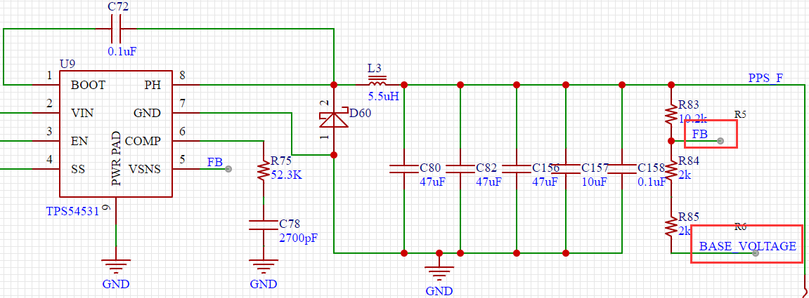
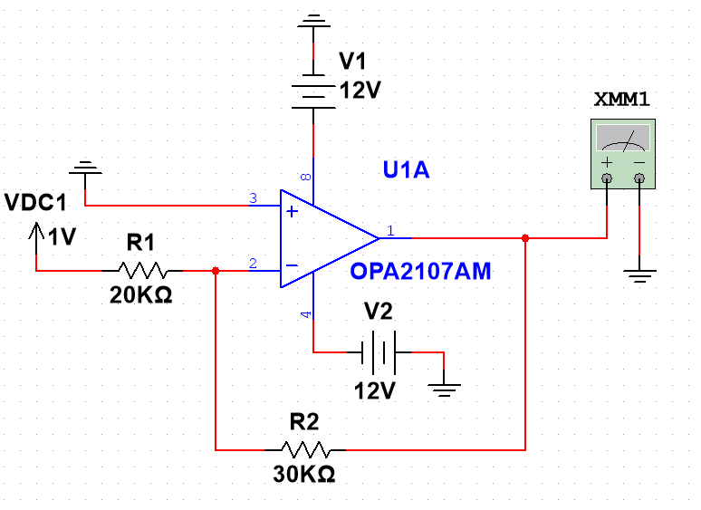
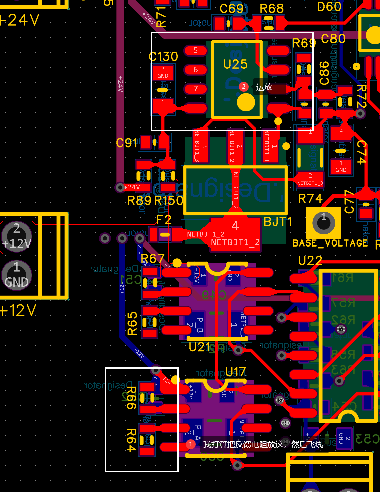
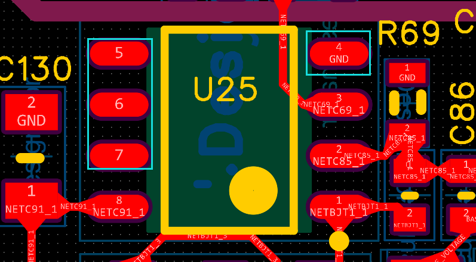
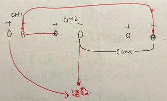

# 起因

起因是因为我要给另一个资深工程师验证一下他的一个方案，里面使用了一个电源芯片叫`TPS54531`，这个芯片是可以根据外围电路然后输出指定的电压（其实大多数的电源芯片都是这个道理，根据数据手册的典型电路以及给的一个公式来计算输出端的电压）。

在本次方案里面他其实是想根据改变FB引脚的电压来实现电压的可调输出，根据数据手册里面的说明，这是可以实现的。

# 预备节~

由于这个验证板其实也是我布局走线打样来的，那边工程师就给我了我一个原理图还有封装。此时我想吐槽两个地方：
> 第一就是封装真就是比着0603来的，就那种机焊标准的封装焊盘啊，手焊真的太苦难了

> 还有就是告诫自己的：之后的验证板，做验证的板子，能打大点就大点，特别是对于电源输出、信号部分，需要加测试点就放个焊盘，或者0R电阻也行。🤡🤡

这次就因为我的板子画得太小了，唉，上一份工作，一直让板子画小，画小，给整出固定思维了，以至于这个板子画得及其小。。。😵

不过好在，我的焊工还是比较扎实，加上电源部分我布板的时候放在的是左上角，输出放了个测试点。

# 上电加问题分析。

电源输出部分焊接完成，我问他可以上电吗，也是这会我才知道是要可调节的输出的，即需要`BASE_VOLTAGE`这个电压

再加上之前有些不可抗力原因，电源输出之后有个NPN的管子没有物料，所以就只有另想方案了：用数字电源给BASE_VOLTAGE进行供电，看能不能实现电压的可调。首先是直接把BASE_VOLTAGE接到GND，就相当于FB的电压就是三个电阻分压之后。这个我记得当时是有电压输出的，还是正确的。

讲BASE_VOLTAGE不接地之后是不行的，电压就是不对，然后那个工程师说供一下负压试试，诶嘿，负压可以实现可调，（具体的分析过程我记不得太清楚了，他其实那会演算了一下的，弄个减法器在那边应该也行）

对于负压，我跟他都还是想到了弄了一个反相放大器就行，正好其中有个运放块子的另外一半运放没有用，正好用来飞线吧！

# 飞线飞线

对于飞线就是我的事了，我先搭建了一个反相运放出来，然后再Multisim上面进行了一下仿真，确实是可以的，现在就是实物方面看怎么飞线噜。🙊

因为之前还是看过运放相关知识，我还在想要不要在运放正端加一个平衡电阻🧐，到底加不加呢，懒得加了，《乐🤪》，直接先硬搭一个，指标什么之后再考虑吧。

本来反相放大器电路就比较简单，所以我就直接在PCB上面找了两个空电阻的地方焊接上电阻，然后飞线了，也好在PCB上边刚好有这两个电阻的位哟。

**▶️还有个地方我需要考虑的就是供电那边，因为是输出负压，所以供电原本GND那个脚我就得给他负电压，所以我还得把之前焊接的芯片拆下来，把GND搞了，在焊接上去，然后从芯片负供电脚飞线供电，如下。**

说干就干。。。。。⏸️董师飞线焊接中。

# 又是一次上电

由于要供负压，，还有正电压，还有就是输入电压，所以这就有三路。使用数字可调电源刚好嘛三个口。

我上电的时候，都加了限流的并且我限流到0.1A，这个算是比较低的电压了，运放好像50mA都可以工作，所以说如果是什么短路了，电流大一点，就关闭通道了。

第一波上电，叮~“通道二超过限流，通道二自动关闭”啊？短路了，然后我又看了一下没接错，实在费解就求救了那个工程师。

首先：CH1我是输出+12V；CH2用来输出-12V；CH3输出1V用作运放负端输入电压。当我要输出压的时候，就相当于CH1和CH2是串联的，然后负电压从CH2的-出来，我就用线把CH1的-和CH2的+连接上，然后要共GND 我就用导线给CH1-和CH3的-连接起来了，连接如图：

因为那个电源放在座子上，他那个CH2和CH3的COM我并没有看到，被那个接线坐子挡住了，加之之前使用电源也不够多，不熟悉，根本我就不知道`CH1和CH2的GND是不通的，CH2和CH3的GND是通的`，才导致了短路的情况，从上面的图明显看出来CH2的正负接在了一起。

其实解决方法很简单，就用CH1输出负电压，CH2输出正电压就行了。

第二波上上电，叮~我用万用表打了一下确实是-1.5V，因为我设置的方向放大电压1.5倍，然后改变几个电压，也确实是可以输出-1.5倍的电压。🥳🥳

我想说的是：泰裤辣！！！

之后我把输出端接到BASE_VOLTAGE,然后调压确实是可以实现理论上的东西，之后就是带载测试啦！...

# 总结

1、之后画验证版我再也不画那么小了，我真的蚌埠住了。

2、对数字可调电源的使用又加深了，之后不确定的时候可以开个限流过着限压，这样就不会害怕爆炸了，我老害怕爆炸...之前做电源炸电容整除阴影了🥱

3、最后就是第一次把运放用实物搭建出来，之前都是停留在理论的分析上面，就是那种在书上熟悉得再熟悉不过的东西，真真正正的呈现在自己眼前的那种震撼，不可相信的感觉充斥大脑的感觉。