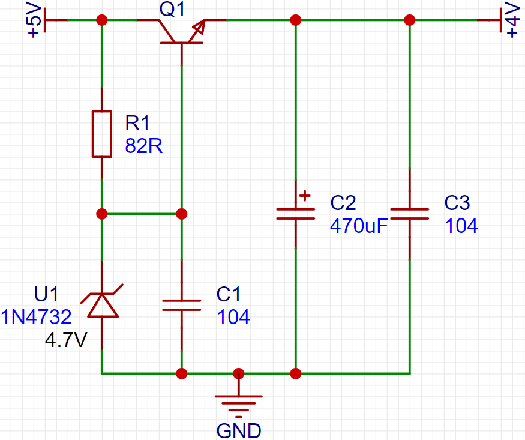
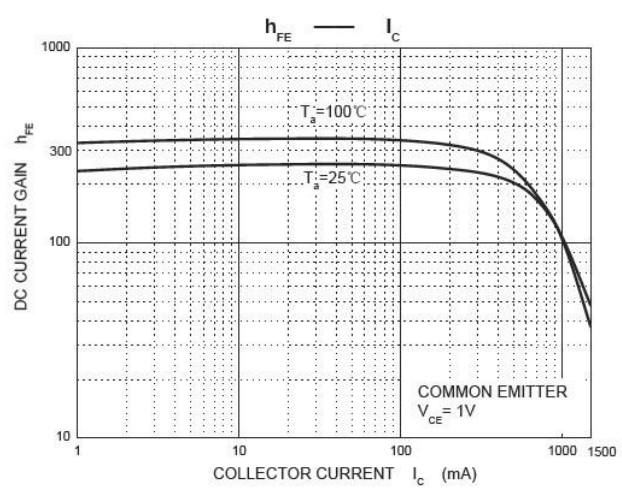

# 三级管射极跟随器

首先需要实现的要求是：**输出电压4V，输出电流0.5A，最大电流有时需要到达1.5A**

方案如下：

## 对于电压

使用稳压管，把基极电流钳位到4.7V，然后Vbe的压降为0.7V,这样Vout就为4.7-0.7 = 4V。

## 对于电流

对于三极管有Ic = **β**Ib,电流流向如图所示，Ib的大小完全是取决的R1，并且Ib =(5-4.7)V ÷ R1 = 3.6mA。

最大输出1.5A，由上图可知电流到1.5A的时候大概放大五十倍，即Ic = 1.5A,且放大50倍。那么Ib = Ib ÷ **β（50）**，=30mA。

**说明，需要Ib等于30mA的时候，才能输出1.5A，而且还是在温度为25℃的时候、不考虑管子自身电流损耗的情况下**首先管子到25℃是不显示的，这管子必然会发烫，并且过了1A之后随着温度升高放大倍数还在下降。其次，管子本身电流损耗是不可忽略的。

## 整改方案🛠️

**①让Ib上升。②更换更大电流和放大倍数的管子**

R1 = (5-4.7)V ÷ 30mA(Ib) = 10R ,所以只需要R1换成10R即可。

## Tips⚠️：由于需要计算的是Ib

- 小电流的三极管的数据手册可能并没有表明基极最大电流，只有一些大功率的三极管会表明

- 电路中的Ib通常由最大集电极电流Icmax除放大倍数得到；工程上也可以去Icmax的十分之一，不超过这个值，就是比较安全的