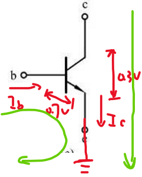
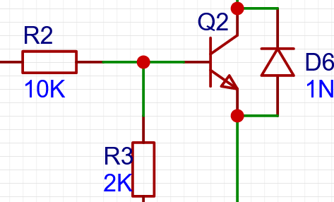

# 开发与设计

## 1、电阻

> 不同封装的电阻上的功率

## 2、电容

①、电容就想一个水缸一样，可以滤除纹波（即波形的脉动||波纹），**且电容越大，滤波效果越好**

②、电容充电过程中电压的变化：V = V_in_*(1-e^t/τ^) 即当电容电压与电源电压的压差越小时，电容充电越困难（越慢）

③、**电容容值的计算： C = I_out_/(△V*f)**

④电解电容滤波一般是滤除低频的；小电容（贴片的纳法级）可以对高频有一个很好的滤除效果

⑤：d_i_/d_t_ 称为浪涌电流  d_u_/d_t_ 称为尖峰电压

⑥、电容容抗：Z = 1/(2πfC)

## 3、三极管（电流型控制器件）【NPN型】

### 1）、特性

1.I~b~控制I~c~

2.具有放大电流的功能：I~c~≈100I~b~

3.当E极接地，当I~b~≥1mA，R~ce~≈0

4.当I~b~≥1mA，V~be~ = 0.7V

### 2）、上拉下拉

针对B极

### 3）、导通固定电路

> R2主要是一个限流作用，让流过三极管的电流为1mA，R3是一个防止雷击或者其他干扰的作用，D6作用为，当上电或者断电一瞬间，负载如果是一个非线性的负载，可能电流会反向，反接一个D6来给电流提供一个通路

> 反向二极管的接法就跟导通通路方向相反

## 4、MOS管

### 1）、NMOS与PMOS的导通以及导通后的电流方向

​	NMOS一般用于低端驱动（即在负载的接地端进行控制）；PMOS反之。

> 1、对于NMOS：当==Vg＞5V==即电流从G->S，MOS导通，导通之后的电流方向与电气符号的箭头方向相反。
>
> 2、对于PMOS：当==Vg＜5V==即电流从S->G，MOS导通，导通之后的电流方向与电气符号的箭头方向相反。

> ==主要是关断回路的设计：**Tips：主要是R24那边VCC的通路**==
>
> ​	当高电平的时候Q15会导通，VCC经过Q15到GND，不会去Q14那边，所以Q14不通。
>
> ​	当为低电平的时候，导通控制回路关断，Q15 也关断，上边VCC经过R24让Q14导通，使得Q11的结电容放电更快。

### 2）、工程应用中，会在GS之间并联一个大电阻。

> 因为GS之间有一个结电容存在，所以防止结电容放电没放完，无放电回路，MOS一直导通。

### 3）、MOS驱动电路（推挽驱动：共射）

> 这个MOS驱动电路用一个推挽电路进行驱动；R27主要就是一个放电作用，同时D7也作为一个放电使用

## 5、运放

### 1）、基本知识

> 运放是让三极管工作在放大状态，然后搭出来的符合电路

放大电路的四种组态（负反馈）

==**区分方法：**==（Tips：==反馈都接在运放负端==，才能叫负反馈）

**①、输出部分：输出与反馈在同一个点，则是电压反馈；不同一个点，则是电流反馈。**

**②、输入部分：输入与反馈在同一个点，则是并联；不同一个点，则是串联。**

> 使用虚短虚断可以得出电压输出型的输出公式。如下图：

> **运算比较器**

在输出端加一个上拉电阻之后：

在负端设置一个基准电压之后，当正端输入电压高于负端，则输出高电平信号；如比基准电压低则输出低电平信号。

### 2）、运算放大器以及运算比较器的实际应用

1.要求输入一个250mV-500mV的电压，输出2.5V-5V，所以放大了十倍；都是电压输出，所以采用==电压串联的接法==

2.==三个电阻的确定：==

①、输出公式为：V~out~ = V~in~*（1 + R~30~/R~31~）所以就可以确定R~30~和R~31~的值。在工程上一般R~30~的值一般不应该**取太大**

②、R~32~的值等于R~30~并上R~31~的值。

3.输出之后要求电压高于2.5V输出高电平；电压低于2.5V输出低电平。

所以在比较器负端设置一个2.5V基准电压。基准电压的设置用电阻分压定理。

## 6、稳压管

> ==反向流过电流大于2mA时，稳压管稳压==

## 7、推挽电路（==经典的驱动电路：驱动MOS、三极管，也不存在同时导通的情况==）

由两个三极管构成：上管为NPN型，下管为PNP，当高电平时，输出电流，看看做是一个“推”的过程

​																		  当低电平时，电流通过下管流进来（用作放电），可看做“挽”的																		  样子

## 8、反激电路（带变压器）；基于UC3842

### 1）、EMI电路（安规-安全规范）

> F1为保险丝：一般使用慢断的保险丝（带T标识）

> L1为共模电感：一般L1 的值是一个mH级别的，作用为一直共模干扰。

> CX1：X电容

> CY1: Y电容，CY1与CY2是一个π型滤波电路

==Tips：一般EMI电路都大同小异。需要注意EMI部分要接地，因为这一部分一般都是直接接交流220V==

### 2）、主回路以及控制回路

> 主回路如下红色部分；反激电路的基本拓扑期间如图黑色圈出部分；电压电流反馈如下标注。

> U2 与 D3的作用就是防止漏感，当MOS开通时由于变压器漏感的存在会有一个反向电流，稳压管就防止反向电流；但是通了之后只需要电流从变压器流过，所以反接一个二极管控制单向导通。U2 的耐压得有170V。

> R1、R2接到U4电解电容上。目的是为了让通电开始就能给芯片供电：刚刚通电时，给U4充电然后放电给芯片，芯片建立起系统之后在又副边给电。所以U4的容值比较大。D4也是让电容放电完全给芯片，不从辅助绕组放电。

> MOS的开通速率不能太快，太快会导致MOS发烫。

> 芯片电压反馈接15V时，VFB端的电压约为3V，UC3842内部偏置为2.5V，只要在2.5V左右都行。

> 电流采样在MOS的源极，所以采样电阻一般为欧姆级别。

> MOS前方的一个驱动电路（D5、R5）实现了让MOS开通合适（不会产生米勒效应）并且关断过程放电快（降低了MOS的关断损耗）

> D1的选择：D1主要是防止在开通过程加在U3上面是反压，所以D1的选择应该考虑其耐压值

### 3）、变压器的计算

> ==步骤：==
>
> 1、确定变压器体积（即中间磁柱的体积）
>
> 2、由查变压器数据手册来确定中间磁柱的截面积Ae
>
> 3、求匝比
>
> 4、求出初级绕组（此时带入的B~pk~）为变压器材料最大的磁通峰值
>
> 5、由匝比和初级绕组的值确定次级绕组的匝数（取整 ）；再由取整的次级绕组数反算初级绕组的匝数，再算出B~pk~看是否在最大磁通峰值内。

## **、经验**

> LM7805 芯片  后面的05代表的是电压为5V
>
> LM7812 芯片  后面的12代表12V

> ==在工程中，负载电流小于150mA，滤波电容容值一般就取一个220uF（或者330uF）就合适了，主要就是测一下纹波如何；耐压值就取电压的1.5倍（也可留有一定余量）==

> 在大的电容旁边并联一个小的瓷片电容，用于滤除 d~u~/d~t~

## →模块化处理 

### 1）、分立元件搭建一个稳压模块（图例为24V-5V）

>  只要改变稳压管稳压大小以及R2的电阻

R2的大小保证稳压管通过电流为2mA；由于三极管BE之间有导通压降，所以稳压管的稳压大小则为输出电压加上0.6（0.7）V；如果需要的是5V，则稳压管稳压为（5+0.7）V

### 2）、三极管（NPN）作为开关作用（基本固定电路）

由于NPN和PNP管子的特性导致，所以再NPN做开关的时候只能用在负载后面；PNP管子可以用在负载前面但是需要一个NPN管子辅助

#### ①、单管做为开关

> 总结：
>
> 1、在三极管BE之间接一个下拉电阻，用于防止雷击以及防止NPN工作在放大区。
>
> 2、防止雷击就是让三极管的B极有一个确定的状态（高电平/低电平），不可以是悬空的状态（高阻态）
>
> 3、==当NPN作为开关作用时，只能接在负载的后级：即C接负载，因为E极必须接地才能保证三极管导通==

#### ②、PNP型做开关（==也可以作为电平翻转电路，即输入高电平让PNP管子导通==）

> 使用PNP型做开关使用的时候，需要NPN管子来辅助导通才行，PNP管子的电路跟自身做开关时一样

### 3）、RC滤波

### 4）、LED指示电路

> **思路**：M、D1、D2都并联，M、D1受Q2控制
>
> 由于D1要受M的指示，M又受开关管控制，M转动，D1亮，所以两个并联之后再和三极管串联；不让D1与M串联是由于串联不能保证两个电流都达到要求。Q2导通有0.3V压降，D3导通有0.7V压降，左右D2上方有1V电压（＜3.3V）故不亮。
>
> 关断时：需要D2亮就直接给D2供电就行

> ==还需要注意的就是功耗问题，由于12V由前面的一个降压电路得来，如果流过LED的电流比较大，两路加起来电流更大，路过前面降压电路三极管的电流会引起管子发烫，所以一般让LED流过5mA的电流==

### 5）、控制电机正反转电路

> 上管PNP型的，再搭配一个NPN就可以实现电平翻转，电路与NPN做上端开关电路一样

> 输入信号为高低电平，只需要吧低电平时翻转到高电平给下面那个输入，就可以。

> Q5、Q6为一对管子，Q7、Q8为一对管子，当输入信号进入的时候需要有一定死区时间，防止Q5、Q7导通然后烧毁

