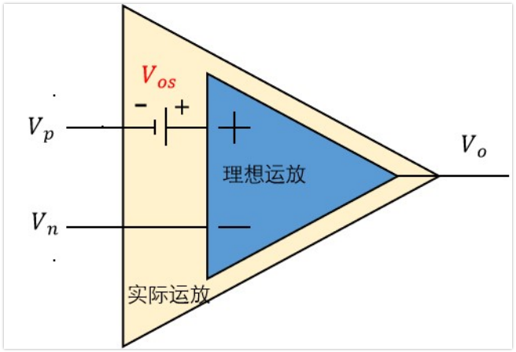
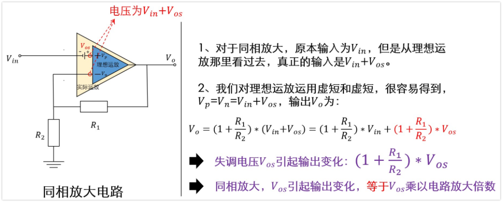
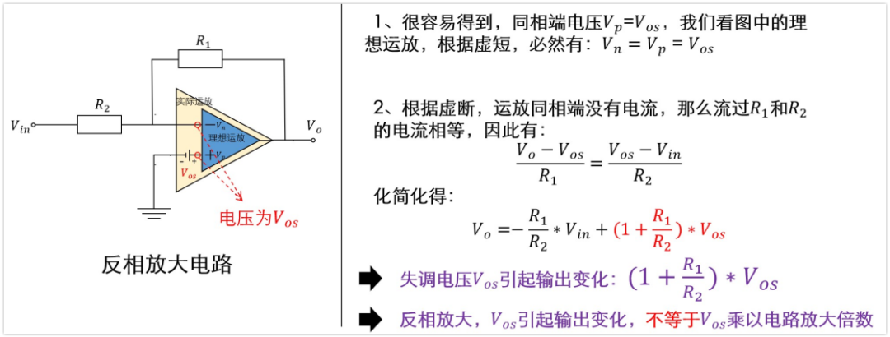

# 运放失调电压Vos（Input offset Voltage）

Tips：运放的指标有很多，这是再看微信公众号`《硬件工程师练成之路》`中学习关于运放失调电压的笔记

首先带着问题来看：
`1、失调电压是什么；是如何产生的？`

`2、失调电压一般是uV，mV级别，对于电路设计需要考虑吗？影响如何。`

## 失调电压的产生

如上图，我们评估运放的失调电压时，一般建立上面的模型。我们将Vp和Vn对地短路，如果是理想放大器，那么输出Vo应该是0V。

真实放大器内部处理Vp和Vn的输入级可能并不是理想的，其对应的晶体管会有偏差。导致当Vp=Vn=0V时，Vo并不是0V。

`此时在In+与IN-加一个电压，这个压差就是失调电压Vos`。我觉它的英文名input offset voltage（输入偏置电压）更容易理解一点。

## 实际应用

1）、假如我们有一个同相放大电路，Vos = 4mV，4mV放大50倍，要求输出电压误差不超过100mV，这个运放满足要求吗？100mV比4mV大很多呀，好像也能用，是这样吗？

答案是`不满足`要求。

`因为失调电压也会在电路中被放大`，我的理解是，因为失调电压是加在IN+和IN-之间的，是输入到运放端的。4mV放大五十倍为200mV。肯定是不满足要求的。

`但是需要注意的是`：输出的“失调电压”并不是200mV。所以就有了失调电压的误差计算。

2）、失调电压的计算

* 同向放大电路

如上图是同相放大电路，原本输入为Vin，但是从里面的理想运放看过去，实际的输入电压为Vin+Vos。那么输出就是Vo=(1+R1/R2)*(Vin+Vos)。

如果Vos=0，那么Vo=(1+R1/R2)×Vin，这是我们常见的同相放大电路输出公式。如果Vos≠0，那么就相当于在原来的基础上叠加了一个电压:(1+R1/R2)×Vos，这个电压就是Vos对输出端的影响。

可以看到，同相放大电路的放大倍数是1+R1/R2，Vos也是被放大了1+R1/R2倍，等于这个电路本身的放大倍数，放大后叠加到输出端。

* 反向放大电路

如上图是反相放大电路，若运放本身的失调电压是Vos，那么图中理想运放的同相输入端电压就是Vos，根据运放的虚短，反相端的电压也就是Vos。

再根据虚断，流过R1的电流与R2的电流相等，Ir1=(Vo-Vos)/R1,Ir2=(Vos-Vin)/R2。那么就有了这个式子:(Vo-Vos)/R1=(Vos-Vin)/R2。化简得到Vo=-(R1/R2)×Vin+(1+R/R2)×Vos

如果Vos=0，那么Vo=-(R1/R2)×Vin，这是我们常见的反相放大电路输出公式，如果Vos≠0，那么就相当于在原来的基础上叠加了一个电压:(1+R1/R2)×Vos，这个电压就是Vos对输出端的影响。

可以看到，反相放大电路的放大倍数是-R1/R2，但是Vos是被放大了1+R1/R2倍，不等于这个电路本身的放大倍数。

总之，尽管同相和反相放大电路放大倍数公式不同，但`Vos都是被放大1+R1/R2倍，叠加到输出端。`

🔞此笔记很多参考微信公众号`《硬件工程师练成之路》`的`运放-3-失调电压Vos的理解与仿真验证`